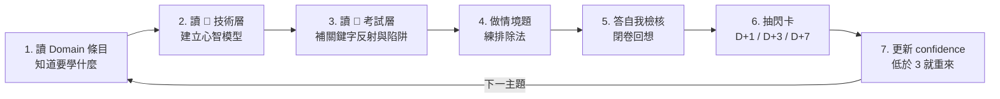

# 01 如何使用本 Vault

## 🧱 筆記的固定結構：技術層 / 考試層

`03-核心服務` 與 `04-模式與決策` 的每篇筆記都切成**兩層**，用 H1 標題明確分隔。在 Obsidian 的大綱（outline）面板中會看到三個並列的區塊：

```
# 主題名稱
  （導言：一句話定位）

# 🧠 技術層            ← 它實際上怎麼運作
  ## 心智模型 / 機制 / 比較表 / 限制
  ## …

# 🎯 考試層            ← 考試會怎麼問
  ## 🎯 考點速記        ← 「看到 X 就想到 Y」的條件反射
  ## 💣 真實場景陷阱     ← 上線後才會痛、考試也愛考的那些事
  ## ✍️ 自我檢核        ← 5 題，答不出來就回技術層重讀

# 🔗 相關              ← 與其他筆記的接點、官方來源
```

> [!important] 為什麼要分成兩層
> 這兩層回答的是**完全不同的問題**，混在一起讀會互相干擾：
> - **技術層**問「S3 的 lifecycle 實際上怎麼運作」——這是你考完之後還用得到的知識。
> - **考試層**問「題幹寫 45 天時該排除哪個選項」——這是考場上的條件反射，對真實工作幾乎沒用。
>
> **第一輪只讀技術層**，把架構直覺建立起來；**第二輪與考前才讀考試層**。
> 一開始就啃數字與誘答套路，只會排擠理解選型邏輯的時間。

> [!tip] 兩種讀者的動線
> **想學 AWS 架構** → 只讀技術層 + `04-模式與決策` 的決策樹，忽略考試層。
> **只想過考試** → 技術層快速掃過，重點放考試層 + `06-速查表` + `07-練習題`（[[10 天急救計劃]] 就是這條路）。

---

## 🔁 推薦的學習循環（每個主題）



> [!important] 最重要的是第 5 步「閉卷回想」
> 讀完覺得懂 = **熟悉感**，不是記憶。**蓋住筆記、把心智模型講出來**，才會真的留下。
> 每篇筆記末尾的「自我檢核」就是為此設計的——**先答再看，不要先看答案**。

---

## 🏷️ 標籤系統

| 標籤 | 用途 |
|---|---|
| `#AWS/SAA-C03` | 全部筆記 |
| `#service/s3`、`#service/vpc` … | 依服務歸類 |
| `#exam/d1` ～ `#exam/d4` | 對應四大 domain |
| `#pattern` | 設計模式 / 決策樹 |
| `#numbers` | 內含必背數字 |
| `#lab` | 動手實作 |
| `#practice` | 練習題 |
| `#weak` | **你自己加**：不熟的地方 |

> [!tip] 弱點管理法（這是最有價值的一招）
> 每次答錯或卡住，就在那一段上方加一行 `#weak`。
> 考前兩天用 Obsidian 搜尋 `tag:#weak`——**那就是你的個人化複習清單，比任何通用重點都有效。**

---

## 📊 三個 frontmatter 欄位

```yaml
status: 未讀 | 讀過 | 熟練
confidence: 1      # 1=沒把握 5=可以教別人（讀完就更新）
importance: 5      # 考試重要性（已設定好，不要改）
```

- **`confidence` 是給你自己用的**，誠實一點。讀完覺得「好像懂了」給 2，不要給 4。
- `importance: 5` 的筆記是高頻考點，時間不夠時優先。
- [[README]] 與 [[每日追蹤模板]] 有 Dataview 查詢會自動彙整低信心的筆記。

---

## 🃏 閃卡格式

`08-Flashcards` 使用 **Spaced Repetition 外掛的單行格式**：

```markdown
S3 Standard-IA 的最低儲存期間是多久？::30 天
```

需要多行答案時：

```markdown
為什麼 gateway endpoint 不能用在「on-prem 經 Direct Connect 存取 S3」？
?
因為 gateway endpoint 只是 **VPC 路由表裡的一筆路由**，
只在 VPC 內部生效；從 on-prem 過來的流量不經過那張路由表。
正解是 S3 **interface endpoint** 或 Public VIF。
```

外掛設定見 [[02 Obsidian 設定與外掛建議]]。
**沒安裝外掛也能用**：把它當成「問題 :: 答案」清單，遮住右邊自測。

---

## 📈 進度追蹤

1. 每天打開你選的計劃（如 [[25 天衝刺計劃]]），勾掉當天的 `- [ ]`。
2. 每篇筆記讀完，更新 frontmatter 的 `status` / `confidence`。
3. 每個複習日打開 [[每日追蹤模板]] 做 15 分鐘回顧。
4. 做完題目，把錯題依**錯因**（不是依主題）記進 [[模考與錯題模板]]。

---

## 💡 高效使用的六個小技巧

1. **用 Graph View 檢查理解**：打開圖表視圖，某個主題的節點若孤零零沒連線，代表你還沒把它放進整體架構裡。
2. **決策樹先背，服務後補**：先把 `04-模式與決策` 的五張決策樹記熟，讀服務筆記時就有掛鉤點。
3. **英文術語不要翻譯**：考試是英文。筆記刻意保留 `visibility timeout`、`gateway endpoint`、`permission boundary` 等原文——**題幹認的是這些字**。
4. **把 Lab 的錯誤訊息貼回筆記**：真實錯誤（`AccessDenied`、target unhealthy、image pull failed）是最好的考點記憶。
5. **練「變形題」**：讀完一題，把題幹的一個限制條件改掉（45 天改成 5 年、可中斷改成不可中斷），答案會不會變？能答出來才是真懂。
6. **Timeout 找網路，403 找權限**：這句心法能在考場上省下大量時間，很多干擾項就是「用網路方案解權限問題」。

---

## ⏱️ 考場節奏（考前一天再讀一次）

130 分鐘 / 65 題 = **每題 120 秒**。

1. **第一輪（~85 分）**：90 秒內能決定的就決定，不確定的標記後跳過。
2. **第二輪（~30 分）**：回頭處理標記題。此時你已看過全卷，常會從其他題得到線索。
3. **第三輪（~15 分）**：檢查複選題有無選滿、有無漏答。**絕不留白，猜題無倒扣。**

> [!tip] 讀長題幹的正確順序
> **先讀最後一句問句與所有選項，再回頭掃題幹找限制條件。** 不要從頭逐字讀——10 行以上的情境題通常限制條件明確、反而好排除。

## 🔗 相關

- [[README]]
- [[00 考試總覽]]
- [[02 Obsidian 設定與外掛建議]]
- [[每日追蹤模板]]
