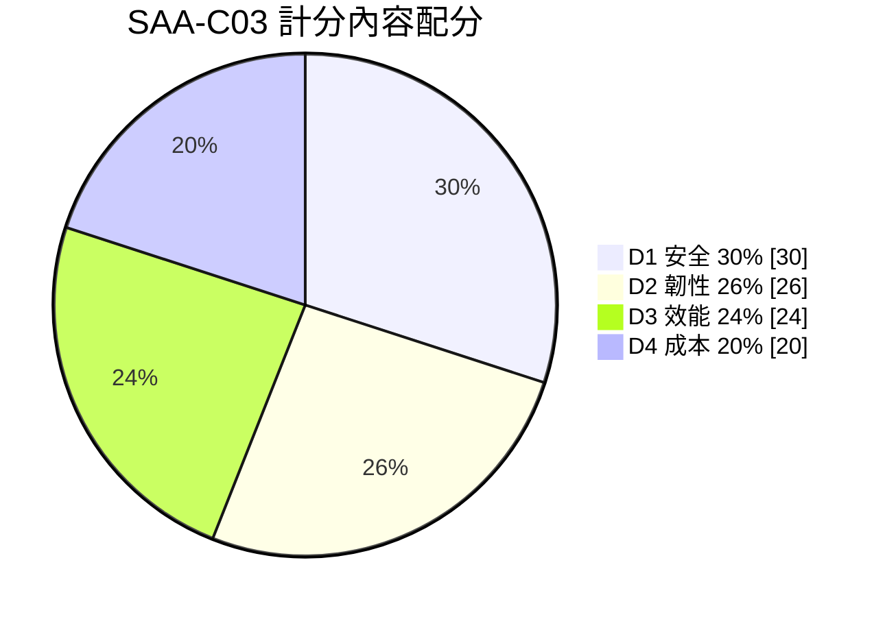

# 考試藍圖與配分

> [!abstract] 本頁作用
> 這是整個 vault 的**校準基準**。所有主題筆記的深度都應該對得起這裡的配分；讀書時間分配也以這裡為準，而不是憑「哪個主題我比較有興趣」。

## 考試規格

以下數字取自 AWS 官方考綱與認證產品頁，2026-09-27 查核。

| 項目 | 數值 | 說明 |
|---|---|---|
| 考試代碼 | SAA-C03 | |
| 題數 | **65 題** | **50 題計分 + 15 題不計分** |
| 時間 | **130 分鐘** | 平均每題 **120 秒** |
| 費用 | **150 USD** | |
| 計分 | scaled score **100–1000**，**720 分通過** | |
| 計分模型 | **補償式（compensatory）** | 不需要每個 domain 都及格，只看總分 |
| 題型 | 單選（1 正解 + 3 干擾）、複選（5+ 選項中 2+ 正解） | 只有這兩種 |
| 空白 | 未作答一律算錯，**猜題無倒扣** | 絕不留白 |

> [!important] 那 15 題不計分的意義
> 你無法辨識哪些題不計分。實務含意有兩個：**(1)** 遇到極度冷門、感覺超綱的題目，很可能就是測試題，別因此動搖節奏或自信；**(2)** 時間規劃要用 65 題算（120 秒/題），不能用 50 題算。

## 四大 Domain 與權重

| # | Domain | 權重 | 約當計分題數 | 核心問題 |
|---:|---|---:|---:|---|
| 1 | **Design Secure Architectures** 設計安全架構 | **30%** | ~15 | 誰能存取？用什麼身分？資料靜態/傳輸如何加密？邊界在哪？ |
| 2 | **Design Resilient Architectures** 設計高韌性架構 | **26%** | ~13 | 壞掉什麼還能活？RPO/RTO 多少？解耦了嗎？ |
| 3 | **Design High-Performing Architectures** 設計高效能架構 | **24%** | ~12 | 瓶頸在哪？如何擴展？選對儲存/資料庫/快取了嗎？ |
| 4 | **Design Cost-Optimized Architectures** 設計成本最佳化架構 | **20%** | ~10 | 哪裡在燒錢？有沒有更便宜又滿足需求的做法？ |

> [!tip] 配分的實際讀法
> **安全（30%）是最大單一區塊**，比成本（20%）多出一半。但安全題很少是「背 IAM 語法」，而是「網路通了為什麼還是 403」這種串聯題——所以 [[EC2與IAM安全]]、[[威脅偵測與邊界防護]]、[[治理與合規]] 三篇要讀到能互相推導。
>
> 另外注意：**四個 domain 是評分維度，不是題目分類**。同一題經常同時考安全與成本（例如「最低成本且不得經公開網際網路」）。題幹裡的每一個限制條件都要當作獨立的篩選器。

## 官方 in-scope 服務 × 本 vault 覆蓋對照

官方明列的 in-scope 服務清單如下（標註 ⬛ 者為考試高頻、必須熟；⬜ 為知道定位即可，通常只當干擾項或一句話帶過）。最後一欄是本 vault 的對應筆記。

### Storage

| 服務 | 頻度 | 對應筆記 |
|---|:-:|---|
| Amazon S3 / S3 Glacier | ⬛ | [[S3與資料生命週期]] |
| Amazon EBS | ⬛ | [[EC2與儲存]] |
| Amazon EFS | ⬛ | [[EC2與儲存]] |
| Amazon FSx（全部類型） | ⬛ | [[EC2與儲存]] |
| AWS Storage Gateway | ⬛ | [[遷移與混合雲]] |
| AWS Backup | ⬛ | [[治理與合規]] |

### Compute / Containers / Serverless

| 服務 | 頻度 | 對應筆記 |
|---|:-:|---|
| Amazon EC2 / EC2 Auto Scaling | ⬛ | [[EC2與負載平衡及擴展]]、[[運算與容器選型]] |
| AWS Lambda / AWS Fargate | ⬛ | [[事件驅動與無伺服器]]、[[運算與容器選型]] |
| Amazon ECS / EKS / ECR | ⬛ | [[運算與容器選型]] |
| AWS Batch | ⬜ | [[運算與容器選型]] |
| AWS Elastic Beanstalk | ⬜ | [[運算與容器選型]] |
| AWS Outposts / Wavelength / VMware Cloud on AWS | ⬜ | [[遷移與混合雲]] |
| ECS Anywhere / EKS Anywhere / EKS Distro / Serverless App Repository | ⬜ | [[運算與容器選型]] |

### Networking and Content Delivery

| 服務 | 頻度 | 對應筆記 |
|---|:-:|---|
| Amazon VPC | ⬛ | [[EC2與網路]] |
| Elastic Load Balancing（ALB/NLB/GWLB） | ⬛ | [[EC2與負載平衡及擴展]] |
| Amazon CloudFront | ⬛ | [[DNS與全球流量]] |
| Amazon Route 53 | ⬛ | [[DNS與全球流量]] |
| AWS PrivateLink / Transit Gateway | ⬛ | [[EC2與網路]] |
| AWS Direct Connect / Site-to-Site VPN | ⬛ | [[遷移與混合雲]] |
| AWS Global Accelerator | ⬛ | [[DNS與全球流量]] |
| AWS Client VPN | ⬜ | [[遷移與混合雲]] |

### Database

| 服務 | 頻度 | 對應筆記 |
|---|:-:|---|
| Amazon RDS / Aurora / Aurora Serverless | ⬛ | [[資料庫與快取]] |
| Amazon DynamoDB | ⬛ | [[資料庫與快取]] |
| Amazon ElastiCache | ⬛ | [[資料庫與快取]] |
| Amazon Redshift | ⬛ | [[資料分析與串流]] |
| Amazon DocumentDB / Neptune / Keyspaces | ⬜ | [[資料庫與快取]]（認得定位即可） |

### Security, Identity, and Compliance

| 服務 | 頻度 | 對應筆記 |
|---|:-:|---|
| IAM / IAM Identity Center / KMS | ⬛ | [[EC2與IAM安全]] |
| AWS Secrets Manager / ACM | ⬛ | [[EC2與IAM安全]] |
| AWS WAF / Shield | ⬛ | [[威脅偵測與邊界防護]] |
| Amazon Cognito | ⬛ | [[身分聯合與應用存取]] |
| Amazon GuardDuty / Inspector / Macie | ⬛ | [[威脅偵測與邊界防護]] |
| AWS Network Firewall / Firewall Manager | ⬛ | [[威脅偵測與邊界防護]] |
| AWS RAM / Directory Service | ⬜ | [[身分聯合與應用存取]] |
| Security Hub / Detective / Artifact / CloudHSM | ⬜ | [[威脅偵測與邊界防護]] |

### Application Integration

| 服務 | 頻度 | 對應筆記 |
|---|:-:|---|
| Amazon SQS / SNS / EventBridge | ⬛ | [[事件驅動與無伺服器]] |
| AWS Step Functions | ⬛ | [[事件驅動與無伺服器]] |
| Amazon MQ | ⬛ | [[事件驅動與無伺服器]]（「既有 AMQP/JMS 應用搬遷」唯一正解） |
| Amazon AppFlow | ⬜ | [[資料分析與串流]] |

### Analytics

| 服務 | 頻度 | 對應筆記 |
|---|:-:|---|
| Amazon Kinesis（Data Streams / Video Streams） | ⬛ | [[資料分析與串流]] |
| Amazon Data Firehose | ⬛ | [[資料分析與串流]] |
| Amazon Athena / AWS Glue | ⬛ | [[資料分析與串流]] |
| Amazon OpenSearch Service | ⬛ | [[資料分析與串流]] |
| Amazon EMR / Amazon MSK | ⬜ | [[資料分析與串流]] |
| Lake Formation / Data Exchange / Amazon Quick | ⬜ | [[資料分析與串流]] |

### Management, Governance & Cost

| 服務 | 頻度 | 對應筆記 |
|---|:-:|---|
| Amazon CloudWatch / AWS CloudTrail | ⬛ | [[成本與可觀測性]] |
| AWS Organizations | ⬛ | [[治理與合規]] |
| AWS Systems Manager | ⬛ | [[治理與合規]] |
| AWS Config / Control Tower | ⬛ | [[治理與合規]] |
| Cost Explorer / Budgets / CUR / Savings Plans | ⬛ | [[成本與可觀測性]] |
| AWS Trusted Advisor / Compute Optimizer | ⬛ | [[成本與可觀測性]] |
| CloudFormation / Service Catalog / License Manager | ⬜ | [[治理與合規]] |
| Health Dashboard / Well-Architected Tool / Managed Grafana / Managed Prometheus | ⬜ | [[治理與合規]] |

### Migration and Transfer

| 服務 | 頻度 | 對應筆記 |
|---|:-:|---|
| AWS DataSync / AWS DMS | ⬛ | [[遷移與混合雲]] |
| AWS Snow Family | ⬛ | [[遷移與混合雲]] |
| AWS Transfer Family | ⬛ | [[遷移與混合雲]] |
| AWS Application Migration Service (MGN) | ⬜ | [[遷移與混合雲]] |

### 其他（低頻，認得名字與用途即可）

Developer Tools：AWS X-Ray（分散式追蹤，微服務延遲定位）。
Front-End：API Gateway ⬛、Amplify ⬜、Device Farm ⬜。
Media：Elastic Transcoder ⬜、Kinesis Video Streams ⬜。
Machine Learning：Rekognition（影像辨識）、Textract（文件擷取）、Comprehend（NLP）、Transcribe（語音轉文字）、Polly（文字轉語音）、Translate、Lex、SageMaker AI。**這些在 SAA 幾乎只考「哪個服務做哪件事」的一句話對應**，不考模型細節。

> [!warning] ML 服務的唯一考法
> 題幹出現「掃描上傳的證件照擷取欄位」→ Textract；「偵測影片中的物件/人臉」→ Rekognition；「分析客服逐字稿的情緒」→ Comprehend；「客服語音轉文字」→ Transcribe。背這張對應表就夠，不要花時間深入。

## 時間策略

130 分鐘 / 65 題 = **每題 120 秒**。建議節奏：

1. **第一輪（~85 分鐘）**：能在 90 秒內決定的就決定。不確定的標記（flag）後直接跳過，不要糾纏。
2. **第二輪（~30 分鐘）**：回頭處理標記題。此時你已看過全卷，常會從其他題目的敘述中得到線索。
3. **第三輪（~15 分鐘）**：檢查複選題是否選滿必要數量、檢查有無漏答。

> [!danger] 最常見的時間陷阱
> 長題幹的情境題（10 行以上）看起來嚇人，但通常**限制條件明確、答案反而好排除**。真正吃時間的是短題幹但選項四個都很像的題目。策略：**先讀最後一句問句與所有選項，再回頭掃題幹找限制條件**，不要從頭逐字讀。

## 關鍵字 → 限制條件對照

題幹的形容詞不是修辭，每一個都是篩選器。

| 題幹關鍵字 | 真正的意思 | 常見正解方向 |
|---|---|---|
| `most cost-effective` | 在**滿足所有其他條件**的前提下最便宜 | 先用其他條件淘汰，剩下的才比價 |
| `least operational overhead` / `minimal management` | 偏好全託管、無伺服器 | Lambda、Fargate、Aurora Serverless、DynamoDB、託管服務 |
| `highly available` | 至少跨 **AZ**；沒說跨 Region 就不要選 Region 級方案 | Multi-AZ、多 AZ ASG |
| `disaster recovery` / `region failure` | 跨 **Region** | 跨 Region 複寫、Global Database、Route 53 failover |
| `without traversing the public internet` | 私有路徑 | VPC endpoint、PrivateLink、Direct Connect |
| `decouple` | 非同步、緩衝 | SQS、SNS、EventBridge |
| `real-time` / `sub-second` | 串流或快取 | Kinesis Data Streams、ElastiCache、DAX |
| `near real-time`（分鐘級） | 批次緩衝可接受 | Data Firehose |
| `existing application, no code change` | 不能換 API | Amazon MQ（非 SQS）、FSx（非 S3）、EFS（非 S3） |
| `unpredictable / spiky workload` | 不能用固定容量 | On-Demand、DynamoDB on-demand、Auto Scaling |
| `steady state, 1-3 years` | 承諾折扣 | Savings Plans / Reserved Instances |
| `fault-tolerant, can be interrupted` | 可中斷 | Spot Instances |
| `POSIX` / `shared file system` / `NFS` | 檔案系統，不是物件 | EFS（Linux）、FSx（Windows/Lustre） |
| `petabyte-scale, limited bandwidth` | 實體搬運 | Snow Family |
| `audit who called which API` | API 稽核 | CloudTrail（**不是** CloudWatch） |
| `compliance / configuration drift` | 組態合規 | AWS Config（**不是** CloudTrail） |

---

返回 [[00-開始這裡]]；接續 [[25天日程]]、[[選型比較與常見陷阱]]。官方來源見 [[官方資料]]。
