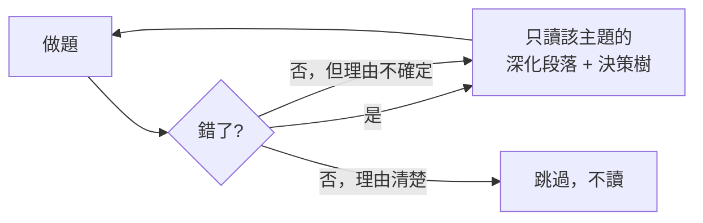

# 10 天急救計劃

> [!warning] 誰適合這份計劃
> **已有 2 年以上 AWS 實務經驗**，日常就在用 VPC、IAM、RDS、S3，只是沒有系統性對過考綱。
> **不適合**：AWS 經驗不足一年、或主要經驗在其他雲。那種情況請走 [[25 天衝刺計劃]]——10 天硬塞的結果通常是重考。

**節奏**：2.5 小時/天。**不讀完整筆記**，只讀決策樹、深化段落與速查表，其餘靠做題暴露弱點。

---

## 核心策略：以題帶讀

**這份計劃的原則是：不主動讀，讓錯題決定讀什麼。** 你的經驗已經覆蓋大部分內容，時間該花在暴露盲點上。

---

## 日程

| Day | 上午 60 分 | 下午 90 分 | 產出 |
|:--:|---|---|---|
| 1 | [[00 考試總覽]] + [[常見陷阱與誘答選項識別]] | **65 題基線模考（計時）** | 列出四個 domain 的正確率，找出最弱兩個 |
| 2 | [[決策樹 運算選型]] + [[決策樹 儲存選型]] | [[情境題庫]] Q1–Q30，逐題寫排除理由 | 錯因統計 |
| 3 | [[決策樹 資料庫選型]] + [[決策樹 訊息與事件選型]] | [[情境題庫]] Q31–Q60 | 錯因統計 |
| 4 | [[決策樹 網路與連線選型]] + [[EC2與網路]] 深化段落 | 網路與 IAM 題 40 題 | 畫出「三條路」與排錯決策樹 |
| 5 | **Domain 1 集中日**：[[EC2與IAM安全]]、[[身分聯合與應用存取]]、[[威脅偵測與邊界防護]] 深化段落 | 安全題 40 題 | 背熟安全服務一句話職責表 |
| 6 | 最弱 domain 的核心筆記（依 Day 1 結果） | 該 domain 40 題 | confidence 更新 |
| 7 | 次弱 domain 的核心筆記 | 該 domain 40 題 | confidence 更新 |
| 8 | 補讀 `#weak` 標記處 | **65 題模考 #2（計時）** | 對比 Day 1 的進步 |
| 9 | [[數字與門檻速查]] 自測 + [[選型比較與常見陷阱]] | **65 題模考 #3（計時）** | 只補最高頻錯誤 |
| 10 | [[考前 48 小時衝刺]] 的 T-24h 流程 | 休息 | — |

---

## 硬性取捨

這 10 天**明確放棄**以下內容，不要碰：

- `05-實作實驗室` 的所有 Lab（改成紙上推演，且只做 [[實作路線]] 的「權限推演」那一題）
- [[遷移與混合雲]] 的 7R 策略名詞、Outposts/Wavelength/Local Zones 細節
- ML 服務（只看 [[00 考試總覽]] 裡那張一句話對照表）
- [[資料分析與串流]] 的 EMR / Lake Formation / Data Exchange
- 所有核心筆記的**前半段**（假設你的實務經驗已覆蓋），**只讀 `# 深化` 之後**

> [!danger] 不能放棄的
> Domain 1 佔 **30%**，而實務經驗最容易漏掉的正是 **SCP / permission boundary / Cognito / GuardDuty 系列 / KMS 跨 Region** 這些「平常用不到但一定考」的東西。**Day 5 是這份計劃的核心，不要跳過。**

---

## 每天結束前的三個問題

1. 今天的錯題，**錯因**集中在哪一類？（判準 / 知識 / 數字 / 讀題 / 過度設計 / 粗心）
2. 有沒有出現「答對但理由錯」？那等同錯題。
3. 明天該讀什麼——是**錯因**告訴我的，還是我自己想讀的？（要是後者，重新想一次）

## 🔗 相關

- [[替代方案 比較與選擇]]
- [[25 天衝刺計劃]]
- [[每日追蹤模板]]
- [[考前 48 小時衝刺]]
