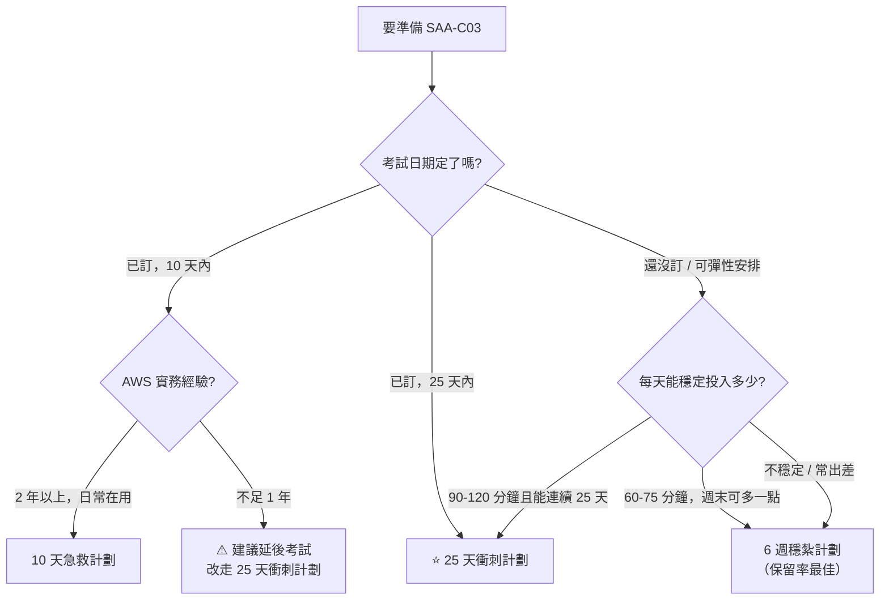

# 替代方案：比較與選擇

> [!abstract] 花 5 分鐘選對計劃
> 選錯節奏的代價比你想的大：太趕會在 Day 18 崩潰，太鬆會在 Week 4 失去動力。

---

## 🌳 選擇決策樹

---

## 📊 三份計劃對照

| | ⭐ [[25 天衝刺計劃]] | [[6 週穩紮計劃]] | [[10 天急救計劃]] |
|---|---|---|---|
| **每日投入** | 90–120 分 | 60–75 分（+ 週末 2 h） | 150 分 |
| **總時數** | 約 42 h | 約 48 h | 約 25 h |
| **前提經驗** | 有雲端/後端架構概念即可 | 同左 | **2 年以上 AWS 實務** |
| **讀法** | 逐主題讀完整筆記 | 逐主題 + **每週複習日** | **以題帶讀**，只讀決策樹與深化段落 |
| **複習次數/主題** | 1–2 次 | **4–5 次（分散）** | 依錯題決定 |
| **模考次數** | 3 次 + 2 次階段測驗 | 3 次 | 3 次 |
| **含 Lab** | 有（可砍） | 有（週末） | **無** |
| **長期保留率** | 中 | **最佳** | 低（考完會忘） |
| **失敗模式** | Day 18 左右疲乏 | 動力流失、拖成 10 週 | 盲點沒暴露就上考場 |

---

## 🎯 依「你缺什麼」選

| 你的狀況 | 建議 |
|---|---|
| 有 K8s / 微服務 / EDA 背景，但沒碰過 AWS 網路與 IAM | **25 天**。你的架構直覺是優勢，缺的是 AWS 特有的 VPC / IAM / 儲存語意，這些需要逐篇讀 |
| AWS 用得熟，但都在同一個服務範圍（例如只碰 EC2+RDS） | **10 天**，但 **Day 5 的 Domain 1 集中日不能跳** |
| 想順便把 AWS 學起來，不只是考照 | **6 週**。它是唯一有真正間隔重複的版本 |
| 公司報名了、下個月要考、平常很忙 | **25 天**，並提前砍掉 Lab 換成紙上推演 |
| 考過其他雲的架構師認證 | **10 天**，但要特別注意 AWS 的名詞陷阱（Multi-AZ ≠ DR、gateway endpoint 僅兩服務） |

---

## 🔀 中途換計劃的時機

> [!important] 換計劃不是失敗，硬撐才是
> **25 天 → 6 週**：連續**兩天**沒完成當日進度，立刻換。落後累積的罪惡感比落後本身更傷。
> **6 週 → 25 天**：Week 3 結束時若 confidence 平均已達 3.5 以上，可壓縮後三週。
> **10 天 → 25 天**：Day 1 的基線模考若正確率低於 60%，**立刻改計劃並延後考試**。10 天補不了 40% 的缺口。

---

## ⛔ 三份計劃共同的不可砍項目

無論選哪一份，這些都不能省：

1. **Domain 1（安全，30%）的完整覆蓋**——包含平常實務用不到的 SCP、permission boundary、Cognito、GuardDuty 系列、KMS 跨 Region
2. **三次 65 題計時模考**（130 分鐘，照正式規格）
3. **錯題的錯因分析**（不是重看答案，是分類錯因）
4. **[[常見陷阱與誘答選項識別]]** 至少完整讀一遍
5. **[[考前 48 小時衝刺]]** 的流程

> [!tip] 可以砍的
> Lab 實作、[[遷移與混合雲]] 的 7R 名詞、ML 服務細節、[[資料分析與串流]] 的 EMR/Lake Formation、各筆記的「真實場景陷阱」段落。

## 🔗 相關

- [[25 天衝刺計劃]]
- [[6 週穩紮計劃]]
- [[10 天急救計劃]]
- [[每日追蹤模板]]
- [[README]]
