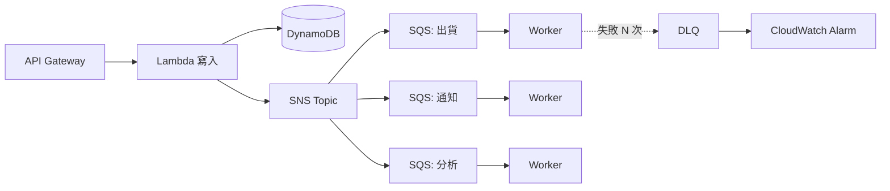

# 事件驅動與無伺服器

你的 EDA/SAGA 經驗可直接用來辨識「解耦、廣播、路由、編排」四種不同需求。

| 需求 | 典型服務 | 為何 |
|---|---|---|
| 消費者排隊、緩衝尖峰、重試 | SQS | producer 與 worker 解耦；可配 DLQ |
| 一則消息廣播多訂閱者 | SNS | topic fan-out；訂閱 SQS 可保留每個 consumer 的緩衝 |
| 依事件內容/來源路由，跨服務或 SaaS | EventBridge | 規則與 event bus，仍需設計失敗/重試 |
| 有狀態多步工作流程 | Step Functions | 執行步驟、分支、錯誤處理；業務補償需自行設計 |
| 短時事件運算 | Lambda | 注意 timeout、並行與 downstream DB 連線 |
| 長時間/特定 runtime 或容器 | ECS/Fargate 或 EC2 | 比較維運、彈性與成本 |

訂單流程：API → DB 寫入 → 發布事件（要設計可靠發布，例如 outbox）→ SQS 工作者 → DLQ/警報。SNS + SQS 讓多組消費者各自保留消息；EventBridge 適合進階事件路由；Step Functions 適合明確步驟的 orchestration。這些可以組合，並非互斥。

**冪等性**：SQS standard 可能重複、通常不保證嚴格順序；FIFO 提供排序及去重能力，但仍要依語義設計冪等 consumer。DLQ 不是自動修復，要有觀測與重送機制。若需要 Kafka 生態，評估 MSK，但 SAA 先掌握需求與管理負擔。

同一 API 可以由 API Gateway + Lambda，或 ALB + ECS/EC2 實作；比較持續負載、執行時間、控制需求和維運。延伸 [[EC2與負載平衡及擴展]]、[[成本與可觀測性]]。

---

# 深化

## SQS 的四個機制（考題幾乎都繞著這些打轉）

| 機制 | 作用 | 題幹關鍵字 |
|---|---|---|
| **Visibility timeout** | 訊息被取出後**暫時隱藏**的時間；沒在期限內刪除就會重新可見 | **`messages are being processed more than once`** → visibility timeout **太短**，應調長到大於處理時間 |
| **Long polling** | `ReceiveMessage` 最多等待 20 秒才回應 | **`reduce cost`**、**`reduce empty responses`**、`reduce API calls` → **啟用 long polling** |
| **DLQ** | 超過 `maxReceiveCount` 的訊息移到死信佇列 | `isolate messages that fail repeatedly`、`prevent poison pill blocking the queue` |
| **Delay queue / message timer** | 延後訊息可見時間（最長 15 分鐘） | `delay processing` |

**關鍵數字**：訊息保留 **預設 4 天、最長 14 天**；visibility timeout **預設 30 秒、最長 12 小時**；訊息大小上限 **256 KB**（更大要用 **S3 + Extended Client Library**，題目說「要送 1 GB 的檔案給 worker」→ 訊息只放 S3 指標）。

> [!danger] Standard vs FIFO
> | | Standard | FIFO |
> |---|---|---|
> | 順序 | **不保證** | **嚴格保證**（同一 message group 內） |
> | 傳遞 | **至少一次**（可能重複） | **恰好一次**（5 分鐘去重窗） |
> | 吞吐 | 幾乎無限 | 較低（可用 high throughput 模式提升） |
>
> 題幹出現 **`order must be preserved`**、**`no duplicates`**、`financial transactions in sequence` → **FIFO**。
> 沒提到順序就選 **Standard**（吞吐與成本較佳）——選 FIFO 是過度設計。

## SNS 補充

- **Fan-out 標準模式**：`SNS → 多個 SQS`。每個 consumer 有自己的佇列與重試緩衝，**是「一份事件多方處理」的標準答案**。
- **訂閱目標**：SQS、Lambda、HTTP(S)、Email、SMS、行動推播、**Data Firehose**。
- **FIFO topic**：需搭配 FIFO queue。
- **Message filtering**：訂閱層級的過濾政策，讓不同訂閱者只收到相關訊息——避免「每個 consumer 都收到全部再自己丟掉」。

> [!tip] SNS vs EventBridge（高頻）
> **SNS**：單純 **pub/sub 廣播**，高吞吐、低延遲、便宜。
> **EventBridge**：**事件匯流排 + 規則路由**。具備 **schema registry**、**事件重播（archive & replay）**、**排程（scheduler）**、**與 SaaS 夥伴及 AWS 服務原生整合**。
> 題幹出現 `route events based on content`、`integrate with third-party SaaS`、`schedule`、`replay past events`、`react to AWS service state changes` → **EventBridge**。
> 只是「通知多個訂閱者」→ **SNS**。

## EventBridge 補充

- **Default event bus** 接收 AWS 服務事件（EC2 狀態變化、S3 事件、CodePipeline…）；**custom bus** 給自己的應用；**partner bus** 給 SaaS。
- **EventBridge Scheduler**：取代 CloudWatch Events 排程，支援 cron/rate 與一次性排程，可直接呼叫上百種 API。題目說「每天凌晨執行某個作業」→ EventBridge Scheduler（+ Lambda / Step Functions）。
- **Archive & Replay**：保存事件並可重播，這是 SNS 沒有的能力。
- **Pipes**：point-to-point 的來源→目標串接（含過濾與轉換）。

## Step Functions：兩種工作流程

| | **Standard** | **Express** |
|---|---|---|
| 最長執行 | **1 年** | **5 分鐘** |
| 執行模型 | 恰好一次 | 至少一次 |
| 計費 | 按**狀態轉換次數** | 按**執行次數與時間** |
| 適用 | 長時間、需要稽核歷史的業務流程 | 高頻、短時的串流/IoT 事件處理 |

> [!note] 與你的 SAGA 經驗對接
> Step Functions 的 **error handling（Retry / Catch）** 與 **parallel / map state** 可以實作 orchestration-based SAGA 的骨架，但**補償交易（compensating transaction）的業務邏輯仍要自己寫**——原筆記這點已正確指出。考試層面只要記住：**「多步驟、有狀態、需要視覺化流程與錯誤處理」→ Step Functions**，而不是「用 Lambda 互相呼叫」。

## API Gateway：三種 API

| 類型 | 特性 | 何時選 |
|---|---|---|
| **HTTP API** | **更便宜、延遲更低**、功能較精簡 | **預設首選**（若不需要進階功能）。`lowest cost`、`simple proxy to Lambda` |
| **REST API** | 功能完整：使用量方案、API key、請求驗證、WAF、快取、私有端點 | 需要 `usage plans`、`API keys`、`caching`、`WAF` |
| **WebSocket API** | 雙向長連線 | `real-time chat`、`push notifications to clients` |

**其他考點**：**Throttling / Usage plan + API key** 用於限制第三方呼叫量；**Caching** 降低後端負載（REST API）；**授權方式**有 IAM、**Cognito User Pool authorizer**、**Lambda authorizer**（自訂邏輯，見 [[身分聯合與應用存取]]）；**Private API** 只能從 VPC 經 interface endpoint 存取。

## 非同步處理的可靠性設計

這張圖是 SAA 最常出現的「解耦」正解形狀：**SNS 做 fan-out，每個下游各自一個 SQS 緩衝，各自的 DLQ 與告警**。相對地，**讓 SNS 直接觸發 Lambda** 少了緩衝與重試隔離，題目若強調「某個下游處理很慢/會失敗，不能影響其他下游」就要選 SNS+SQS。

> [!warning] Lambda 的非同步失敗處理
> Lambda 非同步呼叫預設**重試 2 次**，之後訊息就消失。要保留失敗事件必須設定 **DLQ** 或 **Lambda Destinations**。題目說「失敗的事件不能遺失」→ 這兩者之一。

## 與其他筆記的接點

Lambda/Fargate 的執行限制與併發模式：[[運算與容器選型]]；串流與佇列的分界（Kinesis vs SQS）：[[資料分析與串流]]；API 的身分驗證：[[身分聯合與應用存取]]。

參考 [[官方資料]]；返回 [[考試藍圖與配分]]。
