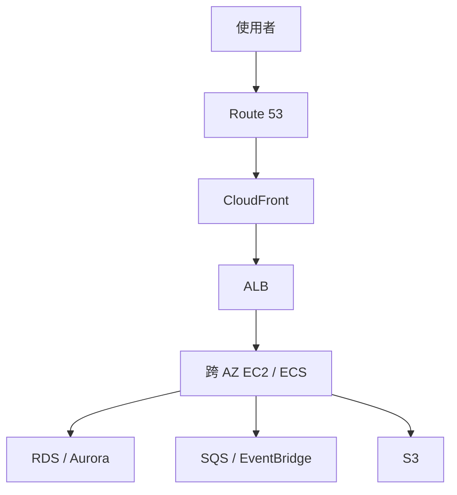

# 服務關聯總圖

## 以一個電商訂單系統為例

這只是候選架構：CloudFront 可以加速適合快取的內容；若動態請求不適合快取，仍可經 ALB 到應用。儲存、DB、佇列各自服務不同資料需求。

| 追蹤路徑 | 問題 | 延伸筆記 |
|---|---|---|
| 使用者到應用 | DNS 如何指向服務、誰終止 TLS、如何分流與健康檢查？ | [[DNS與全球流量]] → [[EC2與負載平衡及擴展]] → [[EC2與網路]] |
| 應用到資料 | 磁碟、共享檔、物件、交易 DB 各適合什麼？ | [[EC2與儲存]] → [[S3與資料生命週期]] → [[資料庫與快取]] |
| 應用到 AWS API | 網路可達是否等於可存取？身分、資源政策、金鑰如何配合？ | [[EC2與IAM安全]] → [[EC2與網路]] |
| 事件與故障 | 尖峰、失敗、AZ 故障、區域故障如何處理？ | [[事件驅動與無伺服器]] → [[高可用備援與災難復原]] |
| 觀測與費用 | 哪裡付費、看哪些指標、何時縮容？ | [[成本與可觀測性]] |

## 從需求回推

`高可用 HTTP API` → ALB + target group + 多 AZ ASG；狀態放在外部持久服務。`private subnet 訪問 S3` → S3 gateway endpoint + IAM/bucket policy（依限制）；`共享 Linux 檔案` → EFS mount target/NFS；`延遲解耦` → SQS；`global static files` → S3 + CloudFront + OAC。這些是常見解法，仍需逐題檢查可用性、資料一致性及成本條件。

返回 [[00-開始這裡]]。
