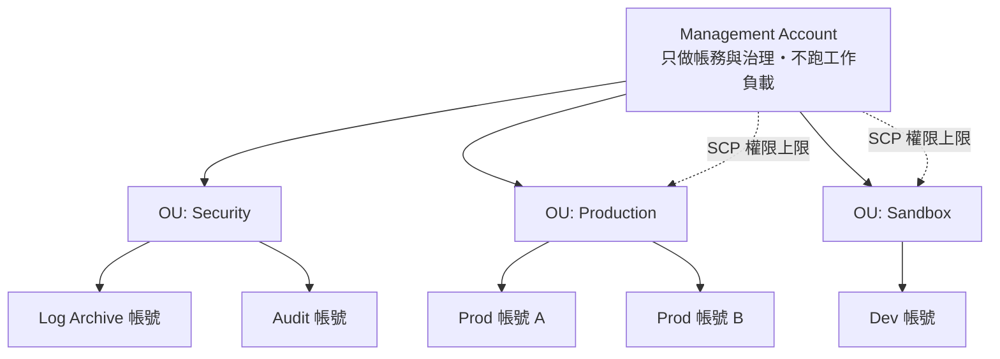

# 治理與合規

> [!abstract] 缺漏補完
> 原筆記把 Organizations/SCP 塞在 [[EC2與IAM安全]] 的一個段落，但官方 **Management and Governance** 是獨立且題量不小的類別，而且 **Systems Manager、AWS Config、AWS Backup 都是高頻正解**。這篇把「多帳號治理」與「營運自動化」獨立出來。

## 多帳號架構

| 元件 | 作用 | 關鍵細節 |
|---|---|---|
| **AWS Organizations** | 帳號樹、OU、合併帳務 | **合併帳務**帶來級距折扣、**RI / Savings Plans 可跨帳號共享** |
| **SCP**（Service Control Policy） | 設定**權限上限**，不授予權限 | **不影響管理帳號**；即使 IAM 給了 Allow，SCP 沒放行也不行 |
| **RCP**（Resource Control Policy） | 對**資源**設定存取上限 | 較新，與 SCP 互補（SCP 管 principal，RCP 管 resource） |
| **Control Tower** | 一鍵建立符合最佳實務的 landing zone | **preventive guardrail = SCP**；**detective guardrail = Config rule**；Account Factory 標準化開帳號 |
| **AWS RAM** | 跨帳號**共享資源**（subnet、TGW、Resolver rule） | 共享 VPC subnet 讓多帳號共用同一網路 |
| **Service Catalog** | 發布經核准的產品範本給使用者自助部署 | `standardized`、`approved`、`self-service` |

> [!danger] SCP 的三個必考結論
> **(1) SCP 只做減法。** 它是「權限天花板」，**永遠不會授予任何權限**。帳號內仍需 IAM policy 明確 Allow。
> **(2) SCP 不適用於管理帳號（management account）。** 所以最佳實務是管理帳號不放工作負載。
> **(3) 有效權限 = IAM policy ∩ SCP ∩ permission boundary ∩ resource policy，任何一層 explicit Deny 直接否決。**

## 稽核與合規三兄弟（最常混淆）

| 服務 | 回答的問題 | 題幹關鍵字 |
|---|---|---|
| **CloudTrail** | **誰**在**什麼時候**呼叫了**哪個 API**？ | `who made the API call`、`audit`、`governance`、`forensics`、`compliance audit trail` |
| **AWS Config** | 我的資源**現在**的設定是什麼？**符合規範嗎**？**何時被改過**？ | `configuration history`、`compliance`、`drift`、`ensure all EBS volumes are encrypted` |
| **CloudWatch** | 系統**跑得如何**？效能指標與日誌 | `metrics`、`alarm`、`monitor performance`、`logs` |

> [!danger] 一句話分辨
> **CloudTrail 記錄「動作」，Config 記錄「狀態」，CloudWatch 記錄「表現」。**
> 「稽核是誰刪了這個 S3 bucket」→ **CloudTrail**。
> 「確保所有 bucket 都沒開公開存取，違規就自動修正」→ **Config**（+ remediation）。
> 「CPU 超過 80% 要告警」→ **CloudWatch**。

**CloudTrail 補充**：預設記錄 **management events**；**data events**（S3 物件層級 `GetObject`、Lambda `Invoke`）**預設關閉**且會另外收費——題目說「需要稽核個別物件的讀取」記得要啟用 data events。**Log file validation** 提供防竄改雜湊；**Organization trail** 一次涵蓋所有成員帳號；日誌通常集中送到專用 Log Archive 帳號的 S3（搭配 **Object Lock** 達成 WORM）。

**Config 補充**：**conformance pack** 打包多條規則；**remediation action** 可自動修復（呼叫 SSM Automation）；**aggregator** 跨帳號跨 Region 彙整合規狀態。

## Systems Manager（SSM）

SAA 考得比多數人預期的多，尤其是 Session Manager 與 Parameter Store。

| 功能 | 用途 | 題幹關鍵字 |
|---|---|---|
| **Session Manager** | 不開任何**入站端口**、不需 bastion、不需 SSH key 就能連進 EC2，操作全程記錄 | `without opening inbound ports`、`no bastion host`、`no SSH keys`、`audit shell sessions` |
| **Parameter Store** | 組態參數與密鑰儲存（SecureString 走 KMS） | `store configuration`、`free`、`hierarchical` |
| **Patch Manager** | 自動修補 OS/應用 | `patch compliance`、`maintenance window` |
| **Run Command** | 對大量實例執行命令，免 SSH | `run scripts across fleet` |
| **Automation** | 維運 runbook 自動化 | `automate remediation` |
| **Fleet Manager / Inventory** | 資產盤點與管理 | `inventory of installed software` |

> [!important] Session Manager 是「無 bastion」題的標準答案
> 題幹只要出現「管理 private subnet 的 EC2 但**不想開 22 port / 不想維護 bastion host**」，答案就是 **Session Manager**。
> 前提條件（Lab 會踩到）：實例要有 **SSM Agent**、要有帶 `AmazonSSMManagedInstanceCore` 的 **instance profile**、而且要有到 SSM API 的**網路路徑**（NAT gateway 或 **interface endpoint**：`ssm`、`ssmmessages`、`ec2messages`）。見 [[EC2與網路]]。

> [!tip] Parameter Store vs Secrets Manager（高頻比較）
> | | Parameter Store | Secrets Manager |
> |---|---|---|
> | 費用 | Standard 層**免費** | **每個 secret 按月計費** |
> | 自動輪替 | ❌（要自己寫 Lambda） | ✅ **內建自動輪替**，與 RDS 深度整合 |
> | 跨帳號共享 | ❌ | ✅ |
> | 隨機產生密碼 | ❌ | ✅ |
>
> 題幹出現 **`automatic rotation`** → **Secrets Manager**。只說「安全存放組態、成本最低」→ **Parameter Store**。

## AWS Backup

集中式備份，取代「每個服務各自寫 snapshot 腳本」。

- **涵蓋範圍**：EBS、EFS、FSx、RDS、Aurora、DynamoDB、Storage Gateway、EC2、S3、Neptune、DocumentDB 等。
- **Backup plan**：排程、保留期、生命週期（自動轉冷儲存）。
- **跨 Region / 跨帳號複製**：DR 與勒索軟體防護的關鍵。
- **Vault Lock**：**WORM（write once read many）**。**Compliance mode 一旦生效連 root 都無法刪除或縮短保留期**——題幹出現 `immutable backups`、`cannot be deleted even by administrators`、`ransomware protection`、`regulatory retention` → **AWS Backup Vault Lock**。

> [!tip] 題型辨識
> 「要用**一套政策**集中管理多個服務、多個帳號的備份與保留」→ **AWS Backup**（不是各服務自己的 snapshot 排程，那是維運負擔高的錯誤選項）。

## 成本與最佳化建議工具

| 服務 | 給什麼 |
|---|---|
| **Trusted Advisor** | 五大支柱檢查（成本、效能、安全、容錯、服務限額）。**完整檢查需要 Business / Enterprise Support 方案** |
| **Compute Optimizer** | 依實際使用率給 **EC2 / EBS / Lambda / ECS on Fargate 的規格建議** |
| **Well-Architected Tool** | 依五（六）大支柱做架構自評 |
| **AWS Health Dashboard** | AWS 服務事件與**影響你帳號的個別事件** |
| **License Manager** | 追蹤 BYOL 授權用量，防止超用 |
| **AWS Artifact** | 下載合規報告（SOC、PCI、ISO） |

## IaC

**CloudFormation**：宣告式範本、**change set** 先看變更、**drift detection** 偵測手動改動、**StackSets** 一次部署到**多帳號多 Region**（與 Organizations 整合）。題幹說「在所有帳號所有 Region 部署同一組基準資源」→ **CloudFormation StackSets**。

## 與其他筆記的接點

- IAM policy 評估邏輯與跨帳號信任：[[EC2與IAM安全]]、[[身分聯合與應用存取]]
- 威脅偵測發現後的處理：[[威脅偵測與邊界防護]]
- 備份與 DR 策略的關係：[[高可用備援與災難復原]]
- 成本工具與帳務：[[成本與可觀測性]]

---

參考 [[官方資料]]；返回 [[服務關聯總圖]]、[[考試藍圖與配分]]。
