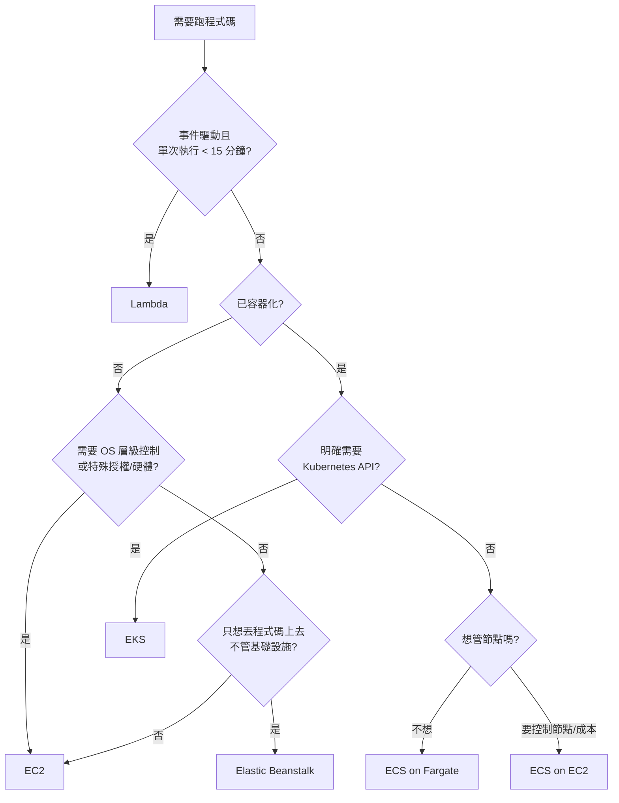

# 運算與容器選型

> [!abstract] 給你的特別提醒
> 你有 Kubernetes 與微服務背景，這在架構思維上是優勢，但在考場上是**陷阱**：SAA 的容器題幾乎都帶著 `minimal operational overhead` 這個限制，而 **EKS 在 AWS 的維運負擔評級中高於 ECS/Fargate**。除非題幹明確出現 `Kubernetes`、`kubectl`、`Helm`、`existing K8s workloads`、`multi-cloud portability`，否則 EKS 通常是干擾項。

## 運算選型決策樹

| 選項 | 何時是正解 | 何時是干擾項 |
|---|---|---|
| **Lambda** | 事件觸發、間歇性流量、`least operational overhead`、`pay only for what you use` | 執行 > 15 分鐘、需要持續運行、需要 GPU/特殊 runtime |
| **Fargate** | 容器 + 不想管節點 + 變動負載 | 需要 GPU、需要 daemon 型 sidecar、極大規模下成本考量 |
| **ECS on EC2** | 容器 + 要控制 instance 類型/成本（可用 Spot/RI） | 題目強調零維運 |
| **EKS** | **題幹出現 Kubernetes 字眼** | 其餘容器題 |
| **EC2** | 需要 OS 控制、BYOL、legacy、特殊硬體 | `serverless`、`no servers to manage` |
| **Batch** | 批次計算作業排程、大量平行 job | 線上請求服務 |
| **Elastic Beanstalk** | 「快速部署既有 web app，不想碰基礎設施，但仍要 EC2」 | 需要細緻架構控制 |
| **App Runner** | 從原始碼/容器直接跑 web service，最簡 | 非 HTTP 工作負載 |

## EC2 購買模式（成本題核心，Domain 4 必考）

| 模式 | 折扣 | 承諾 | 題幹關鍵字 |
|---|---|---|---|
| **On-Demand** | 基準價 | 無 | `unpredictable`、`short-term`、`spiky`、`cannot be interrupted` 且無法預測 |
| **Savings Plans** | 最高約 72% | 1 或 3 年，承諾**每小時金額** | `steady state`、`commit`、`flexibility across instance families` |
| **Reserved Instances** | 最高約 72% | 1 或 3 年，綁定**規格** | `predictable steady usage`、`specific instance type`、需要 **capacity reservation** 時選 zonal RI |
| **Spot** | 最高約 90% | 無，**可能被中斷（2 分鐘通知）** | `fault-tolerant`、`interruptible`、`flexible start/end time`、`batch`、`stateless` |
| **Dedicated Instance** | 加價 | 專用硬體（實例層級隔離） | `compliance requires dedicated hardware` |
| **Dedicated Host** | 加價 | 專用**實體主機**，可見 socket/core | `BYOL`、`per-socket / per-core licensing`（Windows Server、Oracle） |
| **Capacity Reservation** | 無折扣 | 保留容量，隨時取消 | `guarantee capacity in a specific AZ`（可與 SP 疊加折扣） |

> [!important] 兩組最常混淆的比較
> **Savings Plans vs RI**：兩者折扣相近。**Compute Savings Plans 最有彈性**（跨 instance family、跨 region、甚至涵蓋 **Fargate 與 Lambda**）；EC2 Instance Savings Plans 折扣略高但鎖定 family + region；Standard RI 最僵硬但可在 Marketplace 轉售。題目說「要折扣又要保有更換機型的彈性」→ **Compute Savings Plans**。
>
> **Dedicated Instance vs Dedicated Host**：只有 **Dedicated Host** 讓你看到實體 socket/core 數量，所以**「既有授權要按 socket/core 計算（BYOL）」一定是 Dedicated Host**。只說「法規要求不與其他客戶共用硬體」→ Dedicated Instance 就夠。

> [!tip] Spot 的安全用法
> ASG 的 **mixed instances policy** 可以設定「基準 N 台 On-Demand + 其餘用 Spot」。題目問「降低成本但要維持基本可用性」→ 這個組合是標準答案，而不是全 Spot。

## Placement Groups（效能題會考）

| 類型 | 擺放方式 | 用途 | 限制 |
|---|---|---|---|
| **Cluster** | 擠在同一機架/同 AZ | 極低延遲、高吞吐（HPC、緊耦合運算） | **單一 AZ**，AZ 故障全滅 |
| **Spread** | 分散到不同底層硬體 | 少量關鍵實例要避免同時故障 | 每 AZ 每群組**最多 7 台** |
| **Partition** | 分成多個 partition，各自獨立硬體 | 分散式系統感知拓樸（HDFS、Kafka、Cassandra） | 每 AZ 最多 **7 個 partition** |

> [!warning] 記憶點
> `lowest network latency / highest throughput between instances` → **Cluster**
> `reduce correlated failures for a small number of critical instances` → **Spread**
> `large distributed and replicated workload`（點名 Hadoop/Cassandra/Kafka）→ **Partition**
> 另外：**EFA（Elastic Fabric Adapter）** 搭配 Cluster placement group 用於 HPC/MPI；一般網路加速是 **ENA**。

## Auto Scaling 深入

Launch template 定義「長什麼樣」，ASG 定義「要幾台、放哪裡、何時增減」。

**擴縮政策類型**

| 政策 | 行為 | 何時選 |
|---|---|---|
| **Target tracking** | 維持某指標在目標值（如平均 CPU 50%） | **預設首選**，最簡單，`maintain average utilization` |
| **Step scaling** | 依警報超標幅度分級調整 | 需要對不同負載強度有不同反應 |
| **Simple scaling** | 單一調整 + 冷卻期 | 舊做法，考試中通常不是最佳解 |
| **Scheduled** | 按時間表 | `known traffic pattern`、`every weekday at 9am` |
| **Predictive** | 機器學習預測週期性負載，**提前**擴容 | `recurring pattern` 且**啟動時間長**、要避免擴容延遲 |

**四個容易被考的機制**

- **Health check type**：預設只看 **EC2 status check**。若應用掛了但 OS 還活著，ASG 不會替換——必須把 health check type 設為 **ELB**，ASG 才會依 target group 健康狀態替換實例。這是高頻考點。
- **Lifecycle hook**：在實例 `Pending` 或 `Terminating` 時暫停，讓你做初始化或**優雅排空/擷取日誌**。題目說「終止前要先把日誌上傳」→ lifecycle hook。
- **Warm pool**：預先啟動並停止一批實例，縮短擴容時間。題目說「應用啟動要 10 分鐘，擴容太慢」→ warm pool（或 predictive scaling）。
- **Instance refresh**：滾動替換實例以套用新 AMI/launch template，不必自己寫流程。

> [!note] ASG 的邊界
> ASG 保證**容量與健康替換**，不保證**資料狀態**。session、上傳檔、快取都必須外部化（[[EC2與儲存]]、[[資料庫與快取]]）。ASG 也**不會**擴大單一 RDS writer 的寫入容量。

## 容器：ECS 的考點

**兩種 IAM 角色是經典陷阱**

| 角色 | 誰用 | 做什麼 |
|---|---|---|
| **Task execution role** | **ECS agent / Fargate 基礎設施** | 拉 ECR 映像、寫 CloudWatch Logs、讀 Secrets Manager 注入環境變數 |
| **Task role** | **容器內的應用程式** | 應用呼叫 AWS API（讀 S3、寫 DynamoDB） |

> [!danger] 這題一定會出現
> 「容器啟動失敗，無法從 ECR 拉映像」→ **task execution role** 權限不足。
> 「應用執行中呼叫 S3 得到 AccessDenied」→ **task role** 權限不足。
> 兩者搞混是最常見的失分點。同理，EKS 上應用取得 AWS 權限的機制是 **IRSA（IAM Roles for Service Accounts）** 或較新的 **EKS Pod Identity**，不是給節點 instance role（給節點等於所有 Pod 共用權限，違反最小權限）。

**其他 ECS 要點**：`awsvpc` 網路模式讓每個 task 有自己的 ENI 與 SG（Fargate 強制使用）；**ECR** 支援映像掃描、lifecycle policy 清理舊映像、跨 Region 複寫；**capacity provider** 讓 ECS 自動管理 EC2 容量或使用 Fargate Spot。

## Lambda 深入

| 限制 | 數值 | 考點 |
|---|---|---|
| 最長執行時間 | **15 分鐘** | 超過就不能用 Lambda → Fargate/Batch/Step Functions |
| 記憶體 | 128 MB – **10 GB** | CPU 隨記憶體等比增加，**調大記憶體可能反而更便宜**（跑更快） |
| `/tmp` 暫存 | 512 MB – **10 GB** | 需要大量暫存檔時要設定 |
| 部署包 | 50 MB（zip 直傳）/ 250 MB（解壓後）/ **10 GB**（容器映像） | 大型相依 → 容器映像或 Layer |
| 預設併發 | 每帳號每 Region **1,000** | 可申請調高 |

- **Reserved concurrency**：為某函式**保留**併發額度（同時也是上限），避免它吃光帳號額度拖垮其他函式。
- **Provisioned concurrency**：**預先初始化**執行環境，消除冷啟動。題目說「延遲敏感、要消除 cold start」→ 這個（**不是** reserved concurrency，那是隔離用的）。
- **SnapStart**：針對 Java/Python/.NET 的冷啟動最佳化，免費替代方案。
- **VPC 內 Lambda**：可存取私有資源；要出網際網路仍需 **NAT gateway**（Lambda 在 VPC 內沒有公網路徑）。存取 S3/DynamoDB 則可用 gateway endpoint，見 [[EC2與網路]]。
- **Lambda@Edge vs CloudFront Functions**：前者跑在 Regional edge cache、可做重量級處理（存取網路、較長執行）；後者跑在 edge location、**只做輕量 header/URL 改寫**、延遲次毫秒、成本更低。題目說「簡單的 URL 重寫/header 操作、極低延遲」→ **CloudFront Functions**。

## 與其他筆記的接點

- 前面的流量入口與健康檢查：[[EC2與負載平衡及擴展]]
- 容器/函式的網路可達性與私有存取：[[EC2與網路]]
- 事件來源與工作流程編排：[[事件驅動與無伺服器]]
- 購買模式的帳務呈現與最佳化工具：[[成本與可觀測性]]
- 執行身分與最小權限：[[EC2與IAM安全]]

---

參考 [[官方資料]]；返回 [[服務關聯總圖]]、[[考試藍圖與配分]]。
