# 00 服務索引

> [!abstract] 這篇的用途
> **反查表**：在題目或模考中看到某個服務名，用這裡找到它在哪篇筆記。
> 若你要的是「依考綱權重看覆蓋率」，請看 [[00 考試總覽]] 的 in-scope 對照表。
>
> **⬛ = 高頻必熟；⬜ = 認得定位即可**（通常只當干擾項或一句話帶過）。

---

## 🗺️ SAA 技術棧全景

先看整體再查表。這張圖只列**每個類別的代表性服務**，完整清單在下方各節。

```mermaid
flowchart LR
    ROOT(("SAA-C03<br/>技術棧"))

    ROOT --> CP["🖥 運算"]
    ROOT --> ST["💾 儲存"]
    ROOT --> NW["🌐 網路與交付"]
    ROOT --> DB["🗄 資料"]
    ROOT --> SE["🔐 安全"]
    ROOT --> IN["🔀 整合"]
    ROOT --> GV["🏛 治理與成本"]
    ROOT --> HY["🌉 遷移與混合"]

    CP --> CP1["EC2・ASG<br/>Launch template"]
    CP --> CP2["ELB<br/>ALB・NLB・GWLB"]
    CP --> CP3["容器<br/>ECS・EKS・Fargate・ECR"]
    CP --> CP4["無伺服器<br/>Lambda・Batch"]

    ST --> ST1["區塊<br/>EBS・Instance Store"]
    ST --> ST2["檔案<br/>EFS・FSx 四型"]
    ST --> ST3["物件<br/>S3・Glacier"]
    ST --> ST4["備份<br/>AWS Backup"]

    NW --> NW1["VPC<br/>subnet・SG/NACL・NAT"]
    NW --> NW2["私有存取<br/>endpoint・PrivateLink・TGW"]
    NW --> NW3["全球流量<br/>Route 53・CloudFront・GA"]

    DB --> DB1["關聯式<br/>RDS・Aurora・RDS Proxy"]
    DB --> DB2["NoSQL<br/>DynamoDB・DAX"]
    DB --> DB3["快取<br/>ElastiCache"]
    DB --> DB4["分析與串流<br/>Kinesis・Athena・Redshift"]

    SE --> SE1["身分<br/>IAM・STS・Cognito<br/>Identity Center"]
    SE --> SE2["加密<br/>KMS・ACM・Secrets Manager"]
    SE --> SE3["偵測<br/>GuardDuty・Inspector・Macie"]
    SE --> SE4["防護<br/>WAF・Shield・Network Firewall"]

    IN --> IN1["佇列與廣播<br/>SQS・SNS"]
    IN --> IN2["事件與編排<br/>EventBridge・Step Functions"]
    IN --> IN3["API<br/>API Gateway・Amazon MQ"]

    GV --> GV1["多帳號<br/>Organizations・SCP・Control Tower"]
    GV --> GV2["組態與稽核<br/>Config・CloudTrail・SSM"]
    GV --> GV3["觀測與成本<br/>CloudWatch・Budgets<br/>Cost Explorer"]

    HY --> HY1["資料搬遷<br/>DataSync・Snow・DMS"]
    HY --> HY2["混合存取<br/>Storage Gateway<br/>Direct Connect・VPN"]

    classDef root fill:#232f3e,stroke:#131a22,color:#fff,font-weight:bold
    classDef cat fill:#ff9900,stroke:#c77700,color:#16191f,font-weight:bold
    classDef leaf fill:#f2f3f3,stroke:#879196,color:#16191f
    class ROOT root
    class CP,ST,NW,DB,SE,IN,GV,HY cat
    class CP1,CP2,CP3,CP4,ST1,ST2,ST3,ST4,NW1,NW2,NW3,DB1,DB2,DB3,DB4,SE1,SE2,SE3,SE4,IN1,IN2,IN3,GV1,GV2,GV3,HY1,HY2 leaf
```

> [!tip] 用法
> **考前自測**：遮住葉節點，看著八個類別能不能自己列出下面的服務。
> 這八個類別正好對應 `03-核心服務` 的八個子資料夾，所以講得出來就代表你知道去哪裡找。

---

## 🖥 運算 `03-核心服務/運算`

| 服務 | 頻度 | 筆記 |
|---|:-:|---|
| Amazon EC2 | ⬛ | [[運算與容器選型]] |
| EC2 Auto Scaling | ⬛ | [[EC2與負載平衡及擴展]] |
| Elastic Load Balancing（ALB / NLB / GWLB） | ⬛ | [[EC2與負載平衡及擴展]] |
| AWS Lambda | ⬛ | [[運算與容器選型]]、[[事件驅動與無伺服器]] |
| AWS Fargate | ⬛ | [[運算與容器選型]] |
| Amazon ECS / ECR | ⬛ | [[運算與容器選型]] |
| Amazon EKS | ⬛ | [[運算與容器選型]] |
| AWS Batch | ⬜ | [[運算與容器選型]] |
| AWS Elastic Beanstalk | ⬜ | [[運算與容器選型]] |
| AWS Outposts / Wavelength / Local Zones | ⬜ | [[遷移與混合雲]] |
| VMware Cloud on AWS | ⬜ | [[遷移與混合雲]] |

## 💾 儲存 `03-核心服務/儲存`

| 服務 | 頻度 | 筆記 |
|---|:-:|---|
| Amazon S3 / S3 Glacier | ⬛ | [[S3與資料生命週期]] |
| Amazon EBS | ⬛ | [[EC2與儲存]] |
| Amazon EFS | ⬛ | [[EC2與儲存]] |
| Amazon FSx（Windows / Lustre / ONTAP / OpenZFS） | ⬛ | [[EC2與儲存]] |
| Instance Store | ⬛ | [[EC2與儲存]] |
| AWS Storage Gateway | ⬛ | [[遷移與混合雲]] |
| AWS Backup | ⬛ | [[治理與合規]] |

## 🌐 網路與內容交付 `03-核心服務/網路`

| 服務 | 頻度 | 筆記 |
|---|:-:|---|
| Amazon VPC（subnet、route table、SG、NACL） | ⬛ | [[EC2與網路]] |
| NAT Gateway / Internet Gateway / Egress-Only IGW | ⬛ | [[EC2與網路]] |
| VPC Endpoint（gateway / interface） | ⬛ | [[EC2與網路]] |
| AWS PrivateLink | ⬛ | [[EC2與網路]] |
| VPC Peering / Transit Gateway | ⬛ | [[EC2與網路]] |
| Amazon Route 53 | ⬛ | [[DNS與全球流量]] |
| Route 53 Resolver（inbound / outbound endpoint） | ⬛ | [[遷移與混合雲]] |
| Amazon CloudFront | ⬛ | [[DNS與全球流量]] |
| AWS Global Accelerator | ⬛ | [[DNS與全球流量]] |
| AWS Direct Connect / Site-to-Site VPN | ⬛ | [[遷移與混合雲]] |
| AWS Client VPN | ⬜ | [[遷移與混合雲]] |
| VPC Flow Logs / Reachability Analyzer | ⬛ | [[威脅偵測與邊界防護]] |

## 🗄 資料 `03-核心服務/資料`

| 服務 | 頻度 | 筆記 |
|---|:-:|---|
| Amazon RDS / RDS Proxy | ⬛ | [[資料庫與快取]] |
| Amazon Aurora / Aurora Serverless / Global Database | ⬛ | [[資料庫與快取]] |
| Amazon DynamoDB / DAX / Global Tables | ⬛ | [[資料庫與快取]] |
| Amazon ElastiCache（Redis / Valkey / Memcached） | ⬛ | [[資料庫與快取]] |
| Amazon Redshift / Redshift Spectrum | ⬛ | [[資料分析與串流]] |
| Amazon Kinesis Data Streams | ⬛ | [[資料分析與串流]] |
| Amazon Data Firehose | ⬛ | [[資料分析與串流]] |
| Amazon Athena / AWS Glue | ⬛ | [[資料分析與串流]] |
| Amazon OpenSearch Service | ⬛ | [[資料分析與串流]] |
| Amazon EMR / MSK | ⬜ | [[資料分析與串流]] |
| Lake Formation / Data Exchange / Amazon Quick / AppFlow | ⬜ | [[資料分析與串流]] |
| DocumentDB / Neptune / Keyspaces / Timestream / QLDB | ⬜ | [[資料庫與快取]] |

## 🔐 安全 `03-核心服務/安全`

| 服務 | 頻度 | 筆記 |
|---|:-:|---|
| IAM（user / group / role / policy / instance profile） | ⬛ | [[EC2與IAM安全]] |
| AWS STS / cross-account / External ID | ⬛ | [[身分聯合與應用存取]] |
| IAM Identity Center | ⬛ | [[身分聯合與應用存取]] |
| Amazon Cognito（User Pool / Identity Pool） | ⬛ | [[身分聯合與應用存取]] |
| AWS Directory Service | ⬜ | [[身分聯合與應用存取]] |
| AWS RAM / IAM Roles Anywhere / Access Analyzer | ⬜ | [[身分聯合與應用存取]] |
| AWS KMS | ⬛ | [[威脅偵測與邊界防護]] |
| AWS Secrets Manager | ⬛ | [[治理與合規]] |
| AWS Certificate Manager (ACM) | ⬛ | [[DNS與全球流量]]、[[EC2與IAM安全]] |
| AWS WAF / Shield | ⬛ | [[威脅偵測與邊界防護]] |
| Amazon GuardDuty / Inspector / Macie | ⬛ | [[威脅偵測與邊界防護]] |
| AWS Network Firewall / Firewall Manager | ⬛ | [[威脅偵測與邊界防護]] |
| Security Hub / Detective / CloudHSM / Artifact | ⬜ | [[威脅偵測與邊界防護]] |

## 🔀 整合 `03-核心服務/整合`

| 服務 | 頻度 | 筆記 |
|---|:-:|---|
| Amazon SQS（Standard / FIFO / DLQ） | ⬛ | [[事件驅動與無伺服器]] |
| Amazon SNS | ⬛ | [[事件驅動與無伺服器]] |
| Amazon EventBridge / Scheduler | ⬛ | [[事件驅動與無伺服器]] |
| AWS Step Functions | ⬛ | [[事件驅動與無伺服器]] |
| Amazon API Gateway | ⬛ | [[事件驅動與無伺服器]] |
| Amazon MQ | ⬛ | [[事件驅動與無伺服器]] |

## 🏛 治理與成本 `03-核心服務/治理`

| 服務 | 頻度 | 筆記 |
|---|:-:|---|
| AWS Organizations / SCP / RCP | ⬛ | [[治理與合規]] |
| AWS Control Tower | ⬛ | [[治理與合規]] |
| AWS Config | ⬛ | [[治理與合規]] |
| AWS Systems Manager（Session Manager / Parameter Store） | ⬛ | [[治理與合規]] |
| AWS CloudTrail | ⬛ | [[成本與可觀測性]]、[[治理與合規]] |
| Amazon CloudWatch（metrics / logs / alarms / agent） | ⬛ | [[成本與可觀測性]] |
| Cost Explorer / Budgets / CUR / Savings Plans | ⬛ | [[成本與可觀測性]] |
| Trusted Advisor / Compute Optimizer | ⬛ | [[成本與可觀測性]] |
| AWS X-Ray | ⬜ | [[成本與可觀測性]] |
| CloudFormation / StackSets / Service Catalog | ⬜ | [[治理與合規]] |
| Health Dashboard / Well-Architected Tool / License Manager | ⬜ | [[治理與合規]] |

## 🌉 遷移與混合 `03-核心服務/混合`

| 服務 | 頻度 | 筆記 |
|---|:-:|---|
| AWS DataSync | ⬛ | [[遷移與混合雲]] |
| AWS DMS（+ SCT） | ⬛ | [[遷移與混合雲]] |
| AWS Snow Family | ⬛ | [[遷移與混合雲]] |
| AWS Transfer Family | ⬛ | [[遷移與混合雲]] |
| AWS Application Migration Service (MGN) | ⬜ | [[遷移與混合雲]] |

## 🤖 機器學習（只考「哪個服務做哪件事」）

| 需求 | 服務 |
|---|---|
| 從文件/證件擷取欄位 | **Textract** |
| 影像或影片物件、人臉辨識 | **Rekognition** |
| 文字的情緒、實體、語言分析 | **Comprehend** |
| 語音轉文字 | **Transcribe** |
| 文字轉語音 | **Polly** |
| 語言翻譯 | **Translate** |
| 對話機器人 | **Lex** |
| 自訂模型訓練與部署 | **SageMaker AI** |

詳見 [[00 考試總覽]] 的說明——這一類**只背對應表，不要深入**。

---

## 📐 跨服務的模式筆記

不屬於單一服務，但考試會反覆用到：

- [[服務關聯總圖]] — 從請求、資料、權限、故障等 11 條路徑理解架構
- [[高可用備援與災難復原]] — RPO/RTO、DR 策略、跨 Region 複寫對照
- [[決策樹 運算選型]]、[[決策樹 儲存選型]]、[[決策樹 資料庫選型]]、[[決策樹 訊息與事件選型]]、[[決策樹 網路與連線選型]]

## 🔗 相關

- [[README]]
- [[00 考試總覽]]
- [[選型比較與常見陷阱]]
