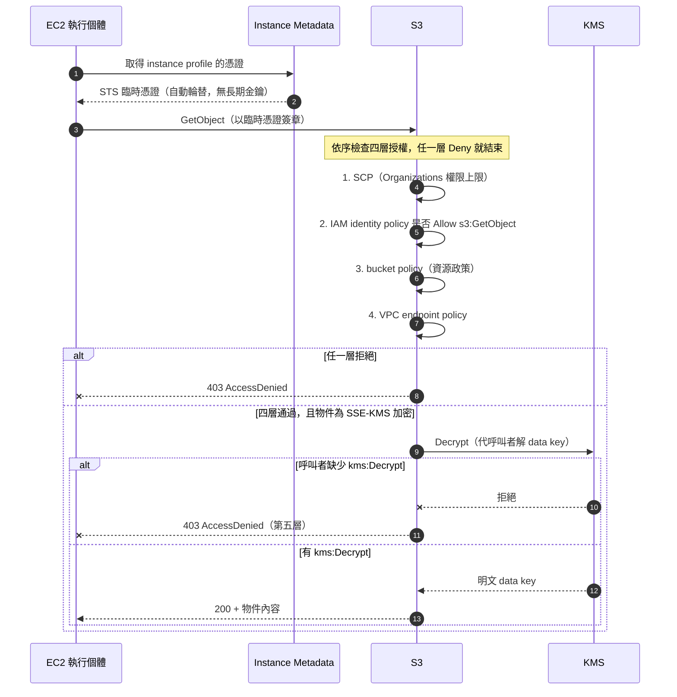

# EC2與IAM安全

---

# 🧠 技術層
*它實際上怎麼運作——心智模型、機制、限制。**第一輪只讀這一層**，先把架構直覺建立起來。*

## 一個 EC2 讀私有 S3 物件

`EC2 instance → instance profile → IAM role 暫時憑證 → S3 API`。角色的 **trust policy** 決定誰可 assume，**permissions policy** 決定能做什麼；S3 bucket policy、SCP、VPC endpoint policy、KMS key policy 等也可能限制結果。網路可達與授權是兩道不同檢查。避免將長期 access key 放在 AMI、user data 或程式設定。

> [!danger] 這張圖解釋了「明明給了 s3:GetObject 卻還是 403」
> **授權有五層，而第五層（KMS）最常被忘記。** 只要物件是 SSE-KMS 加密的，呼叫者就必須同時具備 `s3:GetObject` **與** `kms:Decrypt`。
> 另外注意：**整張圖完全沒有網路元件**——網路不通的症狀是 **timeout**，不是 403。

| 需求 | 常見工具 | 邊界 |
|---|---|---|
| EC2 呼叫 AWS API | IAM role + instance profile | 最小權限，必要時檢查 metadata 服務設定 |
| 跨帳號讀取資源 | STS AssumeRole + 對方 role trust/permissions | 不能只在來源帳號給 Allow 就期待成功 |
| 管理人員登入多帳號 | IAM Identity Center | 與應用在 EC2 上的 instance role 用途不同 |
| 保存 DB 密碼並輪替 | Secrets Manager | 讀取 secret 需要 IAM，若自訂 KMS key 還要評估解密權限 |
| 加密 EBS/S3/RDS | KMS 整合與適當 key policy | 傳輸中 TLS 與靜態加密是不同需求 |
| TLS 憑證 | ACM 與支援的整合服務如 ALB/CloudFront | 不等於把憑證直接安裝到 EC2 OS |
| L7 Web 攻擊防護 | AWS WAF 附於受支援資源 | SG 管端口/來源；WAF 管 HTTP 規則 |
| 審計 API 操作 | CloudTrail | CloudWatch metrics/logs 用來觀測運作，職責不同 |

SCP 限制 Organizations 帳號的**權限上限**，一般不直接授予權限；root user 等例外與服務連結角色細節以官方文件為準。Resource policy 與 identity policy 的跨帳號組合要逐題看明確 deny、owner 與信任關係。

## 三個診斷問題

「EC2 連不到 S3」分成三個診斷問題：DNS/route/endpoint 是否通？身份與 bucket policy 是否允許 `s3:GetObject`？若物件使用 SSE-KMS，KMS 權限是否滿足？也參考 [[EC2與網路]] 與 [[S3與資料生命週期]]。

> [!tip] 這三個問題的通用形式
> **Timeout 找網路，403 找權限。** 完整的排錯決策樹（含 endpoint policy、SCP、KMS 五個權限層）整理在 [[EC2與網路]] 的技術層。

---

# 🎯 考試層
*考試會怎麼問——關鍵字反射、誘答陷阱、閉卷檢核。**第二輪與考前讀這一層**。*

## 🎯 考點速記

看到 `403 AccessDenied` → 查 IAM → 資源 policy → endpoint policy → SCP → **KMS**
看到 access key 出現在程式碼/AMI/user data → **一律排除該選項**
看到 `cross-account` → **兩邊都要設定**（trust policy + 來源的 AssumeRole 權限）
看到 `third-party vendor assumes my role` → **External ID**
看到 `EC2 needs to call AWS API` → **instance profile + role**
看到 `SSE-KMS 物件讀不到` → 需要 **`kms:Decrypt`**，不只 `s3:GetObject`

## 💣 真實場景陷阱

- **instance profile 更新後舊憑證仍在快取**：metadata 服務的臨時憑證有有效期，換 role 後不一定立即生效。
- **IMDSv1 的 SSRF 風險**：應強制 IMDSv2（token 機制）。題目提到「防止透過應用漏洞竊取實例憑證」時會考。
- **把權限加在 identity policy 卻忘了 bucket policy 的 explicit Deny**：任何一層的明確 Deny 都會勝出。
- **服務連結角色（service-linked role）不能隨意刪改**，由服務自己管理。

## ✍️ 自我檢核

1. EC2 取得 AWS API 權限的完整鏈路是什麼？（從實例到 API 呼叫）
2. 「EC2 連不到 S3」的三個診斷問題依序是什麼？
3. trust policy 與 permissions policy 各決定什麼？跨帳號為什麼要兩邊設定？
4. SSE-KMS 加密的物件，讀取需要哪兩層授權？
5. 有哪些選項一看到就可以直接排除？

參考答案

1. `EC2 instance → instance profile → IAM role → STS 臨時憑證（經 metadata 服務）→ 簽署 AWS API 請求`。全程沒有長期金鑰。
2. **① 網路通嗎**（DNS / route / endpoint）**② 身分與 bucket policy 允許 `s3:GetObject` 嗎 ③ 若是 SSE-KMS，KMS 權限夠嗎**。注意第一題的症狀是 timeout，後兩題是 403。
3. **trust policy 決定「誰可以 assume 這個 role」**；**permissions policy 決定「assume 之後能做什麼」**。跨帳號時目標帳號要在 trust policy 信任來源 principal，**且**來源帳號的 IAM policy 要允許 `sts:AssumeRole`——只設一邊不會通。
4. **`s3:GetObject`**（對 S3）與 **`kms:Decrypt`**（對該 CMK）。這是「網路通了還是 403」最常見的第三個原因。
5. 把 **access key 放進程式碼 / 環境變數 / AMI / user data**；為終端使用者建 **IAM user**；用 **`AdministratorAccess`** 解決權限問題；給 EKS **節點** role 而不是給 Pod。

---

# 🔗 相關

Domain 1（安全）佔 **30%**，是最大單一區塊。這篇處理「**工作負載**如何取得權限」，其餘三個面向各自獨立成篇：

| 面向 | 筆記 | 涵蓋 |

|---|---|---|

| **人與終端使用者**的身分 | [[身分聯合與應用存取]] | Cognito User Pool / Identity Pool、IAM Identity Center、Directory Service、STS 與 External ID、**IAM 權限評估流程圖** |

| **偵測與邊界防護** | [[威脅偵測與邊界防護]] | GuardDuty / Inspector / Macie / Security Hub / Detective、WAF 與 Shield 的掛載限制、Network Firewall、**KMS 深入**、S3 五種加密選項 |

| **多帳號治理與稽核** | [[治理與合規]] | Organizations 與 SCP 的精確邊界、Config vs CloudTrail vs CloudWatch、Systems Manager（Session Manager、Parameter Store）、AWS Backup Vault Lock |

參考 [[03 官方資源清單]]；返回 [[服務關聯總圖]]、[[00 考試總覽]]。
