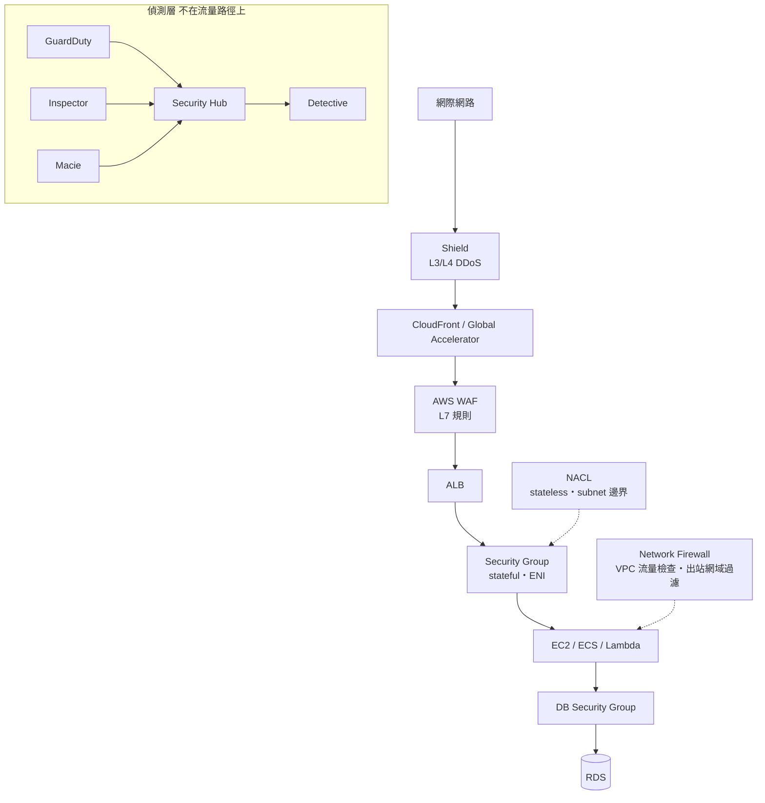

# 威脅偵測與邊界防護

> [!abstract] 為什麼要獨立一篇
> **Domain 1「設計安全架構」佔 30%，是最大單一區塊。** 原筆記的 [[EC2與IAM安全]] 處理得很好，但偏重「身分與授權」；官方 in-scope 的 **GuardDuty、Inspector、Macie、Security Hub、Detective、Shield、Network Firewall、Firewall Manager、CloudHSM** 幾乎都沒出現。這些服務考法很固定——**每個服務對應一句話的職責**，混淆了就直接失分。

---

# 🧠 技術層
*它實際上怎麼運作——心智模型、機制、限制。**第一輪只讀這一層**，先把架構直覺建立起來。*

## 一句話職責對照

| 服務 | 一句話 | 題幹關鍵字 |
|---|---|---|
| **GuardDuty** | **偵測**帳號與工作負載的**威脅行為** | `threat detection`、`compromised instance`、`crypto mining`、`unusual API activity`、`malicious IP` |
| **Inspector** | **掃描漏洞**（CVE）與網路可達性 | `vulnerability`、`CVE`、`patch`、`scan EC2 / ECR images / Lambda` |
| **Macie** | 在 **S3** 中**發現敏感資料**（PII） | `sensitive data`、`PII`、`discover`、`personally identifiable`、**且是 S3** |
| **Security Hub** | **彙整**各安全服務的 findings + 合規標準計分 | `centralized view`、`aggregate findings`、`CIS / PCI DSS benchmark` |
| **Detective** | 對 findings 做**根因調查**與關聯分析 | `investigate`、`root cause`、`analyze the source of` |
| **Shield Standard** | **免費**的 L3/L4 DDoS 防護，自動啟用 | （不用選，本來就有） |
| **Shield Advanced** | 付費 DDoS 進階：**DDoS Response Team**、**費用保護** | `DDoS`、`24/7 support`、`cost protection against scaling during attack` |
| **WAF** | **L7 HTTP 規則**過濾 | `SQL injection`、`XSS`、`rate limiting`、`block by country`、`bad bots` |
| **Network Firewall** | **VPC 層級**的有狀態 IDS/IPS 與流量過濾 | `VPC-level`、`intrusion prevention`、`inspect all traffic`、`Suricata rules`、`egress filtering by domain` |
| **Firewall Manager** | 跨 Organizations **集中管理** WAF/Shield/SG/Network Firewall 規則 | `across all accounts`、`centrally enforce` |
| **DNS Firewall**（Route 53 Resolver） | 阻擋對惡意網域的 DNS 查詢 | `block DNS queries to known malicious domains` |
| **CloudHSM** | **單租戶**專屬硬體 HSM，金鑰完全由你掌控 | `FIPS 140-3 Level 3`、`single-tenant`、`AWS must not have access to keys`、`customer-managed HSM` |

> [!danger] 四組最常被交換的干擾項
> **GuardDuty vs Inspector**：GuardDuty 看「**有沒有壞事正在發生**」（行為/威脅），Inspector 看「**有沒有已知弱點**」（漏洞/修補）。
> **Macie vs Inspector**：Macie 看**資料內容**（S3 裡有沒有身分證號），Inspector 看**運算資源**（EC2 有沒有未修補 CVE）。
> **Security Hub vs Detective**：Security Hub **彙整與呈現**，Detective **深入調查**。
> **WAF vs Network Firewall vs SG**：WAF 在 **L7** 看 HTTP 內容；Network Firewall 在 **VPC 網路層**檢查所有協定流量；SG 在 **ENI** 只看端口/來源。

## 分層防禦全景

> [!important] 一個常被忽略的結構
> **WAF 只能掛在受支援的資源上**：CloudFront、ALB、API Gateway、AppSync、Cognito User Pool、App Runner、Verified Access。
> **WAF 掛不上 NLB，也掛不上 EC2。** 題幹如果是「NLB 後面的服務要擋 SQL injection」，正解通常是**在前面加 CloudFront 或改用 ALB**，而不是直接把 WAF 貼到 NLB。

## WAF 規則類型

| 規則 | 用途 |
|---|---|
| **Managed rule groups** | AWS/第三方維護的常見攻擊規則（OWASP Top 10、已知惡意 IP） |
| **Rate-based rule** | 限制單一 IP 在時間窗內的請求數 → `brute force`、`HTTP flood`、`limit requests per IP` |
| **IP set / Geo match** | 允許或封鎖特定 IP 範圍、特定國家 → `block traffic from specific countries` |
| **String / regex match** | 針對 header、body、URI 做比對 |

## 加密：KMS 深入

原筆記提到 KMS 但未展開，這裡補齊考點。

| 概念 | 重點 |
|---|---|
| **AWS managed key** | 服務自動建立（`aws/s3`、`aws/ebs`），**免費**，輪替由 AWS 管，**無法自訂 key policy** |
| **Customer managed key (CMK)** | 你建立、你寫 key policy、可**啟用自動輪替**、可停用/排程刪除 | 
| **金鑰刪除** | 只能**排程刪除**，等待期 **7–30 天**，期間可取消 |
| **Key policy** | KMS 的**資源政策**。**沒有 key policy 允許，IAM admin 也用不了這把金鑰** |
| **Grant** | 臨時、細粒度的授權，常用於 AWS 服務代理操作 |
| **Multi-Region key** | 同一金鑰材料複製到多 Region，讓跨 Region 複寫的加密資料可在目的地解密 |
| **Envelope encryption** | 用 data key 加密資料、用 CMK 加密 data key。大於 4 KB 的資料一律走這條 |
| **Imported key material** | 你自己產生金鑰材料匯入（BYOK） |

> [!danger] 跨 Region 複寫 + 加密 = 必考組合
> 「S3 CRR / Aurora Global Database / EBS snapshot 複製到另一個 Region，但資料用 KMS 加密」——
> 正解必然涉及**目的地 Region 的金鑰**：要嘛使用 **multi-Region key**，要嘛在目的地指定一把該 Region 的 CMK 並給予適當權限。
> **KMS CMK 預設是 Region 專屬的，不能跨 Region 直接使用**——這是最常見的錯誤假設。

> [!tip] KMS vs CloudHSM
> 題幹出現 **`FIPS 140-3 Level 3`**、**`single-tenant dedicated hardware`**、**`AWS must have no access to the keys`** → **CloudHSM**。
> 其他絕大多數加密需求 → **KMS**（維運負擔低得多）。

## S3 加密選項（高頻）

| 選項 | 金鑰管理 | 何時選 |
|---|---|---|
| **SSE-S3** | AWS 全權管理（AES-256） | 預設、最簡單、免費 |
| **SSE-KMS** | 你的 CMK | 需要**稽核金鑰使用（CloudTrail）**、需要**細粒度金鑰權限**、需要輪替控制 |
| **DSSE-KMS** | 雙層 KMS 加密 | 極高合規要求 |
| **SSE-C** | **你提供金鑰**，AWS 不儲存 | 必須自己掌管金鑰但仍用 S3 加密 |
| **Client-side** | 完全在用戶端加密 | AWS 不得接觸明文 |

> [!note] SSE-KMS 的兩個副作用
> **(1) 權限要兩層**：除了 `s3:GetObject`，還需要對該 CMK 的 `kms:Decrypt`。這正是 [[EC2與IAM安全]] 裡「EC2 讀 S3 失敗」第三個診斷問題。
> **(2) 有 KMS API 請求配額與費用**：超大量小物件存取時可能觸及限流，此時考慮 **S3 Bucket Keys**（大幅減少 KMS 呼叫）。

## 網路層可觀測性

| 工具 | 給什麼 | 不給什麼 |
|---|---|---|
| **VPC Flow Logs** | 誰連到誰、端口、**accept/reject** | **不含封包內容（payload）** |
| **Traffic Mirroring** | 複製實際封包到分析工具 | 成本較高 |
| **Network Access Analyzer / Reachability Analyzer** | 靜態分析「A 能不能連到 B」與路徑 | 非即時流量 |

> [!tip] 排錯題的標準路徑
> 「懷疑有未授權連線 / 想知道 SG 是否擋掉流量」→ **VPC Flow Logs**（看 REJECT 記錄）。
> 「需要做封包層級的入侵分析」→ **Traffic Mirroring**。
> 「要驗證設計上兩個資源是否互通」→ **Reachability Analyzer**。

---

# 🎯 考試層
*考試會怎麼問——關鍵字反射、誘答陷阱、閉卷檢核。**第二輪與考前讀這一層**。*

## 🎯 考點速記

看到 `compromised instance` / `crypto mining` / `unusual API` → **GuardDuty**
看到 `CVE` / `vulnerability` / `patch` → **Inspector**
看到 `PII` / `sensitive data` **在 S3** → **Macie**
看到 `aggregate findings` / `CIS / PCI benchmark` → **Security Hub**
看到 `investigate root cause` → **Detective**
看到 `SQL injection` / `rate limiting` / `block by country` → **WAF**
看到 `DDoS` + `24/7 team` + `cost protection` → **Shield Advanced**
看到 `VPC-level IDS/IPS` / `egress domain filtering` → **Network Firewall**
看到 `FIPS 140-3 L3` / `single-tenant HSM` → **CloudHSM**

## 💣 真實場景陷阱

- **WAF 掛不上 NLB 也掛不上 EC2**：只能掛 CloudFront / ALB / API Gateway / AppSync / Cognito UP / App Runner / Verified Access。
- **KMS CMK 是 Region 專屬的**：跨 Region 複寫加密資料時忘了目的地金鑰，是最常見的複寫失敗原因。
- **沒有 key policy 允許，IAM 管理員也用不了金鑰**：key policy 是 KMS 的資源政策，預設只有建立者與 root 有權。
- **金鑰刪除有 7–30 天等待期**：期間資源會開始解密失敗，但金鑰還能取消刪除。
- **GuardDuty 不是即時阻擋**：它只偵測與產生 findings，阻擋要靠 WAF / Network Firewall / SG 或自動化回應。

## ✍️ 自我檢核

1. GuardDuty、Inspector、Macie、Security Hub、Detective 各一句話。哪兩組最容易被交換？
2. WAF 能掛在哪些資源上？「NLB 後面的服務要擋 SQL injection」怎麼辦？
3. 跨 Region 複寫 SSE-KMS 加密的資料為什麼常失敗？有哪兩種解法？
4. KMS 與 CloudHSM 的分界點是什麼？BYOK 算不算滿足 CloudHSM 的條件？
5. S3 的五種加密選項，SSE-KMS 相對 SSE-S3 多了什麼、代價是什麼？

> [!success]- 參考答案
> 1. GuardDuty=威脅**行為**偵測；Inspector=**漏洞/CVE** 掃描；Macie=**S3 敏感資料**發現；Security Hub=findings **彙整**與合規計分；Detective=**根因調查**。最容易交換的是 **GuardDuty↔Inspector**（行為 vs 漏洞）與 **Macie↔Inspector**（資料內容 vs 運算資源）。
> 2. **CloudFront、ALB、API Gateway、AppSync、Cognito User Pool、App Runner、Verified Access**。NLB 的情況要**前面加 CloudFront** 或**改用 ALB**。
> 3. 因為 **CMK 是 Region 專屬的**，複寫角色必須能在來源 Region `kms:Decrypt`、在目的地 Region `kms:Encrypt`。解法：**① 使用 multi-Region key ② 在目的地指定該 Region 的 CMK 並授予權限**。
> 4. 出現 **`FIPS 140-3 Level 3`、`single-tenant dedicated hardware`、`AWS 不得存取金鑰`** 才選 CloudHSM。**BYOK 不算**——匯入的金鑰材料仍存放在 KMS 的多租戶 HSM 中。
> 5. SSE-S3、SSE-KMS、DSSE-KMS、SSE-C、client-side。SSE-KMS 多了**金鑰使用的 CloudTrail 稽核**與**細粒度金鑰權限**；代價是需要額外 `kms:Decrypt` 權限、KMS API 費用與可能的限流（用 **S3 Bucket Keys** 緩解）。

---

# 🔗 相關

- 身分、角色、policy 評估邏輯：[[EC2與IAM安全]]、[[身分聯合與應用存取]]

- SG/NACL 與 VPC 路由基礎：[[EC2與網路]]

- WAF/Shield 的部署位置與 CDN：[[DNS與全球流量]]

- findings 的集中化與多帳號治理：[[治理與合規]]

- 不可變備份對抗勒索軟體：[[高可用備援與災難復原]]

參考 [[03 官方資源清單]]；返回 [[服務關聯總圖]]、[[00 考試總覽]]。
