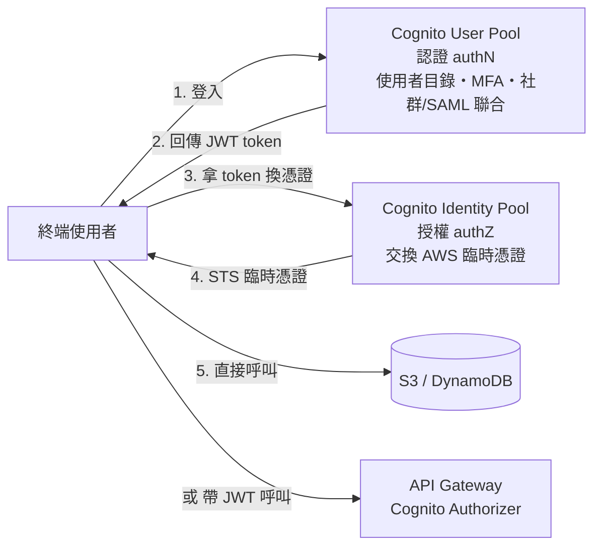
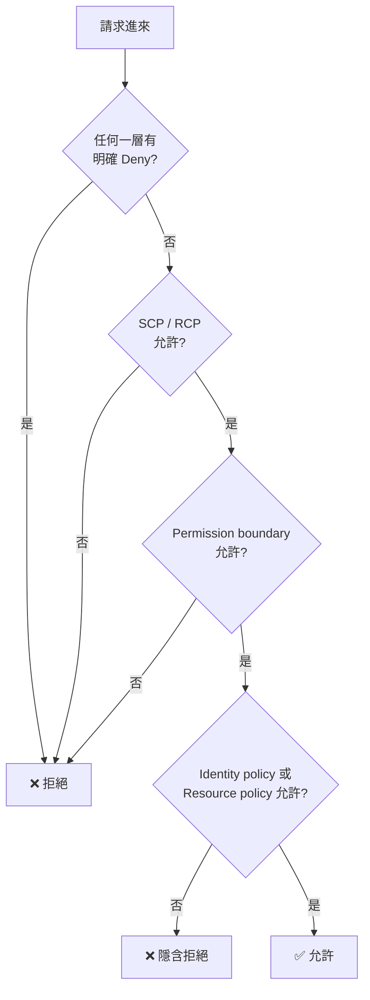

# 身分聯合與應用存取

> [!abstract] 為什麼要獨立一篇
> [[EC2與IAM安全]] 處理的是「**工作負載**如何取得權限」（instance profile → role）。這篇處理的是「**人與終端使用者**如何取得身分」——**Cognito、IAM Identity Center、Directory Service、STS 聯合登入**。Domain 1 佔 30%，這半邊不能空著。

## 先分清楚三種「使用者」

這是本篇最重要的分類，選錯服務通常是因為沒分清楚題目在講誰。

| 對象 | 需求 | 正解服務 |
|---|---|---|
| **應用程式的終端使用者**（App 註冊/登入、百萬級） | 使用者目錄、社群登入、JWT | **Cognito User Pool** |
| **公司員工**（存取 AWS Console / CLI） | SSO、多帳號、與公司 IdP 整合 | **IAM Identity Center** |
| **工作負載**（EC2、Lambda、ECS） | 免長期金鑰的臨時憑證 | **IAM Role**（見 [[EC2與IAM安全]]） |

> [!danger] 最常見的誤選
> 題幹說「**行動 App 的數百萬名使用者**要能用 Google/Facebook 帳號登入」→ **Cognito**。
> **絕對不要選「為每個使用者建立 IAM user」**——IAM user 有帳號層級數量上限，且 IAM 不是為終端使用者設計的。這個錯誤選項幾乎每次都會出現。

## Cognito：兩個元件，職責完全不同

| 元件 | 做什麼 | 產出 |
|---|---|---|
| **User Pool** | **認證（authN）**：使用者目錄、註冊/登入、MFA、密碼政策、hosted UI、聯合 Google/Facebook/Apple/SAML/OIDC | **JWT token** |
| **Identity Pool**（Federated Identities） | **授權（authZ）**：把 token 換成 **AWS 臨時憑證**，讓使用者**直接**存取 AWS 資源；支援 **guest（未驗證）存取** | **STS 臨時憑證** |

> [!important] 一句話判斷要哪個
> 只需要「使用者登入我的 API」→ **User Pool**（API Gateway 用 Cognito Authorizer 驗 JWT）。
> 需要「使用者的手機 App **直接**上傳到 S3 / 讀 DynamoDB」→ **User Pool + Identity Pool**（必須有 Identity Pool 才拿得到 AWS 憑證）。
> 需要「**未登入的訪客**也能有限度存取 AWS 資源」→ **Identity Pool 的 unauthenticated role**。

## IAM Identity Center（原 AWS SSO）

| 概念 | 說明 |
|---|---|
| **定位** | **員工**存取多個 AWS 帳號與應用的單一入口 |
| **Permission set** | 一組權限範本，指派給「使用者/群組 × 帳號」的組合，背後會在目標帳號建立 IAM role |
| **身分來源** | 內建目錄、**Active Directory**、或外部 IdP（Okta、Entra ID）經 SAML/SCIM |
| **與 Organizations** | 深度整合，跨帳號指派權限的標準做法 |

> [!tip] 題型
> 「公司有 50 個 AWS 帳號，員工要用既有的 Active Directory 帳號登入，**不想在每個帳號建 IAM user**」→ **IAM Identity Center**。
> 舊式做法（IAM role + SAML federation 自建）在考試中通常是「可行但維運負擔較高」的干擾項。

## Directory Service

| 選項 | 用途 |
|---|---|
| **AWS Managed Microsoft AD** | AWS 上的**完整託管 Microsoft AD**。需要 AD 功能（群組原則、AD 整合應用、FSx for Windows、RDS for SQL Server Windows 驗證）時選它 |
| **AD Connector** | **代理**，把請求轉發到**既有 on-prem AD**，AWS 端不儲存目錄資料 |
| **Simple AD** | 小規模、低成本的 Samba 相容目錄，功能有限 |

> [!note] 記法
> `want to use existing on-premises AD, no directory data in AWS` → **AD Connector**。
> `need a standalone AD in AWS with trust to on-prem` → **AWS Managed Microsoft AD**。

## STS 與跨帳號存取

| API | 用途 |
|---|---|
| `AssumeRole` | 跨帳號 / 同帳號切換角色 |
| `AssumeRoleWithSAML` | 企業 IdP（SAML 2.0）聯合 |
| `AssumeRoleWithWebIdentity` | 社群/OIDC 聯合（Cognito Identity Pool 底層用這個） |

**跨帳號存取需要兩邊都同意**：目標帳號的 role **trust policy** 要信任來源 principal，**且**來源帳號的 IAM policy 要允許 `sts:AssumeRole`。只設一邊不會通——這點原筆記已正確指出。

> [!danger] External ID 與 confused deputy
> 當你讓**第三方廠商**assume 你帳號的 role 時，必須在 trust policy 加上 **`sts:ExternalId`** 條件。
> 原因：若沒有 external ID，該廠商可能被誘導用你的 role ARN 去存取**別的客戶**的資源（**confused deputy 混淆代理人問題**）。
> 題幹出現 `third-party`、`external vendor`、`SaaS provider needs access to my account` → 答案裡一定有 **External ID**。

## IAM 權限評估邏輯（必背）

三條鐵律：
1. **預設拒絕**（implicit deny）——沒有任何 Allow 就是拒絕。
2. **明確 Deny 永遠勝出**——任何一層的 explicit Deny 直接否決，沒有例外。
3. **權限上限機制（SCP、permission boundary）只能限縮，不能授予。**

> [!tip] Permission boundary 的典型考法
> 「允許開發團隊自行建立 IAM role，但**他們建立的 role 權限不能超過某個範圍**」→ **permission boundary**（不是 SCP，SCP 作用在帳號/OU 層級）。

## 其他相關服務

| 服務 | 用途 |
|---|---|
| **AWS RAM** | 跨帳號**共享資源**（VPC subnet、Transit Gateway、Route 53 Resolver rule、License）。共享 subnet 讓多帳號共用同一 VPC 網路 |
| **IAM Roles Anywhere** | 讓**地端**工作負載用 X.509 憑證取得 AWS 臨時憑證，免長期 access key |
| **IAM Access Analyzer** | 找出**可被外部存取**的資源（bucket、role、KMS key），以及未使用的權限 |
| **Service-linked role** | AWS 服務代表你操作的預定義角色，由服務管理 |

> [!warning] 長期 access key 是錯誤答案
> 只要選項出現「把 access key 存在程式碼 / 環境變數 / AMI / user data」，**一律排除**。
> 正解永遠是：EC2/ECS/Lambda → **IAM role**；地端 → **IAM Roles Anywhere** 或 IAM Identity Center；終端使用者 → **Cognito**。

## 與其他筆記的接點

- 工作負載取得權限與 instance profile：[[EC2與IAM安全]]
- SCP、Organizations、多帳號結構：[[治理與合規]]
- 金鑰政策與加密權限的第二層檢查：[[威脅偵測與邊界防護]]
- API Gateway 的授權方式：[[事件驅動與無伺服器]]

---

參考 [[03 官方資源清單]]；返回 [[服務關聯總圖]]、[[00 考試總覽]]。

---

## 🎯 考點速記

看到 `millions of app users` + 社群登入 → **Cognito User Pool**
看到「手機直接存取 S3/DynamoDB」→ 還要 **Identity Pool**
看到 `employees` + `multiple AWS accounts` + 既有 IdP → **IAM Identity Center**
看到 `existing on-prem AD, no directory data in AWS` → **AD Connector**
看到 `third-party / SaaS assumes my role` → **External ID**
看到「限制開發者建立的 role 權限上限」→ **permission boundary**
看到「整個帳號的權限天花板」→ **SCP**

## 💣 真實場景陷阱

- **User Pool 與 Identity Pool 搞混**：只建 User Pool 是拿不到 AWS 憑證的，App 無法直接寫 S3。
- **IAM Identity Center 是 Region 綁定的**：啟用時選的 Region 之後不易變更。
- **permission boundary 只限縮不授予**：附加了 boundary 但 identity policy 沒給權限，結果仍然是拒絕。
- **忘了 External ID 的後果**：第三方廠商若被誘導，可能用你的 role ARN 存取其他客戶資源（confused deputy）。

## ✍️ 自我檢核

1. 三種「使用者」（App 終端使用者、公司員工、工作負載）各用什麼機制？各自的錯誤選項長什麼樣？
2. Cognito User Pool 與 Identity Pool 的職責與產出各是什麼？什麼需求一定要用 Identity Pool？
3. IAM 權限評估的三條鐵律？有效權限怎麼算？
4. SCP 與 permission boundary 的作用範圍差別？各自的典型題型？
5. External ID 防的是什麼攻擊？為什麼需要它？

> [!success]- 參考答案
> 1. **App 使用者 → Cognito**（錯誤選項：為每人建 IAM user）；**員工 → IAM Identity Center**（錯誤選項：每帳號建 IAM user、或手刻 50 組 SAML 信任）；**工作負載 → IAM role**（錯誤選項：嵌入 access key）。
> 2. **User Pool = 認證（authN）**，產出 **JWT**；**Identity Pool = 授權（authZ）**，產出 **STS 臨時憑證**。需求是「客戶端**直接**呼叫 AWS 服務」或「未登入訪客也要有限存取」時一定要 Identity Pool。
> 3. **① 預設隱含拒絕 ② 任何一層的 explicit Deny 直接否決 ③ 權限上限機制只能限縮不能授予。** 有效權限 = **IAM policy ∩ SCP ∩ permission boundary ∩ resource policy**。
> 4. **SCP = 帳號/OU 層級的天花板**（典型題：「連帳號管理員都不能停用 CloudTrail」）；**permission boundary = 單一身分的天花板**（典型題：「允許開發者自建 role 但不能超過某範圍」）。
> 5. **confused deputy（混淆代理人）**。沒有 External ID 時，第三方廠商可能被誘導用你的 role ARN 去存取別的客戶資源。External ID 是雙方約定的秘密字串，寫在 trust policy 的條件裡。
