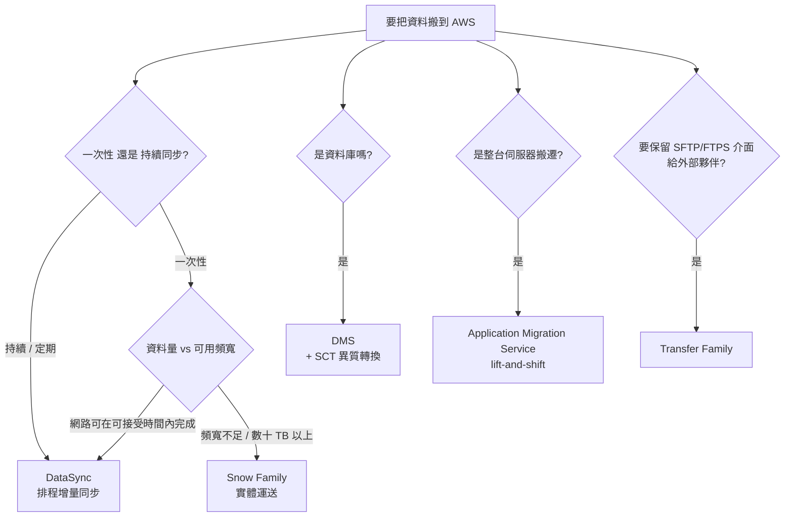

# 遷移與混合雲

> [!abstract] 缺漏補完
> 官方 in-scope 有一整個 **Migration and Transfer** 類別，原本筆記只在網路篇提了 DX/VPN 各一句。這類題目的判斷軸只有三個：**資料量多大、頻寬夠不夠、能停機多久**。抓住這三個變數，選項就好排除了。

---

# 🧠 技術層
*它實際上怎麼運作——心智模型、機制、限制。**第一輪只讀這一層**，先把架構直覺建立起來。*

## 資料搬遷決策

| 服務 | 一句話定位 | 題幹關鍵字 |
|---|---|---|
| **DataSync** | 線上**大量檔案**傳輸與**排程同步**，自動增量、驗證完整性 | `ongoing`、`scheduled`、`incremental`、`NFS/SMB/HDFS to S3/EFS/FSx`、`data validation` |
| **Snow Family** | **實體裝置**運送 PB 級資料 | `limited bandwidth`、`petabytes`、`remote location`、`would take months over network` |
| **DMS** | 資料庫遷移，支援**持續複寫（CDC）**以最小化停機 | `migrate database`、`minimal downtime`、`source remains available` |
| **SCT**（Schema Conversion Tool） | **異質**資料庫的 schema/程式碼轉換 | `Oracle to Aurora PostgreSQL`、`heterogeneous` |
| **Application Migration Service (MGN)** | 整台伺服器 lift-and-shift 成 EC2 | `rehost`、`lift and shift`、`physical/VMware servers` |
| **Transfer Family** | 全託管 **SFTP / FTPS / FTP / AS2** 端點，後端存 S3 或 EFS | `existing SFTP clients`、`partners upload via SFTP`、`no change to partner workflow` |
| **Storage Gateway** | **混合**儲存，本地應用用傳統介面存取雲端 | `on-premises application`、`iSCSI / NFS / SMB / tape` |

> [!danger] DataSync vs Storage Gateway
> 這兩個最常被放在一起當干擾項，差別是**搬完之後還需不需要本地存取**：
> - **DataSync = 搬家**。把資料移過去，之後本地就不用了。一次性或排程同步。
> - **Storage Gateway = 延伸**。本地應用**持續**透過 NFS/SMB/iSCSI/VTL 存取，資料實際放在雲端，本地留快取。
>
> 題幹說「把 500 TB 歸檔資料遷移到 S3 後淘汰本地 NAS」→ **DataSync**（或 Snowball，看頻寬）。
> 題幹說「本地應用必須繼續用 SMB 存取，但不想再擴充本地儲存」→ **Storage Gateway**。

## Storage Gateway 四種型態

| 型態 | 本地介面 | 資料落在 | 典型題幹 |
|---|---|---|---|
| **S3 File Gateway** | NFS / SMB | S3 物件（1:1 對應檔案） | 「本地應用寫檔案，希望存成 S3 物件供雲端分析」 |
| **FSx File Gateway** | SMB | FSx for Windows File Server | 「本地 Windows 使用者要低延遲存取雲端 SMB 共享」 |
| **Volume Gateway** | **iSCSI 區塊** | S3（以 EBS snapshot 形式） | 「本地應用需要區塊裝置」。**Cached**：主資料在雲、本地留熱資料快取（省本地空間）；**Stored**：主資料在本地、非同步備份到雲（低延遲 + 異地備援） |
| **Tape Gateway** | **iSCSI VTL** | S3 / Glacier | 「用既有備份軟體（Veeam/NetBackup），想淘汰實體磁帶」 |

> [!tip] Volume Gateway 的 Cached vs Stored 記法
> 問「**減少本地儲存空間**」→ **Cached**（主資料在雲端）。
> 問「**本地需要低延遲存取全部資料**，同時要異地備份」→ **Stored**（主資料在本地）。

## Snow Family

| 裝置 | 容量級距 | 用途 |
|---|---|---|
| **Snowball Edge Storage Optimized** | 數十 TB 級 | 大量資料搬遷 |
| **Snowball Edge Compute Optimized** | 較低儲存 + 較強運算 | 邊緣運算、斷網環境就地處理 |
| **Snowcone** | 小容量、可攜 | 空間受限、邊緣場景 |

> [!warning] 型號會變，判斷點不會變
> AWS 近年調整過 Snow 產品線（例如 **Snowmobile 已停售**），部分題庫仍沿用舊型號。**不要背容量數字**，抓住判斷點即可：
> **「頻寬不足 + 資料量大到用網路傳要數週/數月」→ Snow Family**。
> 反向題也常出現：「10 TB 資料、有 1 Gbps 專線」→ 網路傳輸（DataSync）就夠，選 Snowball 是**過度設計**。

## 混合網路連線

| 方案 | 特性 | 何時選 |
|---|---|---|
| **Site-to-Site VPN** | IPsec over 網際網路，**每個連線兩條隧道**，數小時內可建好 | `quickly`、`encrypted`、`temporary`、`backup for Direct Connect`、預算有限 |
| **Direct Connect (DX)** | **專用實體連線**，1/10/100 Gbps，穩定低延遲、降低傳輸費 | `consistent / predictable network performance`、`dedicated`、`large sustained data transfer`、`bypass the public internet` |
| **DX + VPN** | 在 DX 上疊 IPsec | `Direct Connect` **且** `encrypted in transit`（DX 本身**不加密**） |
| **Client VPN** | 遠端**使用者**（非站台）連進 VPC | `remote employees access VPC` |
| **Transit Gateway** | 多 VPC / 多站台的**中央路由樞紐** | `hundreds of VPCs`、`hub and spoke`、`transitive routing` |

> [!danger] Direct Connect 的三個必考點
> **(1) DX 不加密。** 題幹同時要求 `dedicated connection` 與 `encryption in transit` → **DX + Site-to-Site VPN**（或 MACsec）。
> **(2) DX 建置要數週到數月。** 題幹說「需要專線但要**立即**可用」→ **先用 VPN 過渡，DX 完成後切換**。
> **(3) 單一 DX 沒有高可用。** 要 HA → **兩條 DX（不同 location）**；要低成本備援 → **DX + VPN backup**。

**Virtual Interface (VIF) 類型**：**Private VIF** 連到 VPC（經 VGW 或 DX Gateway）；**Public VIF** 連到 AWS 公開端點（如 S3、DynamoDB 的公開 API）但不經網際網路；**Transit VIF** 經 DX Gateway 連到 Transit Gateway。

**Direct Connect Gateway**：讓一條 DX 連到**多個 Region 的多個 VPC**（同一帳號或跨帳號），避免每個 VPC 各拉一條。

## 混合 DNS

混合架構的高頻考點，原筆記完全沒提。

| 需求 | 元件 |
|---|---|
| **on-prem → AWS**：本地主機要解析 VPC 內的私有 DNS 名稱 | **Inbound Resolver Endpoint** |
| **AWS → on-prem**：VPC 內的資源要解析本地 AD/DNS 名稱 | **Outbound Resolver Endpoint** + **Resolver Rule**（轉發規則） |
| 雙向 | 兩者都要 |

> [!note] 記法
> 站在 **AWS 的立場**看流量方向：查詢**進來** AWS → inbound；查詢**出去** on-prem → outbound。

## 邊緣與地端延伸

| 服務 | 定位 | 題幹關鍵字 |
|---|---|---|
| **Outposts** | AWS 實體機櫃放進你的資料中心，跑原生 AWS API | `data residency`、`must remain on-premises`、`low latency to on-prem systems` |
| **Local Zones** | 靠近大都會區的 AWS 延伸，降低該地延遲 | `single-digit millisecond to end users in a specific city` |
| **Wavelength** | 部署在電信商 5G 網路邊緣 | `5G`、`mobile edge` |
| **VMware Cloud on AWS** | 在 AWS 上跑 VMware SDDC | `existing VMware`、`migrate without re-architecting` |

## 遷移策略 7R

考試偶爾直接問名詞對應：

| 策略 | 做什麼 |
|---|---|
| **Rehost** | 直接搬（lift-and-shift），用 MGN |
| **Replatform** | 小幅調整（如自管 MySQL → RDS） |
| **Repurchase** | 換成 SaaS 產品 |
| **Refactor** | 重新架構（單體 → 微服務/無伺服器） |
| **Retire** | 淘汰不用的系統 |
| **Retain** | 暫時保留在地端 |
| **Relocate** | 整批搬遷 hypervisor 層（如 VMware Cloud on AWS） |

---

# 🎯 考試層
*考試會怎麼問——關鍵字反射、誘答陷阱、閉卷檢核。**第二輪與考前讀這一層**。*

## 🎯 考點速記

看到 `ongoing / scheduled / incremental` 傳輸 → **DataSync**
看到 `on-prem app must keep using NFS/SMB/iSCSI/tape` → **Storage Gateway**
看到 `petabytes` + `limited bandwidth` → **Snow Family**
看到 `migrate database` + `minimal downtime` → **DMS**（異質再加 **SCT**）
看到 `partners upload via SFTP` → **Transfer Family**
看到 `dedicated` + `consistent performance` → **Direct Connect**
看到 `Direct Connect` + `encrypted` → **DX + VPN**
看到 `need dedicated link immediately` → **先 VPN 過渡**
看到 `data residency / must remain on-premises` → **Outposts**

## 💣 真實場景陷阱

- **DX 的建置週期是數週到數月**：專案規劃沒算進去，上線前只能臨時用 VPN 頂著。
- **單一 DX 沒有高可用**：要 HA 得拉兩條（不同 location），低成本備援則是 DX + VPN。
- **Snowball 不是越大越好**：訂購、運送、上傳、回送的總時程通常一到兩週，頻寬夠時 DataSync 更快。
- **Volume Gateway 的 Cached 與 Stored 選反**：Cached 主資料在雲（省本地空間），Stored 主資料在本地（低延遲 + 異地備份）。
- **混合 DNS 方向搞反**：站在 AWS 立場，查詢**進來**用 inbound endpoint，查詢**出去**用 outbound endpoint + 轉發規則。

## ✍️ 自我檢核

1. DataSync 與 Storage Gateway 的根本差別？用一句話說。
2. Storage Gateway 的四種型態各對應什麼本地介面與什麼題幹？
3. 什麼時候該選 Snow Family？什麼時候選了反而是過度設計？
4. Direct Connect 的三個必考點是什麼？
5. on-prem 要解析 VPC 私有 DNS、以及 VPC 要解析 on-prem DNS，各用什麼？怎麼記方向？

參考答案

1. **DataSync 是搬家（搬完本地就不用了）；Storage Gateway 是延伸（本地持續以傳統介面存取雲端資料）。**
2. **S3 File Gateway**（NFS/SMB → S3 物件）；**FSx File Gateway**（SMB → FSx for Windows，本地低延遲存取雲端 SMB）；**Volume Gateway**（iSCSI 區塊，Cached/Stored 兩模式）；**Tape Gateway**（VTL，淘汰實體磁帶但沿用既有備份軟體）。
3. **頻寬不足、用網路傳要數週到數月時才選。** 若算出來網路傳得完（例如 10 TB 配 1 Gbps 不到兩天），選 Snowball 就是過度設計——訂購與運送反而更慢。
4. **① DX 不加密**（要加密得疊 VPN 或 MACsec）**② 建置要數週到數月**（急用先架 VPN）**③ 單一 DX 沒有 HA**（兩條 DX 或 DX + VPN backup）。
5. **進來 → Inbound Resolver Endpoint；出去 → Outbound Resolver Endpoint + 轉發規則。** 記法是**站在 AWS 的立場看查詢的流向**。

---

# 🔗 相關

- VPC 路由、endpoint 與 TGW 細節：[[EC2與網路]]

- 搬進來之後的儲存類別與生命週期：[[S3與資料生命週期]]、[[EC2與儲存]]

- 資料庫遷移後的 HA 設計：[[資料庫與快取]]

- 跨 Region 複寫與 DR 演練：[[高可用備援與災難復原]]

- 傳輸費用與 NAT/DX 的成本比較：[[成本與可觀測性]]

參考 [[03 官方資源清單]]；返回 [[服務關聯總圖]]、[[00 考試總覽]]。
