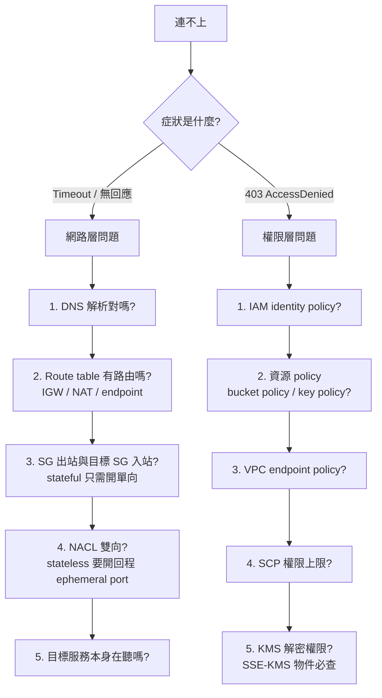

# EC2與網路

**VPC 是網路範圍，subnet 屬於一個 AZ；EC2 的 ENI、私有 IP 與 SG 實際承接流量。** 「public subnet」取決於關聯 route table 有通向 IGW 的路由；instance 要直接 IPv4 網際網路通訊還須適當 public IPv4/EIP 及 SG/NACL 規則。

## 三條不同的路

| 目標 | 路徑與必要條件 | 易錯點 |
|---|---|---|
| Internet → 應用 | Internet-facing ALB 放 public subnets → target group → private EC2；ALB/EC2 SG 各自放行相應端口 | private EC2 不需要 public IP；ALB 仍需健康檢查通過 |
| Private EC2 → Internet IPv4 | private route table 的 0.0.0.0/0 → public NAT gateway（位於 public subnet 並可至 IGW） | NAT 供出站與回應，不開放主動入站；多 AZ 高可用要檢視各 AZ 路徑 |
| Private EC2 → S3/DynamoDB | gateway endpoint + 關聯路由表；IAM、endpoint policy、資源 policy 仍需允許 | gateway endpoint 不是所有服務通用；不是「有網路就有權限」 |
| Private EC2 → 其他支援的 AWS API | interface endpoint / PrivateLink + DNS、endpoint SG、policy | interface endpoint 通常按 AZ/時數與流量計費 |

SG 關聯至網路介面，**stateful、只列允許規則**；NACL 在 subnet 邊界，**stateless、可 allow/deny**，回程與 ephemeral ports 也要考慮。SG 來源可引用另一 SG，適合 ALB SG → App SG → DB SG。SG/NACL 不替代 IAM 權限；見 [[EC2與IAM安全]]。

## VPC 之間與混合網路

- 少量 VPC 點對點：VPC Peering；注意 CIDR 不重疊，peering 不提供任意轉送。
- 多 VPC / on-prem hub：Transit Gateway；設路由與費用。
- 消費對方提供的單一服務而非整網互通：PrivateLink。
- on-prem 加密連線：Site-to-Site VPN；專用連線需求：Direct Connect，並另思考備援/加密。

## 自問

EC2 在 private subnet 為何 `curl` 外網失敗？依序檢查 DNS、route、NAT/endpoint、SG egress、NACL 雙向、目標是否允許。若是 AWS API 403，網路可能已通，繼續查 IAM/resource/endpoint/KMS policy。

連到 [[EC2與負載平衡及擴展]]、[[DNS與全球流量]]、[[成本與可觀測性]]；參考 [[03 官方資源清單]]。

---

# 深化

## CIDR 與 subnet 規劃

- VPC CIDR 大小介於 **/16（65,536 個 IP）到 /28（16 個 IP）**之間，建立後可再新增次要 CIDR 區塊。
- **每個 subnet AWS 保留 5 個 IP**（網路位址、VPC router、DNS、保留、廣播）。所以 `/24` 實際可用 **251** 個，不是 256。題目算 IP 數量時常考這點。
- **Subnet 屬於單一 AZ，不能跨 AZ**；VPC 跨整個 Region。
- 規劃時預留 CIDR 不重疊，否則將來無法做 **VPC Peering** 或 **Transit Gateway** 連通。

## IPv6 與出站（原筆記未涵蓋）

| 需求 | IPv4 | IPv6 |
|---|---|---|
| 私有資源出站到網際網路，且**不接受入站** | **NAT Gateway** | **Egress-Only Internet Gateway** |

> [!important] 這是個乾淨的考點
> **NAT Gateway 只處理 IPv4。** IPv6 沒有位址短缺問題，因此沒有 NAT——要達成「只出不進」必須用 **egress-only internet gateway**。
> 題幹出現 `IPv6` + `outbound only` → **egress-only IGW**，選 NAT gateway 一定錯。
> 另外 **IPv6 位址全部是公開可路由的**，入站控制完全依賴 SG/NACL。

## NAT Gateway vs NAT Instance

| | **NAT Gateway** | **NAT Instance** |
|---|---|---|
| 管理 | AWS 全託管 | 你自己維護 EC2 |
| 可用性 | AZ 內高可用（**每個 AZ 各放一個才是跨 AZ 高可用**） | 需自建 HA |
| 頻寬 | 自動擴展至 45 Gbps | 受 instance 類型限制 |
| SG | **不能掛 SG** | 可以掛 SG |
| 可當堡壘機 | ❌ | ✅ |

> [!warning] NAT Gateway 的兩個高頻考點
> **(1) 高可用**：NAT gateway 是 **AZ 級**資源。只在一個 AZ 放 NAT，該 AZ 故障時**其他 AZ 的私有子網也會斷網**。正解：**每個 AZ 各部署一個 NAT gateway，並讓各 AZ 的私有路由表指向自己 AZ 的 NAT**（同時也省下跨 AZ 傳輸費）。
> **(2) 成本**：NAT gateway 按**小時 + 處理資料量**計費，是帳單上常見的意外大戶。若流量主要是去 **S3/DynamoDB**，改用 **gateway endpoint（免費）** 可大幅降低成本——這是 Domain 4 的經典題。

## VPC Endpoint 精確定義

| | **Gateway Endpoint** | **Interface Endpoint（PrivateLink）** |
|---|---|---|
| 支援服務 | **只有 S3 和 DynamoDB** | 絕大多數 AWS 服務 + 第三方/自建服務 |
| 實作方式 | **路由表中的一筆路由** | 子網中的一個 **ENI**（有私有 IP） |
| 費用 | **免費** | **按小時 + 資料處理量計費** |
| 掛 SG | ❌ | ✅ |
| 跨 VPC/跨帳號 | ❌ | ✅（PrivateLink 的核心用途） |
| 從 on-prem 存取 | ❌ | ✅（經 DX/VPN） |

> [!danger] 兩個精確結論
> **(1) Gateway endpoint 只有 S3 和 DynamoDB 兩個服務。** 原筆記說「不是所有服務通用」是對的，這裡給出確切範圍。其他任何服務要私有存取一律是 interface endpoint。
> **(2) 「從 on-prem 經 Direct Connect 私有存取 S3」不能用 gateway endpoint**（gateway endpoint 只在 VPC 路由表內生效）。要用 **S3 interface endpoint** 或 **Public VIF**。這題很常出。

## Transit Gateway vs VPC Peering

| | **VPC Peering** | **Transit Gateway** |
|---|---|---|
| 拓樸 | 點對點，**N 個 VPC 需 N(N-1)/2 條** | **hub-and-spoke**，中央路由 |
| 遞移路由 | ❌ **不支援**（A-B、B-C 不代表 A 能通 C） | ✅ 支援 |
| 跨 Region | ✅ | ✅（TGW peering） |
| 費用 | 只有資料傳輸費 | **附加費 + 資料處理費** |
| 規模 | 少量 VPC | 數十至數千 VPC、含 on-prem |

> [!important] 判斷句
> `transitive routing`、`hundreds of VPCs`、`simplify network management`、`central hub` → **Transit Gateway**。
> 只有兩三個 VPC 要互通且要最省 → **VPC Peering**。
> **「VPC Peering 不支援遞移路由」**是高頻考點。

## PrivateLink 的定位

PrivateLink 解決的是「**我要消費對方提供的一個服務，但不想把兩個 VPC 的網路整個打通**」。
提供方在自己的 VPC 用 **NLB** 建立 **endpoint service**，消費方在自己 VPC 建 **interface endpoint**。
- **不需要 CIDR 不重疊**（這是相對 Peering/TGW 的最大優勢）。
- 流量單向：消費方主動連到提供方。
- 題幹關鍵字：`expose a service to other VPCs/accounts without exposing the entire VPC`、`overlapping CIDR`、`SaaS provider`。

## VPC 內的 DNS

- `enableDnsSupport`（VPC 內能否用 Amazon DNS，位於 **VPC CIDR 基底 +2** 的位址）與 `enableDnsHostnames`（是否配發公開 DNS 名稱）兩個旗標都要開，**interface endpoint 的 private DNS 才會生效**。
- **Route 53 Private Hosted Zone**：在 VPC 內解析私有網域名稱。
- 混合環境的 DNS 轉發（inbound/outbound Resolver endpoint）見 [[遷移與混合雲]]。

## 排錯決策樹（把原有「自問」段落結構化）

> [!tip] 一句話心法
> **Timeout 找網路，403 找權限。** 這個分流能讓你在考場上省下大量時間——很多題目的干擾項就是「用網路方案解權限問題」或反過來。

## 監控與稽核

**VPC Flow Logs** 記錄 ENI 層級的連線中繼資料（來源、目的、端口、**ACCEPT/REJECT**），可送到 CloudWatch Logs、S3 或 Firehose。**不含封包內容**。詳見 [[威脅偵測與邊界防護]]。

參考 [[03 官方資源清單]]；返回 [[00 考試總覽]]。
