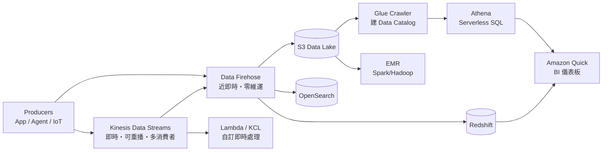

# 資料分析與串流

> [!abstract] 為什麼這篇重要
> 這是原本筆記**完全缺漏**的一整個 in-scope 類別。SAA 不考 Spark 調優，但很常考「這個資料流動需求該用哪個服務」——而且選項經常把 Kinesis、Firehose、SQS、MSK 放在一起當干擾項。你的 EDA 背景會幫上忙，但要小心：**Kafka 的心智模型會讓你過度傾向選 MSK**。

## 先分清楚：佇列 vs 串流

這是本篇最高頻的考點，也是你最容易因為 Kafka 經驗而答錯的地方。

| | SQS | Kinesis Data Streams | Amazon MQ |
|---|---|---|---|
| 模型 | 訊息佇列，消費後**刪除** | 串流日誌，資料**保留在 shard 上** | 傳統 message broker |
| 多消費者 | 每則訊息**一個** consumer 處理完就消失（要 fan-out 得靠 SNS） | **多個**獨立 consumer 各自讀同一份資料、各自維護 position | 依 broker 設定 |
| 重播 | ❌ 不能 | ✅ 可回到保留期內任一點重讀 | ❌ |
| 順序 | Standard 盡力而為；FIFO 保證 | **同一 partition key 內保證順序** | 依協定 |
| 擴展單位 | 自動，無上限 | **shard**（需自己規劃或用 on-demand） | broker instance |
| 保留 | 預設 4 天，最長 14 天 | 預設 24 小時，最長 **365 天** | 依設定 |
| 協定 | AWS 專有 API | AWS 專有 API | **AMQP / MQTT / STOMP / JMS / OpenWire** |

> [!danger] 三個必背的排除規則
> **(1)** 題幹說「**多個不同團隊/應用要各自處理同一份事件流**」或「**需要重播歷史資料**」→ Kinesis Data Streams，**不是** SQS。
> **(2)** 題幹說「**現有應用使用 JMS / AMQP，不想改程式碼**」→ **Amazon MQ**。這是 Amazon MQ 在考試中幾乎唯一的正解情境。看到 "without rewriting the application" + "message broker" 就選它。
> **(3)** 題幹說「**已有 Kafka，要遷移且保留 Kafka API**」→ MSK。**沒提到 Kafka 就不要選 MSK**——它的維運負擔比 Kinesis 高，違背 "least operational overhead"。

## Kinesis Data Streams vs Data Firehose

這兩個名字像，考法完全不同。

| | Kinesis Data Streams | Amazon Data Firehose |
|---|---|---|
| 定位 | **即時**串流擷取，你自己寫 consumer | **近即時**交付管線，全託管 |
| 延遲 | 毫秒 ~ 秒級 | **最低約 60 秒**（buffer 時間/大小觸發） |
| 擴展 | shard（provisioned）或 on-demand 模式 | **完全自動**，無需管容量 |
| 消費端 | Lambda、KCL 應用、Firehose、Managed Flink | **固定目的地**：S3、Redshift、OpenSearch、Splunk、HTTP endpoint |
| 重播 | ✅ | ❌ 送出即結束 |
| 轉換 | 自己做 | 內建 Lambda 轉換、**可轉 Parquet/ORC**、壓縮 |
| 維運 | 要管 shard、consumer position | 幾乎為零 |

**單一 shard 的硬限制**（容量規劃題會用到）：寫入 **1 MB/s 或 1,000 records/s**；讀取 **2 MB/s**（所有共享型 consumer 合計）。啟用 **Enhanced Fan-Out** 後，每個 consumer 各自獨享 2 MB/s（走 push 模式、延遲更低）。

> [!tip] 關鍵字直接對應
> `real-time` / `sub-second` / `multiple consumers` / `replay` → **Data Streams**
> `near real-time` / `deliver to S3 / Redshift / OpenSearch` / `no administration` / `automatically scales` → **Firehose**
> 題目說「把日誌串流存到 S3 供後續分析，維運負擔最低」→ **Firehose**（不是 Data Streams + 自寫 Lambda，那增加了維運）。

## 分析層：查詢與倉儲

| 需求 | 服務 | 判斷線索 | 不要選它當…… |
|---|---|---|---|
| 對 S3 上的檔案直接下 SQL，偶爾查、不想建叢集 | **Athena** | `ad-hoc query`、`serverless`、`query data in S3 directly`、`pay per query` | 不是高併發 BI 後端 |
| 結構化資料倉儲、複雜 join、大量 BI 併發 | **Redshift** | `data warehouse`、`complex joins`、`petabyte`、`OLAP`、`BI reporting` | 不是 OLTP（那是 RDS） |
| 全文檢索、日誌分析、可觀測性儀表板 | **OpenSearch Service** | `full-text search`、`log analytics`、`Kibana/Dashboards` | 不是關聯式資料庫 |
| 託管 Spark / Hadoop / Hive / Presto 叢集 | **EMR** | `Spark`、`Hadoop`、`existing big data framework` | 維運負擔高，`least overhead` 題別選 |
| Serverless ETL + **中央 metadata catalog** | **Glue** | `ETL`、`schema discovery`、`crawler`、`data catalog` | 不是查詢引擎 |
| BI 視覺化儀表板 | **Amazon Quick**（原 QuickSight） | `dashboard`、`business intelligence`、`visualize` | |
| Data lake 細粒度權限（表/欄/列級） | **Lake Formation** | `fine-grained access control on data lake` | |
| 從 SaaS（Salesforce、Slack…）拉資料進 AWS | **AppFlow** | `SaaS integration`、`no code` | |
| 訂閱第三方資料集 | **Data Exchange** | `third-party data` | |

> [!important] Athena 成本題的標準答案
> Athena **按掃描的資料量計費（每 TB）**。題目問「如何降低 Athena 成本 / 提升效能」，正解永遠是這三招的組合：
> 1. **改用列式格式**（Parquet、ORC）——只讀需要的欄位
> 2. **壓縮**（Snappy、GZIP）
> 3. **分區**（partition，例如按 `year/month/day` 的 S3 prefix）
>
> 錯誤選項常見：「改用更大的 instance」（Athena 無伺服器，沒有 instance）、「建索引」（不支援）。

> [!note] Redshift 的三個延伸名詞
> **Redshift Spectrum**：不載入資料，直接從 Redshift 查 S3——適合「熱資料在倉儲、冷資料留 S3」。
> **Redshift Serverless**：不想管節點容量時選它，符合 `least operational overhead`。
> **RA3 節點**：運算與儲存分離（managed storage），可獨立擴展。

## 典型情境串聯

**即時點擊流分析**
`Web/App → Kinesis Data Streams → Lambda（即時告警）+ Firehose → S3 → Glue Crawler → Athena → Quick`
Data Streams 同時餵兩條路，正是「多消費者」的價值所在。

**集中式日誌分析平台**
`CloudWatch Logs 訂閱過濾器 → Firehose → OpenSearch`，或 `→ S3 → Athena`。
選 OpenSearch 還是 Athena？**需要即時搜尋與儀表板 → OpenSearch；偶爾查、要最省 → S3 + Athena。**

**IoT 感測器資料湖**
`裝置 → Kinesis Data Streams（保留 7 天以便重播）→ Firehose（轉 Parquet）→ S3（Lifecycle 轉 Glacier）`
注意 Firehose 的 Parquet 轉換需要 Glue Data Catalog 提供 schema。

## 與其他筆記的接點

- 串流的**解耦設計**與 SQS/SNS/EventBridge 的選型：[[事件驅動與無伺服器]]
- 資料落地後的**儲存類別與生命週期**：[[S3與資料生命週期]]
- Redshift 與 RDS/DynamoDB 的**工作負載邊界（OLAP vs OLTP）**：[[資料庫與快取]]
- 分析結果的**成本歸因與觀測**：[[成本與可觀測性]]
- 資料湖的**加密與細粒度授權**：[[EC2與IAM安全]]、[[治理與合規]]

---

參考 [[03 官方資源清單]]；返回 [[服務關聯總圖]]、[[00 考試總覽]]。

---

## 🎯 考點速記

看到 `multiple consumers` + `replay` → **Kinesis Data Streams**
看到 `near real-time` + `deliver to S3/Redshift/OpenSearch` + `no admin` → **Firehose**
看到 `ad-hoc SQL on S3` + `serverless` → **Athena**
看到 Athena 慢/貴 → **Parquet + 壓縮 + 分區**
看到 `data warehouse` / `complex joins` / `BI` → **Redshift**
看到 `full-text search` + `dashboards` → **OpenSearch**
看到 `ETL` / `schema discovery` / `data catalog` → **Glue**
看到 `existing JMS/AMQP` → **Amazon MQ**
看到 `existing Kafka` → **MSK**；**沒提到 Kafka 就不要選**

## 💣 真實場景陷阱

- **Kinesis shard 數量算錯導致限流**：寫入 1 MB/s 或 1,000 records/s 是**每個 shard** 的上限，不是整個 stream 的。
- **Firehose 的 Parquet 轉換需要 Glue Data Catalog 提供 schema**，沒建 catalog 就轉不了。
- **Athena 查詢未分區的資料湖**：一次掃描整個 bucket，帳單會很可觀。分區是成本控制不是效能微調。
- **OpenSearch 叢集容量規劃**：日誌量成長快，沒設 index lifecycle 會塞爆磁碟。
- **把 SQS 當串流用**：訊息被一個消費者取走就沒了，多團隊各自處理的需求做不到。

## ✍️ 自我檢核

1. SQS、Kinesis Data Streams、Amazon MQ 三者的模型差在哪？各自的正解情境？
2. Data Streams 與 Firehose 在延遲、消費端、重播、維運四個維度的差異？
3. Kinesis 單一 shard 的寫入與讀取上限？Enhanced Fan-Out 改變了什麼？
4. Athena 的降本三招是什麼？為什麼「換更大 instance」一定是錯的？
5. 「即時全文檢索 + 儀表板」與「偶爾查詢 + 最省」分別選什麼？

> [!success]- 參考答案
> 1. **SQS**=佇列，消費後刪除，單一邏輯消費者。**Kinesis**=串流，資料留在 shard，多消費者各自讀取並可重播。**Amazon MQ**=傳統 broker，支援 JMS/AMQP 等標準協定——正解情境是「**既有應用不改程式碼**」。
> 2. **延遲**：毫秒-秒 vs 最低約 60 秒。**消費端**：自寫 Lambda/KCL vs 固定目的地。**重播**：可以 vs 不行。**維運**：要管 shard vs 幾乎為零。
> 3. 寫 **1 MB/s 或 1,000 records/s**、讀 **2 MB/s**（所有共享型 consumer 合計）。**Enhanced Fan-Out 讓每個 consumer 各自獨享 2 MB/s**，且改為 push 模式、延遲更低。
> 4. **列式格式（Parquet/ORC）+ 壓縮 + 分區**，因為 Athena **按掃描的資料量計費**。「換更大 instance」錯在 **Athena 是無伺服器的，根本沒有 instance**。
> 5. 即時全文檢索 + 儀表板 → **OpenSearch Service**；偶爾查、要最省 → **S3 + Athena**。分界在查詢頻率與即時性需求。
