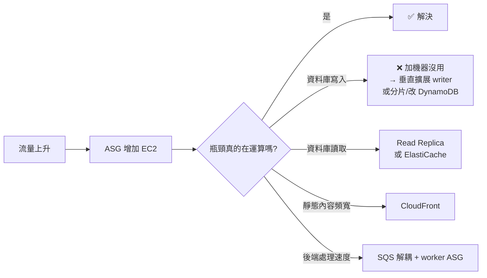

# EC2與負載平衡及擴展

`Route 53 → (可選 CloudFront/WAF) → ALB → Target group → 多 AZ Auto Scaling EC2 → RDS`。Launch template 定義 AMI、instance type、角色、SG 等；ASG 負責期望數量及擴縮，target group 連接負載平衡器並將健康的 instance 作目標。健康檢查路徑必須和應用一致。

| 判斷 | ALB | NLB |
|---|---|---|
| 處理層 | HTTP/HTTPS、路徑/host 路由等 L7 | TCP/UDP/TLS 等 L4 |
| 典型需求 | Web API、微服務路由 | 非 HTTP 協定、特定網路能力或極低延遲需求 |

ASG 的目標追蹤可依 CPU、ALB request count per target 或自訂指標擴展；要看暖機、健康檢查、scale-in 與狀態外部化。增加 instance 不會自動擴大單一 RDS writer 容量；讀負載可用 read replica/cache。跨 AZ 部署改善 AZ 故障容忍，不自動提供跨 Region DR。見 [[資料庫與快取]]、[[高可用備援與災難復原]]。

Spring Boot 練習：`/actuator/health/readiness` 作 target health check；單一節點故障時，ALB 停止導流、ASG 補節點。不要將 session 或上傳檔只放在本機磁碟；改用外部 session store/物件儲存。詳見 [[EC2與儲存]]。

---

# 🧠 技術層
*它實際上怎麼運作——心智模型、機制、限制。**第一輪只讀這一層**，先把架構直覺建立起來。*

## 三種 ELB

| | **ALB** | **NLB** | **GWLB** |
|---|---|---|---|
| OSI 層 | **L7**（HTTP/HTTPS/gRPC） | **L4**（TCP/UDP/TLS） | **L3**（IP 封包） |
| 路由依據 | path、host、header、query、method、source IP | 協定 + 端口 | 透通轉送到虛擬設備 |
| **靜態 IP** | ❌（只有 DNS 名稱） | ✅ **每 AZ 一個靜態 IP，可指定 EIP** | — |
| 效能 | 一般 | **極高吞吐、極低延遲**，可處理突發流量 | — |
| 保留來源 IP | 需看 `X-Forwarded-For` header | **預設保留真實來源 IP** | 保留 |
| WAF 可掛載 | ✅ | ❌ | ❌ |
| 典型用途 | Web / API / 微服務 | 遊戲、IoT、MQTT、極低延遲、需要靜態 IP | 串接第三方防火牆/IDS 虛擬設備 |

> [!danger] 三個高頻判斷句
> 「客戶的防火牆需要**白名單固定 IP**」→ **NLB**（ALB 沒有靜態 IP）。
> 「要擋 **SQL injection / XSS**」→ 需要 **WAF** → 必須是 **ALB**（或前面加 CloudFront）。**WAF 掛不上 NLB**。
> 「要把流量導到**第三方資安虛擬設備**做檢查後再放行」→ **Gateway Load Balancer**。

## ELB 的六個進階設定

| 設定 | 作用 | 題幹關鍵字 |
|---|---|---|
| **Sticky session**（工作階段保持） | 同一使用者固定導到同一目標 | `users are being logged out`、`shopping cart lost`。**注意：正解通常是「把 session 外部化到 ElastiCache/DynamoDB」，sticky session 是次佳解** |
| **Cross-zone load balancing** | 流量平均分配到**所有 AZ 的所有目標**，而非先平均分到 AZ | **ALB 預設開啟且免費**；**NLB 預設關閉**，開啟後跨 AZ 流量計費。題目說「各 AZ 目標數量不同導致負載不均」→ 開啟 cross-zone |
| **Deregistration delay**（connection draining） | 目標移除前等待既有連線完成 | `in-flight requests are being dropped during deployment` |
| **SNI** | 單一 ALB 上掛多張憑證、服務多個網域 | `multiple HTTPS domains on one load balancer` |
| **Slow start** | 新目標逐步增加流量 | 應用需要暖機 |
| **健康檢查** | interval、threshold、逾時、成功碼 | 路徑必須與應用一致，且**不能需要驗證** |

> [!important] Session 題的優先順序
> 題目說「使用者在擴縮後被登出」時，選項通常有三個層次：
> **最佳**：session 外部化到 **ElastiCache（Redis）** 或 **DynamoDB** → 真正無狀態，可自由擴縮。
> **可行**：ALB **sticky session** → 但節點故障時該使用者仍會掉 session。
> **錯誤**：存本機磁碟、或用 EFS 存 session。
> 若題目強調 `minimal changes to the application`，sticky session 才會是正解。

## ASG 深入

完整的擴縮政策類型、lifecycle hook、warm pool、instance refresh、health check type 已整理在 [[運算與容器選型]]，此處只重申最容易失分的一點：

> [!danger] ASG 預設不知道你的應用掛了
> ASG 的 health check type **預設是 `EC2`**，只看 instance status check（硬體與 OS 層）。
> 應用程式當掉但 OS 還活著時，**ASG 不會替換它**——只有 ALB 會停止導流，結果是容量被佔用但不服務。
> 正解：**把 ASG health check type 設為 `ELB`**，讓 ASG 依 target group 的健康狀態決定替換。

## 擴展的邊界在哪裡

這張圖對應考試中一整類題目：**「已經開啟 Auto Scaling 但效能仍然不佳」**。答案永遠不是「再加更多 EC2」，而是找出真正的瓶頸層。見 [[資料庫與快取]]、[[事件驅動與無伺服器]]。

---

# 🎯 考試層
*考試會怎麼問——關鍵字反射、誘答陷阱、閉卷檢核。**第二輪與考前讀這一層**。*

## 🎯 考點速記

看到 `static IP for firewall allowlist` → **NLB**（ALB 沒有靜態 IP）
看到 `SQL injection` / `XSS` → 需要 **WAF** → 必須是 **ALB** 或前置 **CloudFront**（掛不上 NLB）
看到 `third-party firewall appliance` → **GWLB**
看到 `users logged out after scaling` → **session 外部化**（次佳解才是 sticky session）
看到 `app crashed but ASG did not replace` → **health check type 改 ELB**
看到 `in-flight requests dropped during deployment` → **deregistration delay**
看到 `uneven load across AZs` → **開啟 cross-zone**（NLB 預設關閉）
看到 `app takes 10 minutes to start` → **warm pool** 或 **predictive scaling**
看到 `capture logs before termination` → **lifecycle hook**

## 💣 真實場景陷阱

- **健康檢查路徑需要驗證**：`/actuator/health` 若被 Spring Security 擋住，target 永遠 unhealthy，ASG 會無限替換實例。健康檢查端點必須免驗證。
- **ASG 與 ALB 的職責混淆**：ALB 只會「停止導流」，**替換實例是 ASG 的事**。兩者的健康檢查是分開設定的。
- **scale-in 殺掉正在處理請求的實例**：要同時設 deregistration delay（ALB 端）與 lifecycle hook（ASG 端）。
- **NLB 開 cross-zone 會產生跨 AZ 流量費**，而 ALB 的 cross-zone 免費。成本題可能考這個不對稱。

## ✍️ 自我檢核

1. ALB、NLB、GWLB 各在哪一層？哪一個有靜態 IP？哪一個能掛 WAF？
2. 應用當掉但 OS 還活著，ASG 為什麼沒有替換？怎麼修？
3. 「使用者擴縮後被登出」有三個層次的解法，各是什麼？什麼條件下 sticky session 才是正解？
4. cross-zone load balancing 在 ALB 與 NLB 的預設值與費用有何不同？
5. 「已經開了 Auto Scaling 但效能還是不好」，列出四種可能的瓶頸層。

參考答案

1. ALB=**L7**、NLB=**L4**、GWLB=**L3**。**只有 NLB 有靜態 IP**（每 AZ 一個，可指定 EIP）。**WAF 掛不上 NLB**，可掛 ALB / CloudFront / API Gateway / AppSync / Cognito UP / App Runner / Verified Access。
2. health check type **預設是 `EC2`**，只看 instance status check（硬體與 OS 層）。改成 **`ELB`** 後 ASG 才會依 target group 健康狀態替換。
3. 最佳=**session 外部化到 ElastiCache/DynamoDB**；可行=**sticky session**（節點故障仍會掉）；錯誤=存本機磁碟或 EFS。題目強調 `minimal changes to the application` 時 sticky session 才是正解。
4. **ALB 預設開啟且免費**；**NLB 預設關閉**，開啟後跨 AZ 流量要計費。
5. **運算**（加機器有效）、**資料庫寫入**（垂直擴展或改 DynamoDB/分片）、**資料庫讀取**（Read Replica 或快取）、**靜態內容頻寬**（CloudFront）、**後端處理速度**（SQS 解耦 + worker ASG）。

---

# 🔗 相關

參考 [[03 官方資源清單]]；返回 [[00 考試總覽]]。
