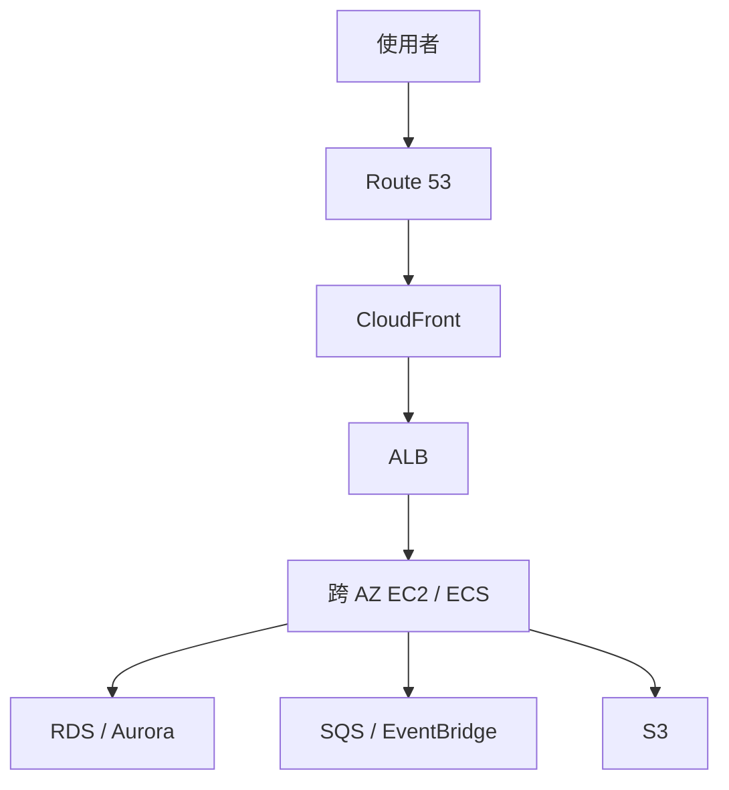

# 服務關聯總圖

---

# 🧠 技術層
*它實際上怎麼運作——心智模型、機制、限制。**第一輪只讀這一層**，先把架構直覺建立起來。*

## 以一個電商訂單系統為例

這只是候選架構：CloudFront 可以加速適合快取的內容；若動態請求不適合快取，仍可經 ALB 到應用。儲存、DB、佇列各自服務不同資料需求。

| 追蹤路徑 | 問題 | 延伸筆記 |
|---|---|---|
| 使用者到應用 | DNS 如何指向服務、誰終止 TLS、如何分流與健康檢查？ | [[DNS與全球流量]] → [[EC2與負載平衡及擴展]] → [[EC2與網路]] |
| 應用到資料 | 磁碟、共享檔、物件、交易 DB 各適合什麼？ | [[EC2與儲存]] → [[S3與資料生命週期]] → [[資料庫與快取]] |
| 應用到 AWS API | 網路可達是否等於可存取？身分、資源政策、金鑰如何配合？ | [[EC2與IAM安全]] → [[EC2與網路]] |
| 事件與故障 | 尖峰、失敗、AZ 故障、區域故障如何處理？ | [[事件驅動與無伺服器]] → [[高可用備援與災難復原]] |
| 觀測與費用 | 哪裡付費、看哪些指標、何時縮容？ | [[成本與可觀測性]] |
| 使用者身分 | 誰在登入？終端使用者、員工、工作負載各用什麼機制？ | [[身分聯合與應用存取]] → [[EC2與IAM安全]] |
| 威脅與防護 | 攻擊面在哪？誰在偵測？誰在阻擋？ | [[威脅偵測與邊界防護]] → [[EC2與網路]] |
| 多帳號治理 | 誰設下權限天花板？合規如何持續驗證？ | [[治理與合規]] |
| 資料流動 | 事件、日誌、串流如何進入分析層？ | [[資料分析與串流]] → [[S3與資料生命週期]] |
| 運算形態 | 這段程式該跑在 VM、容器還是函式上？ | [[運算與容器選型]] |
| 地端與雲端之間 | 資料怎麼搬？連線怎麼建？DNS 怎麼解析？ | [[遷移與混合雲]] → [[EC2與網路]] |

## 從需求回推

`高可用 HTTP API` → ALB + target group + 多 AZ ASG；狀態放在外部持久服務。`private subnet 訪問 S3` → S3 gateway endpoint + IAM/bucket policy（依限制）；`共享 Linux 檔案` → EFS mount target/NFS；`延遲解耦` → SQS；`global static files` → S3 + CloudFront + OAC。這些是常見解法，仍需逐題檢查可用性、資料一致性及成本條件。

---

# 🎯 考試層
*考試會怎麼問——關鍵字反射、誘答陷阱、閉卷檢核。**第二輪與考前讀這一層**。*

## ✍️ 自我檢核

1. 不看筆記，畫出一個高可用電商訂單系統：從使用者到資料庫，標出每一層的服務與故障邊界。
2. 「使用者到應用」這條路徑上，誰終止 TLS？憑證放哪？健康檢查由誰做？
3. 「應用到 AWS API」這條路徑，網路可達與有授權各需要滿足什麼？
4. 同一張圖上，依序假設「單台實例死亡 → 整個 AZ 失效 → 整個 Region 失效」，每層需要什麼機制？
5. 在這張圖上標出五個計費點，並說出哪一個最容易被低估。

參考答案

1. 骨架：`Route 53 → CloudFront（可選）→ WAF → ALB（public subnet，跨 2 AZ）→ ASG EC2/ECS（private subnet，跨 2 AZ）→ RDS Multi-AZ（private subnet）`，旁支 `→ SQS/EventBridge → worker`、`→ S3`、`→ ElastiCache`。故障邊界：實例（ASG 替換）、AZ（多 AZ 部署）、Region（跨 Region 複寫 + DNS/GA 切換）。
2. **TLS 通常在 CloudFront 或 ALB 終止**。憑證用 **ACM**——CloudFront 的必須在 **us-east-1**，ALB 的用同 Region。健康檢查由 **target group** 對後端做，**ASG 要把 health check type 設為 ELB** 才會依此替換實例。
3. **網路可達**：route table（gateway/interface endpoint 或 NAT）、SG 出站、NACL 雙向。**有授權**：IAM identity policy、資源 policy、endpoint policy、SCP、KMS。**兩者是獨立的兩道檢查**——網路通不代表有權限（症狀：403 而非 timeout）。
4. **實例** → ALB health check + ASG 替換（狀態須外部化）；**AZ** → 多 AZ ASG/ALB/RDS Multi-AZ，**NAT 與 subnet 也要每 AZ 規劃**；**Region** → 跨 Region 資料複寫 + Route 53 或 Global Accelerator 切換 + 環境預先部署 + 演練。
5. 計費點：EC2 時數、ALB 容量與流量、NAT gateway 時數與處理量、RDS instance 與儲存、跨 AZ 傳輸、對外 egress。**最容易被低估的是 NAT gateway 的資料處理費與跨 AZ 流量費**——尤其當流量其實是去 S3（可改用免費的 gateway endpoint）。

---

# 🔗 相關

返回 [[README]]。
