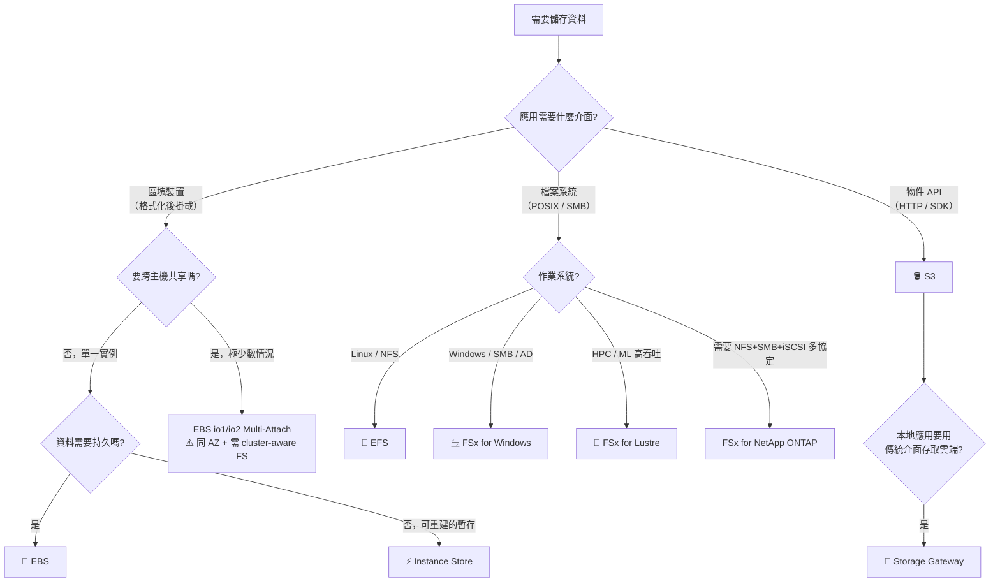
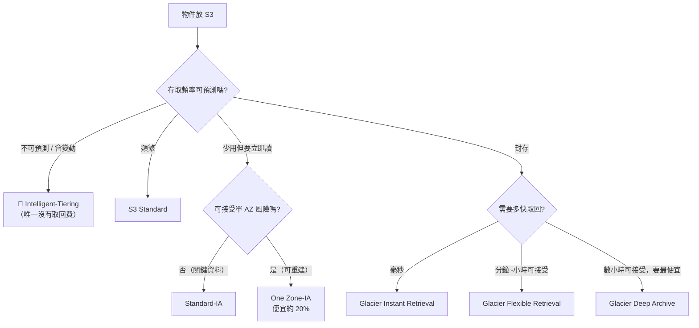
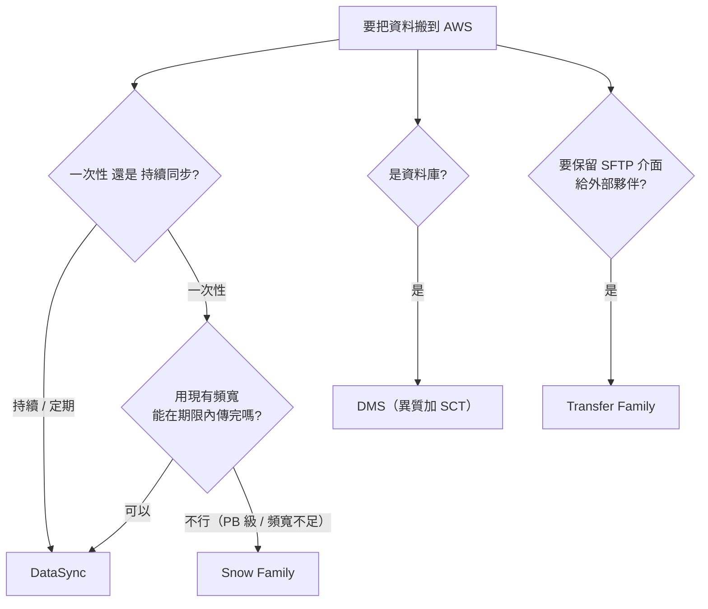

# 決策樹：儲存選型

> [!abstract] 目標
> 儲存題的第一個分岔永遠是**存取介面**（區塊 / 檔案 / 物件），不是容量也不是效能。先鎖定介面，選項立刻砍掉一半。

---

## 🌳 主決策樹

---

## 🔑 關鍵詞 → 服務（必背）

| 題目出現 | 選 | 砍掉 |
|---|---|---|
| `block device`、`boot volume`、`low-latency disk for a database` | **EBS** | S3、EFS |
| `temporary`、`scratch`、`cache`、`can be regenerated`、最高 IOPS | **Instance Store** | EBS（若強調暫存與速度） |
| **`POSIX`**、`shared file system`、`NFS`、多台 **Linux** 同時讀寫 | **EFS** | **S3（不是 POSIX）** |
| **`Windows`**、`SMB`、`Active Directory`、`NTFS` | **FSx for Windows File Server** | EFS |
| **`HPC`**、`machine learning training`、`high-performance parallel file system` | **FSx for Lustre** | EFS |
| `multi-protocol`、`existing NetApp` | **FSx for NetApp ONTAP** | |
| `objects`、`static assets`、`backup`、`data lake`、`unlimited scale` | **S3** | EBS |
| `on-premises application must keep using NFS/SMB/iSCSI/tape` | **Storage Gateway** | DataSync |
| `migrate data then decommission on-prem NAS` | **DataSync** | Storage Gateway |
| 大型循序讀寫、吞吐導向、成本敏感、**非開機碟** | **EBS st1（HDD）** | gp3、io2 |
| 極高 IOPS 的關鍵資料庫 | **EBS io2 / io2 Block Express** | gp3 |
| 「提高 IOPS 但不想加大容量」 | **gp3** | gp2（IOPS 綁容量） |

> [!danger] 三個最常錯的地方
> **(1) S3 不是檔案系統。** 題幹出現 `POSIX`、`mount`、`shared directory` 而選 S3 就是錯的——除非題目允許改寫應用。
> **(2) EBS Multi-Attach 不是共享檔案系統。** 僅 io1/io2、**同一 AZ**、最多 16 台，而且**需要 cluster-aware 檔案系統**；用一般 ext4/XFS 掛兩台會毀損資料。
> **(3) st1 與 sc1 不能當開機碟。** 題幹特意說「不作為開機碟」就是在暗示 HDD 可選。

---

## 🗂 S3 儲存類別決策

| 類別 | **最低儲存期間** | 取回費 | AZ |
|---|---:|:-:|:-:|
| Standard | 無 | 無 | ≥3 |
| **Intelligent-Tiering** | 無 | **無** | ≥3 |
| Standard-IA | **30 天** | 有 | ≥3 |
| One Zone-IA | **30 天** | 有 | **1** |
| Glacier Instant | **90 天** | 有 | ≥3 |
| Glacier Flexible | **90 天** | 有 | ≥3 |
| Glacier Deep Archive | **180 天** | 有 | ≥3 |

> [!danger] 成本題的頭號陷阱
> **提前刪除仍要付滿最低儲存期間。** 資料只保留 45 天卻選 Glacier Flexible（最低 90 天）→ **反而更貴**。
> **先檢查保留時間 vs 最低期間，再比單價。**

---

## 🌉 資料搬遷決策

> [!warning] Snowball 的反向陷阱
> 看到大資料量**不要反射選 Snowball**。先算：10 TB 在 1 Gbps 下不到兩天就傳完，此時 **DataSync 更快也更省事**。
> 判斷點是 **「用網路傳要多久 vs 期限」**，不是資料量本身。

## ✍️ 自我檢核

1. 兩台跨 AZ 的 Linux EC2 要同時讀寫同一目錄、且不能改程式碼——選什麼？為什麼不是 EBS Multi-Attach？
2. 資料只保留 45 天且期間不存取，要最便宜。可以選 Glacier Deep Archive 嗎？
3. 「提高 EBS 的 IOPS，但不想增加容量」——gp2 能做到嗎？
4. DataSync 與 Storage Gateway 的根本差別是什麼？用一句話說。
5. 什麼情況下 One Zone-IA 是錯誤答案？

> [!success]- 參考答案
> 1. **EFS**。EBS Multi-Attach 僅限 io1/io2、**同一 AZ**（題目說跨 AZ 就出局），而且需要 cluster-aware 檔案系統。
> 2. **不行**。Deep Archive 最低儲存期間 **180 天**，只放 45 天要付滿 180 天的錢。正解是 Standard-IA（最低 30 天）或 One Zone-IA。
> 3. **不能**。gp2 的 IOPS 綁定容量（3 IOPS/GB），只能靠加大容量提升。**gp3 的 IOPS 與吞吐量可獨立調整**，這正是它的賣點。
> 4. **DataSync 是搬家（搬完本地就不用了），Storage Gateway 是延伸（本地持續以傳統介面存取雲端資料）。**
> 5. 當資料是**關鍵且無法重建**時。One Zone-IA 只存在單一 AZ，該 AZ 損毀資料就沒了。

## 🔗 相關

- [[EC2與儲存]]
- [[S3與資料生命週期]]
- [[遷移與混合雲]]
- [[數字與門檻速查]]
- [[常見陷阱與誘答選項識別]]
