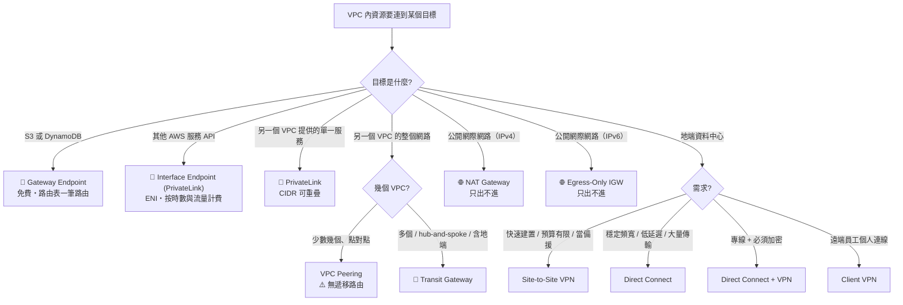
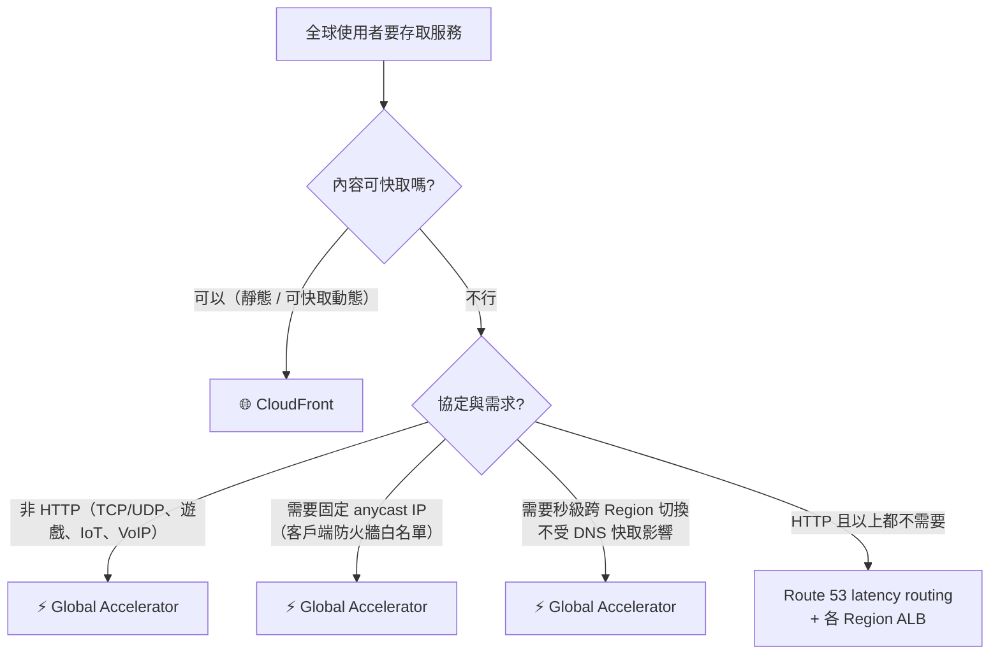
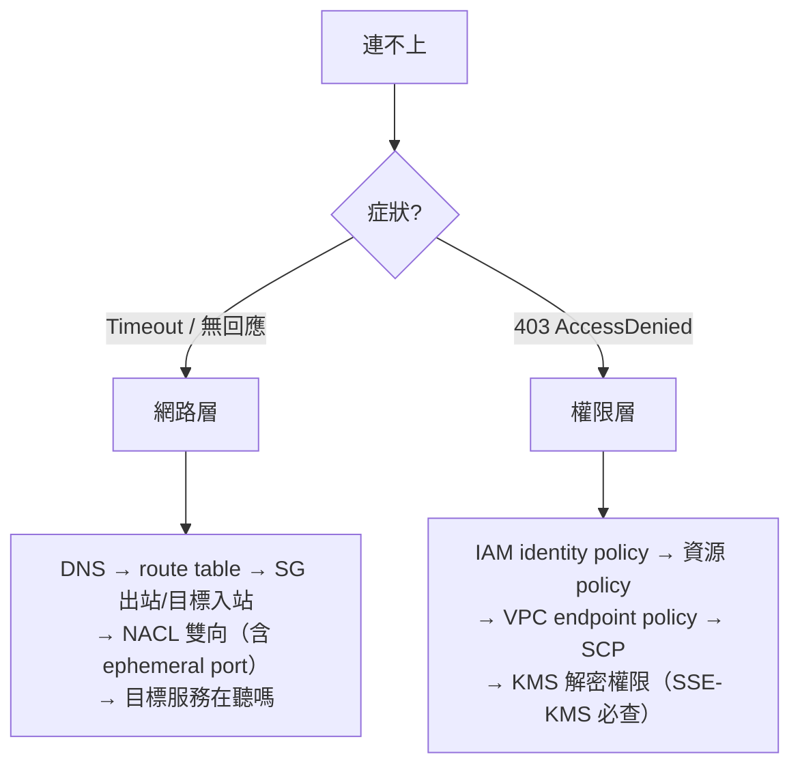

# 決策樹：網路與連線選型

> [!abstract] 目標
> 網路題橫跨 Domain 1（安全）與 Domain 3（效能），而且常和權限題混在一起。**第一步永遠是分清楚「這是網路問題還是權限問題」。**

---

## 🌳 私有存取決策樹

---

## 🔑 關鍵詞 → 服務（必背）

| 題目出現 | 選 | 砍掉 |
|---|---|---|
| `without traversing the public internet` + S3/DynamoDB | **Gateway Endpoint**（免費） | NAT gateway |
| `private access to AWS API`（S3/DDB 以外） | **Interface Endpoint** | Gateway endpoint |
| `overlapping CIDR`、`expose one service without connecting whole VPC`、`SaaS provider` | **PrivateLink** | Peering、TGW |
| `transitive routing`、`hundreds of VPCs`、`central hub` | **Transit Gateway** | **Peering（無遞移路由）** |
| 兩三個 VPC 互通、要最省 | **VPC Peering** | TGW（有附加費） |
| `outbound only` + **IPv4** | **NAT Gateway** | IGW |
| `outbound only` + **IPv6** | **Egress-Only IGW** | **NAT Gateway（不處理 IPv6）** |
| `consistent / predictable network performance`、`dedicated` | **Direct Connect** | VPN |
| `Direct Connect` **且** `encrypted in transit` | **DX + Site-to-Site VPN**（DX 本身不加密） | 單獨 DX |
| `need a dedicated link but must be available immediately` | **先用 VPN 過渡，DX 完成後切換** | 只等 DX |
| `remote employees access VPC` | **Client VPN** | Site-to-Site VPN |
| on-prem 主機要解析 VPC 私有 DNS | **Inbound Resolver Endpoint** | |
| VPC 內資源要解析 on-prem DNS | **Outbound Resolver Endpoint + 轉發規則** | |

---

## 🚨 五個精確結論（最常被考錯）

> [!danger] 記住這五句
> **1. Gateway endpoint 只有 S3 和 DynamoDB 兩個服務。** 其他一律 interface endpoint。
> **2. 「on-prem 經 DX 私有存取 S3」不能用 gateway endpoint**——它只是 VPC 路由表裡的一筆路由，從 on-prem 來的流量不經過那張表。正解是 **S3 interface endpoint** 或 **Public VIF**。
> **3. VPC Peering 不支援遞移路由。** A-B 通、B-C 通，不代表 A 能到 C。
> **4. Direct Connect 不加密。** 要加密就疊 IPsec VPN 或用 MACsec。
> **5. NAT Gateway 是 AZ 級資源。** 只放一個，該 AZ 故障時**所有** AZ 的私有子網都斷網。每 AZ 各一個，且路由指向自己 AZ 的 NAT（同時省跨 AZ 傳輸費）。

---

## 🌍 全球流量入口決策

### Route 53 七種 routing policy

| Policy | 依據 | 關鍵字 |
|---|---|---|
| Simple | 無條件 | — |
| **Weighted** | 權重百分比 | `A/B testing`、`canary`、`send 10%` |
| **Latency-based** | 網路延遲 | `lowest latency`、`best performance` |
| **Failover** | 健康檢查 | `active-passive`、`standby site` |
| **Geolocation** | 使用者所在地 | **`data residency`**、`regulatory`、語言 |
| Geoproximity | 資源位置 + bias | `shift traffic toward a region` |
| Multivalue answer | 多筆健康記錄（最多 8） | 輕量負載平衡 |
| IP-based | 來源 IP CIDR | `route by ISP` |

> [!important] Latency vs Geolocation
> **Latency = 誰快去誰那（效能）。Geolocation = 誰在哪去哪（合規）。**
> 出現 `data residency`、`must be served from EU`、`regulatory` → **Geolocation**，即使那不是延遲最低的。

> [!warning] Alias vs CNAME
> **根網域（zone apex，如 `example.com`）指向 ALB / CloudFront 只能用 Alias record。**
> CNAME 在 DNS 標準上不能用於 zone apex。這題出現頻率很高。

---

## 🛡 負載平衡器選型

| 需求 | 選 |
|---|---|
| HTTP/HTTPS、path/host 路由、要掛 **WAF** | **ALB** |
| TCP/UDP、極低延遲、**需要靜態 IP** | **NLB** |
| 串接第三方防火牆 / IDS 虛擬設備 | **GWLB** |

> [!danger] WAF 掛不上 NLB
> 可掛載 WAF 的只有 **CloudFront、ALB、API Gateway、AppSync、Cognito User Pool、App Runner、Verified Access**。
> 「NLB 後面的服務要擋 SQL injection」→ **前面加 CloudFront** 或 **改用 ALB**。

---

## 🔍 排錯分流（考場省時關鍵）

> [!tip] 一句話心法
> **Timeout 找網路，403 找權限。**
> 很多干擾項就是「用網路方案解權限問題」（或反過來）。看到 `AccessDenied` 卻選「把實例移到公有子網」一定是錯的。

## ✍️ 自我檢核

1. 為什麼「on-prem 經 Direct Connect 私有存取 S3」不能用 gateway endpoint？正解是什麼？
2. IPv6 的私有資源要「只出不進」，用什麼？為什麼不是 NAT gateway？
3. 三個 VPC 要互通，A-B 與 B-C 已建 peering，A 能連到 C 嗎？
4. 什麼情況下必須選 Global Accelerator 而不是 Route 53 failover？
5. 某 EC2 呼叫 S3 收到 403，你會先檢查哪幾層？會檢查 route table 嗎？

參考答案

1. **gateway endpoint 只是 VPC 路由表裡的一筆路由，只在 VPC 內部生效**；從 on-prem 經 DX 進來的流量不走那張路由表。正解是 **S3 interface endpoint** 或 **Public VIF**。
2. **Egress-Only Internet Gateway**。**NAT 只處理 IPv4**——IPv6 沒有位址短缺問題所以沒有 NAT，要達成只出不進得用 egress-only IGW。
3. **不能**。VPC Peering **不支援遞移路由**，必須 A-C 再建一條，或改用 Transit Gateway。
4. 兩種情況：**需要固定 anycast IP**（客戶端防火牆白名單），或**需要秒級切換且不受 DNS TTL 與客戶端快取影響**。
5. 403 是**權限問題**，依序查 IAM identity policy → bucket policy → endpoint policy → SCP → **KMS 解密權限**（SSE-KMS 物件必查）。**不會查 route table**——網路不通的症狀是 timeout 不是 403。

## 🔗 相關

- [[EC2與網路]]
- [[DNS與全球流量]]
- [[遷移與混合雲]]
- [[EC2與負載平衡及擴展]]
- [[常見陷阱與誘答選項識別]]
