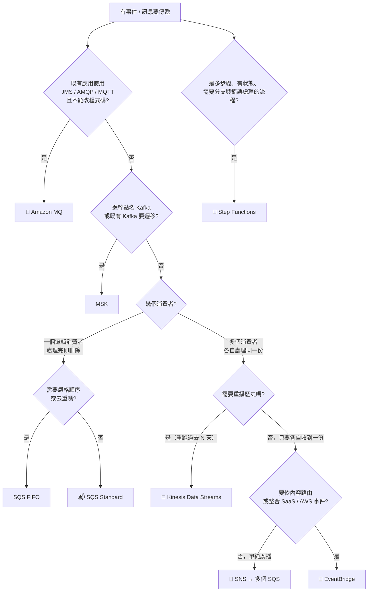

# 決策樹：訊息與事件選型

> [!abstract] 目標
> 這張樹是給有 EDA / Kafka 背景的人特別準備的。你的經驗會讓你**過度傾向選 MSK 與 Kafka 式的思考**，但 SAA 的正解通常更簡單。

---

## 🌳 主決策樹

---

## 🔑 關鍵詞 → 服務（必背）

| 題目出現 | 選 | 砍掉 |
|---|---|---|
| `decouple`、`buffer spikes`、`retry`、`worker pool` | **SQS** | 同步 API 呼叫 |
| **`order must be preserved`**、**`no duplicates`**、`exactly once` | **SQS FIFO** | Standard |
| `fan-out`、`notify multiple subscribers`、`each service must receive every message` | **SNS → 多個 SQS** | 單一 SQS |
| **`multiple teams process the same stream`** + **`replay`** | **Kinesis Data Streams** | SQS、SNS |
| `real-time`、`sub-second`、`clickstream`、`ordered per key` | **Kinesis Data Streams** | Firehose |
| `near real-time`、`deliver to S3 / Redshift / OpenSearch`、`no administration` | **Data Firehose** | Data Streams |
| `route events based on content`、`SaaS integration`、`react to AWS service state change`、`schedule` | **EventBridge** | SNS |
| `archive and replay events` | **EventBridge**（archive/replay）或 Kinesis | SNS（無保留） |
| **`existing JMS / AMQP application`**、`message broker`、`without rewriting` | **Amazon MQ** | SQS |
| `existing Kafka`、`Kafka API compatibility` | **MSK** | Kinesis |
| `multi-step workflow`、`conditional branching`、`visual workflow`、`error handling` | **Step Functions** | 一串 Lambda 互相呼叫 |
| `run a job every day at 2am` | **EventBridge Scheduler** | cron on EC2 |

---

## ⚖️ 三組必考對照

### ① SQS vs SNS vs Kinesis（核心分水嶺）

| | **SQS** | **SNS** | **Kinesis Data Streams** |
|---|---|---|---|
| 模型 | 佇列，消費後**刪除** | 廣播，推給訂閱者 | 串流，資料**留在 shard** |
| 多消費者各收一份 | ❌（要靠 SNS fan-out） | ✅ | ✅ 各自維護 position |
| **重播** | ❌ | ❌ | ✅ 保留期內任一點 |
| 順序 | FIFO 才有 | ❌ | ✅ 同 partition key |
| 緩衝與重試 | ✅ 強項 | 訂閱端自理 | 消費端自理 |

> [!danger] 最容易錯的一題
> 「三個下游服務都要處理同一筆事件」——**單一 SQS 做不到**，訊息被一個消費者取走後其他人就看不到了。
> 正解是 **SNS fan-out + 每個消費者一個 SQS**（各自緩衝、各自 DLQ、彼此隔離）。

### ② Data Streams vs Firehose

| | Data Streams | Firehose |
|---|---|---|
| 延遲 | 毫秒~秒 | **最低約 60 秒** |
| 消費端 | 自己寫（Lambda / KCL） | **固定目的地**：S3 / Redshift / OpenSearch / Splunk |
| 重播 | ✅ | ❌ |
| 擴展 | shard 或 on-demand | **全自動** |
| 維運 | 要管 shard | **幾乎為零** |

`real-time` + `multiple consumers` + `replay` → **Data Streams**
`deliver to storage` + `least operational overhead` → **Firehose**

### ③ SNS vs EventBridge

**SNS** = 單純 pub/sub，高吞吐、低延遲、便宜。
**EventBridge** = 事件匯流排 + **規則路由**，有 schema registry、archive & replay、scheduler、SaaS 與 AWS 服務原生整合。

題幹出現 `route based on event content`、`third-party SaaS`、`AWS service state changes`、`replay` → **EventBridge**。

---

## 🔢 SQS 的四個機制（題目幾乎都繞著這些打轉）

| 症狀 / 需求 | 機制 |
|---|---|
| **訊息被處理多次** | **visibility timeout 太短**，調長到大於處理時間 |
| **降低成本 / 減少空回應** | **long polling**（最長等 20 秒） |
| 反覆失敗的訊息卡住佇列 | **DLQ**（設 `maxReceiveCount`） |
| 訊息要延後處理 | delay queue / message timer（最長 15 分鐘） |
| 訊息超過 256 KB | **S3 + Extended Client Library**（訊息只放指標） |

> [!important] 即使用了 FIFO 仍要冪等
> SQS Standard 本來就是 **at-least-once**；FIFO 的去重窗只有 5 分鐘，跨 message group 也沒有順序保證。
> **冪等 consumer 是設計責任，不是服務保證**——這點和你的 SAGA 經驗一致。

---

## 🔀 Step Functions：兩種工作流程

| | **Standard** | **Express** |
|---|---|---|
| 最長執行 | **1 年** | **5 分鐘** |
| 執行模型 | 恰好一次 | 至少一次 |
| 計費 | 按**狀態轉換次數** | 按執行次數與時間 |
| 適用 | 長時間業務流程、需稽核歷史 | 高頻短時的串流/IoT 處理 |

## ✍️ 自我檢核

1. 三個下游服務都要處理同一筆訂單事件，其中一個很慢不能影響其他兩個——畫出正解架構。
2. 「訊息被重複處理」最可能的原因是什麼？調整哪個參數？
3. 什麼題幹條件會讓 Amazon MQ 成為正解？沒有那個條件時該選什麼？
4. Kinesis Data Streams 與 SQS 最根本的差別是什麼？用一句話說。
5. Lambda 由 S3 事件非同步觸發，失敗的事件為什麼會消失？怎麼保留？

參考答案

1. `事件 → SNS topic → 三個 SQS queue（各一個訂閱）→ 各自的 worker + DLQ`。每個下游獨立緩衝與重試，速度互不影響。
2. **visibility timeout 短於實際處理時間**，訊息在處理完成前重新可見被別的 worker 取走。把 visibility timeout 調到大於處理時間（並仍保持 consumer 冪等）。
3. 題幹有「**既有應用使用 JMS / AMQP**」且「**不修改程式碼**」。沒有這個條件時選 **SQS**——擴展性更好、維運更低、更便宜。
4. **SQS 的訊息被消費後就刪除；Kinesis 的資料留在 shard 上，多個消費者可各自讀取並重播。**
5. Lambda 非同步呼叫**預設只重試 2 次，之後事件被丟棄**。要保留必須設定 **DLQ** 或 **Lambda Destinations（on-failure）**。

## 🔗 相關

- [[事件驅動與無伺服器]]
- [[資料分析與串流]]
- [[運算與容器選型]]
- [[數字與門檻速查]]
- [[常見陷阱與誘答選項識別]]
