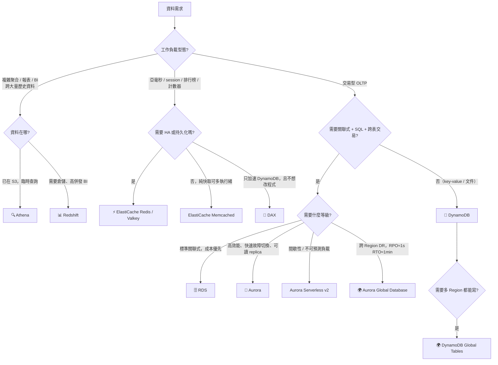
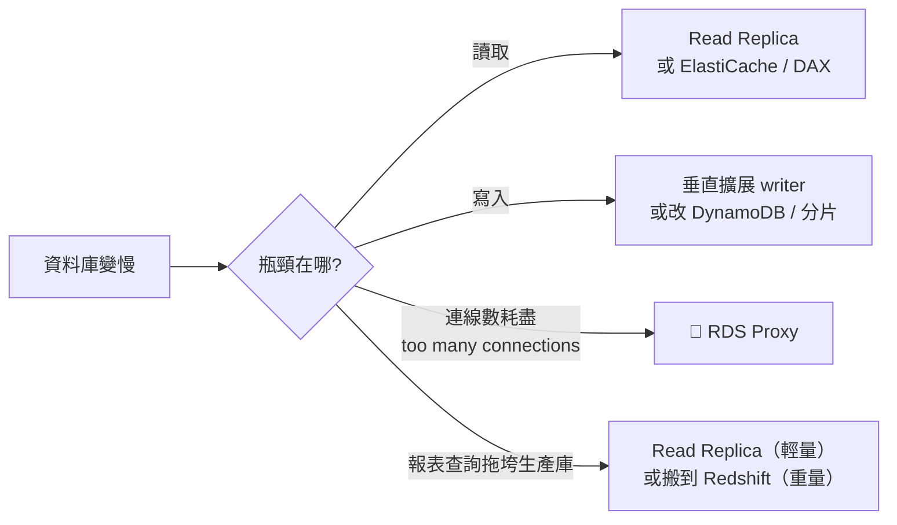

# 決策樹：資料庫與快取選型

> [!abstract] 目標
> 資料庫題的干擾項特別像。**先分 OLTP / OLAP / 快取，再分關聯式 / NoSQL，最後才看 HA 與跨 Region 需求。**

---

## 🌳 主決策樹

---

## 🔑 關鍵詞 → 服務（必背）

| 題目出現 | 選 | 砍掉 |
|---|---|---|
| `ACID`、`complex joins`、`existing MySQL/PostgreSQL` | **RDS / Aurora** | DynamoDB |
| `key-value`、`single-digit millisecond`、`serverless, no capacity planning` | **DynamoDB** | RDS |
| `sub-millisecond`、`in-memory`、`cache`、`session store`、`leaderboard` | **ElastiCache** | 任何資料庫 |
| `DynamoDB reads too slow` + `microsecond` + `minimal code change` | **DAX** | ElastiCache |
| `data warehouse`、`OLAP`、`petabyte`、`BI reporting` | **Redshift** | RDS |
| `ad-hoc SQL on S3`、`pay per query`、`serverless` | **Athena** | Redshift |
| `graph`、`relationships`、`fraud detection`、`recommendation` | **Neptune** | |
| `MongoDB workload` | **DocumentDB** | DynamoDB |
| `Cassandra` | **Keyspaces** | DynamoDB |
| `time-series`、`IoT metrics` | **Timestream** | |
| `immutable ledger`、`cryptographically verifiable` | **QLDB** | |

---

## ⚖️ 三組必背對照

### ① HA vs 讀取擴展 vs DR（最高頻）

| 需求 | 方案 | 為什麼不是另外兩個 |
|---|---|---|
| **AZ 故障自動切換** | **Multi-AZ DB instance**（同步、standby 不可讀） | Read Replica 不會自動切換 |
| **分攤讀取壓力** | **Read Replica**（非同步、有 lag、可跨 Region） | Multi-AZ 的 standby 讀不到 |
| **Region 故障** | **跨 Region Read Replica** 或 **Aurora Global Database** | Multi-AZ 只跨 AZ |
| **兩者兼得** | **Aurora replicas** 或 **RDS Multi-AZ DB cluster**（有可讀 reader） | 名詞要逐字辨識 |

> [!danger] 鐵律
> **Multi-AZ ≠ DR**（同 Region）。**Read Replica ≠ HA**（不自動切換）。**備份 ≠ 高可用**。
> 題目把這三組互換就是錯誤選項。

### ② Redis/Valkey vs Memcached

| 出現這個詞 | 答案 |
|---|---|
| `high availability`、`automatic failover`、`persistence`、`backup`、`replication` | **Redis / Valkey** |
| 只說「純快取、多執行緒、可水平分片、資料可遺失」 | Memcached |

**SAA 中 Memcached 很少是正解**——只要題目提到 HA 或持久化就一定是 Redis。

### ③ DAX vs ElastiCache

| | DAX | ElastiCache |
|---|---|---|
| 服務對象 | **只有 DynamoDB** | 任何資料來源 |
| 程式改動 | **幾乎不用改**（API 相容） | 要自己寫快取邏輯 |
| 延遲 | 微秒 | 亞毫秒 |

---

## 🔢 DynamoDB 的四個考點

| 主題 | 重點 |
|---|---|
| **Capacity mode** | `unpredictable` → **On-demand**；`predictable` 且要省 → **Provisioned + Auto Scaling** |
| **Partition key** | 選**高基數**屬性。「整體容量有剩卻被限流」= **熱分割區**，加容量沒用 |
| **GSI vs LSI** | GSI 可隨時建、不同 partition key、**只支援最終一致性**；LSI 只能建表時建、同 partition key |
| **Global Tables** | **多 Region active-active 寫入**，最後寫入者勝。注意 DynamoDB **沒有「read replica」這個東西** |

---

## 💡 排除「加機器就好」的直覺

> [!important] RDS Proxy 的專屬題型
> 「**Lambda 併發量大，資料庫回報 `too many connections`**」→ **RDS Proxy**（連線池）。
> 選「加大 DB instance」是錯的——問題在**連線數**不在運算量。

## ✍️ 自我檢核

1. 題目說「AZ 故障要自動切換，且不需要額外讀取容量」——選什麼？為什麼不選 read replica？
2. DynamoDB 整體佈建容量還有剩，卻一直被限流。原因與解法？
3. `Aurora Global Database` 的 RPO 與 RTO 量級各是多少？什麼題幹會指向它？
4. 什麼時候 ElastiCache 比 DAX 適合？反過來呢？
5. 「報表查詢拖垮了生產資料庫」有哪兩種等級的解法？怎麼判斷該選哪個？

> [!success]- 參考答案
> 1. **Multi-AZ DB instance**。Read Replica 是非同步複寫且**不會自動切換**，需要人工提升；題目也明說不需要讀取容量。
> 2. **熱分割區（hot partition）**——流量集中在少數 partition key，單一分割區先被打滿。解法是**重新設計 partition key 提高基數**（或加隨機/計算後綴），加容量無效。
> 3. **RPO ≈ 1 秒、RTO ≈ 1 分鐘**。題幹要求「跨 Region 關聯式資料庫 + 極短 RPO/RTO」時指向它。
> 4. 需要快取 **RDS 查詢結果**、或需要 session store / 排行榜 / pub-sub 等通用能力 → **ElastiCache**；只加速 **DynamoDB** 且要求幾乎不改程式 → **DAX**。
> 5. **輕量**：加 Read Replica 把報表流量導過去。**重量**：把分析搬到 Redshift 或 S3+Athena。看題幹的資料規模與查詢複雜度描述——提到 petabyte、complex joins、BI 就是後者。

## 🔗 相關

- [[資料庫與快取]]
- [[資料分析與串流]]
- [[高可用備援與災難復原]]
- [[數字與門檻速查]]
- [[常見陷阱與誘答選項識別]]
