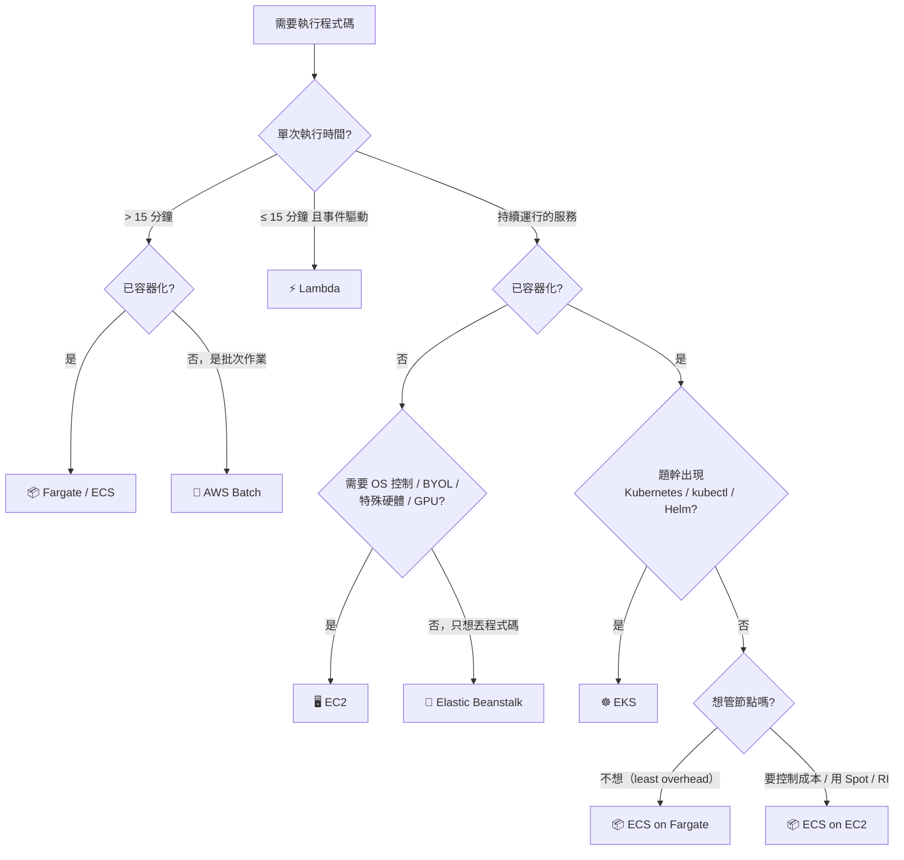
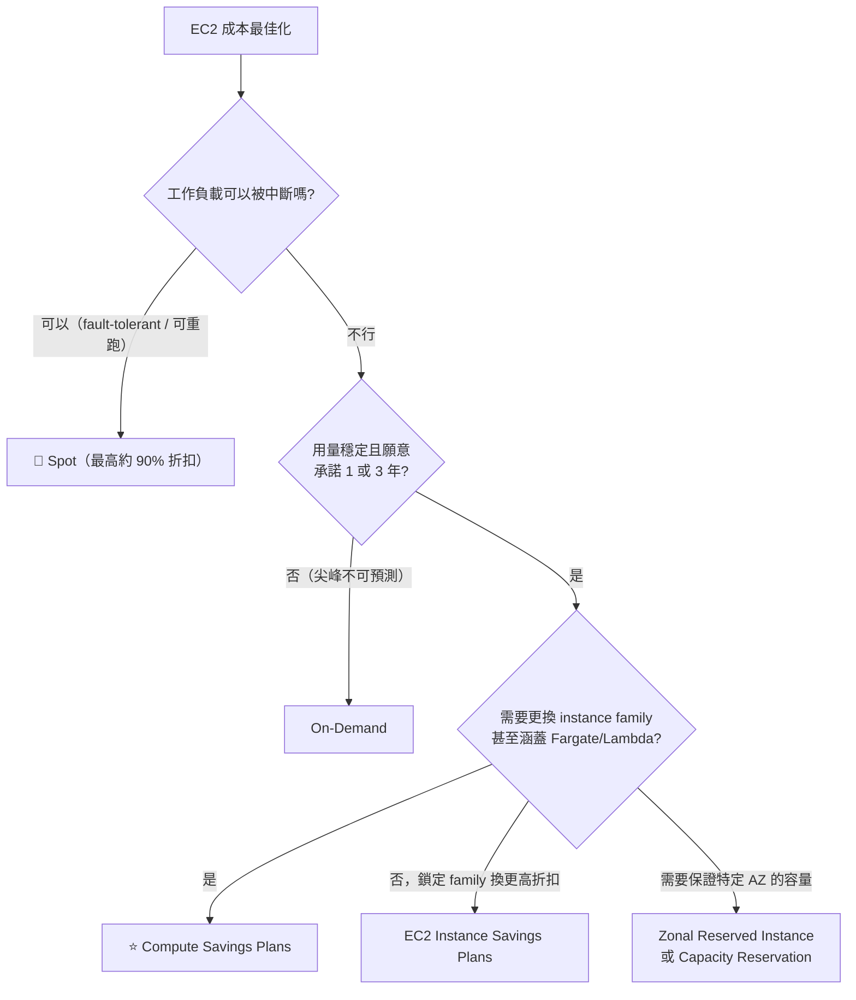

# 決策樹：運算選型

> [!abstract] 目標
> 看到「這段程式該跑在哪」的需求描述，**30 秒內鎖定服務**。這類題目通常有兩個看起來都對的選項，靠的是判準的精確度。

---

## 🌳 主決策樹

> [!danger] 給有 Kubernetes 背景的人的警告
> **SAA 的容器題幾乎都帶著 `minimal operational overhead`，而 EKS 的維運負擔高於 ECS/Fargate。**
> **題幹沒出現 Kubernetes 字眼就不要選 EKS。** 這是 K8s 熟手在這張考卷上最常見的失分模式。

---

## 🔑 關鍵詞 → 服務（必背）

| 題目出現 | 選 | 砍掉 |
|---|---|---|
| `serverless`、`no servers to manage`、`pay only for what you use` | Lambda / Fargate | EC2、EKS Standard |
| `event-driven`、`triggered by S3/SQS/EventBridge` | **Lambda** | 常駐服務 |
| **執行時間 > 15 分鐘** | **Fargate / Batch** | **Lambda（硬上限）** |
| `existing Kubernetes workloads`、`kubectl`、`Helm`、`multi-cloud portability` | **EKS** | ECS |
| `containers` + `least operational overhead` | **Fargate** | EKS、ECS on EC2 |
| `need OS-level access`、`custom kernel`、`legacy agent` | **EC2** | 任何 serverless |
| `BYOL`、`per-socket / per-core licensing` | **EC2 Dedicated Host** | Dedicated Instance |
| `batch jobs`、`array of parallel jobs`、`job queue` | **AWS Batch** | Lambda |
| `deploy an existing web app quickly, don't want to manage infrastructure` | **Elastic Beanstalk** | 手刻 ASG+ALB |
| `GPU`、`HPC`、`MPI` | **EC2**（+ Cluster placement group + EFA） | Fargate（不支援 GPU） |
| `eliminate cold start` | **Provisioned concurrency** | reserved concurrency |
| 簡單的 edge header/URL 改寫、極低延遲 | **CloudFront Functions** | Lambda@Edge |

---

## 💰 購買模式決策樹（Domain 4）

| 比較 | 差異 |
|---|---|
| **Compute SP vs EC2 Instance SP** | 前者跨 family / 跨 Region、**涵蓋 Fargate 與 Lambda**；後者折扣略高但鎖定 family + Region |
| **Savings Plans vs Standard RI** | 折扣相近；RI 綁規格、可在 Marketplace 轉售；SP 彈性高、不可轉售 |
| **Dedicated Instance vs Dedicated Host** | 前者硬體隔離；**只有後者看得到 socket/core，BYOL 必選** |
| **Capacity Reservation** | 保留容量但**沒有折扣**，可與 SP 疊加 |

> [!tip] 兼顧成本與可用性的標準答案
> 「降低成本但要維持基本可用性」→ **ASG mixed instances policy：基準 N 台 On-Demand + 其餘 Spot**，而不是全部用 Spot。

---

## 🧩 Placement Group 決策

| 需求 | 選 | 限制 |
|---|---|---|
| `lowest latency / highest throughput between instances`、HPC | **Cluster** | **單一 AZ，AZ 故障全滅** |
| `reduce correlated failures for a few critical instances` | **Spread** | 每 AZ 每群組最多 **7 台** |
| `large distributed workload`、點名 HDFS / Kafka / Cassandra | **Partition** | 每 AZ 最多 **7 個 partition** |

---

## ⚖️ Lambda 的四條硬線

任何一條被題幹突破，Lambda 就出局：

| 限制 | 值 | 替代方案 |
|---|---|---|
| 執行時間 | **15 分鐘** | Fargate / Batch / Step Functions |
| 記憶體 | 10 GB | EC2 / Fargate |
| 部署包（容器映像） | 10 GB | EC2 |
| 預設併發 | 每帳號每 Region 1,000 | 申請提高 / 改架構 |

## ✍️ 自我檢核

1. 題目說「容器化的微服務，要求維運負擔最低」，你選什麼？**為什麼不是 EKS？**
2. Compute Savings Plans 相對 EC2 Instance Savings Plans，多換到了什麼彈性？
3. 一個工作負載需要 BYOL 且授權按實體 socket 計算——Dedicated Instance 夠嗎？為什麼？
4. `provisioned concurrency` 與 `reserved concurrency` 分別解決什麼問題？
5. Cluster placement group 的代價是什麼？什麼情況下不該用它？

參考答案

1. **ECS on Fargate**。EKS 的控制平面與節點管理在 AWS 的維運負擔評級中高於 ECS/Fargate，題幹沒點名 Kubernetes 就不選它。
2. **跨 instance family、跨 Region、跨 OS，而且涵蓋 Fargate 與 Lambda**。EC2 Instance SP 鎖定 family + Region。
3. **不夠**。Dedicated Instance 只保證硬體不與其他客戶共用，**你看不到 socket/core 數量**，無法據以計算授權。必須用 **Dedicated Host**。
4. **Provisioned = 預先初始化執行環境、消除冷啟動**；**Reserved = 保留併發額度並設上限、避免單一函式吃光帳號配額**。
5. 代價是**全部實例在同一個 AZ**，AZ 故障即全滅。題目同時要求低延遲與跨 AZ 高可用時，這兩個需求本質衝突，要看題幹哪個是硬條件。

## 🔗 相關

- [[運算與容器選型]]
- [[EC2與負載平衡及擴展]]
- [[事件驅動與無伺服器]]
- [[數字與門檻速查]]
- [[常見陷阱與誘答選項識別]]
