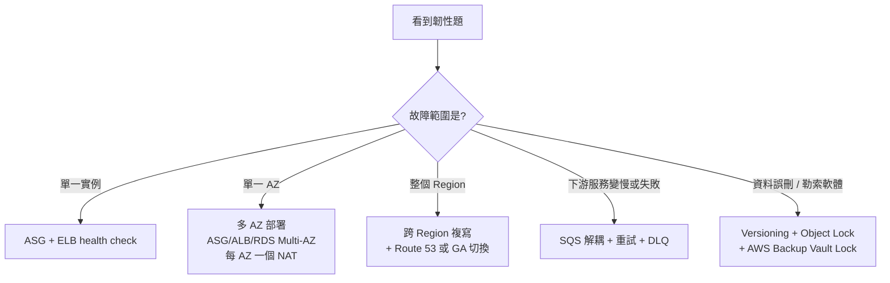

# 高可用備援與災難復原

先寫需求：**RPO** = 可接受的最大資料遺失時間；**RTO** = 可接受的最大恢復時間。然後判斷是 instance、AZ 還是 Region 故障。

| 故障範圍 | 常見能力 | 尚需考慮 |
|---|---|---|
| instance | ALB health check + ASG 替換 | 外部化 session/檔案、DB 連線重試 |
| AZ | 多 AZ ASG + ALB + RDS Multi-AZ/Aurora | subnet/NAT 等網路組件也要跨 AZ 規劃 |
| Region | 跨 Region 備份/複寫 + DNS/Global Accelerator 切換 | 資料 lag、環境預先部署、演練 |

---

# 🧠 技術層
*它實際上怎麼運作——心智模型、機制、限制。**第一輪只讀這一層**，先把架構直覺建立起來。*

## 四類 DR 策略

| 策略 | 預置資源 | RPO 量級 | RTO 量級 | 常駐成本 | 題幹關鍵字 |
|---|---|---|---|:-:|---|
| **Backup & restore** | 只保留備份，災時重建 | 小時 | **數小時 ~ 一天** | 最低 | `lowest cost`、`RTO of 24 hours is acceptable` |
| **Pilot light** | 最小核心（通常只有資料層）長駐 | 分鐘 | **數十分鐘 ~ 數小時** | 低 | `core data replicated`、`scale up when needed` |
| **Warm standby** | 縮小版的完整環境長駐 | 秒 ~ 分鐘 | **數分鐘** | 中 | `scaled-down but fully functional copy` |
| **Multi-site active/active** | 多站同時提供流量 | **近零** | **近零** | 最高 | `zero downtime`、`RPO/RTO near zero`、`serve traffic from both regions` |

> [!warning] 量級是刻度，不是承諾
> 上表的 RPO/RTO 是**相對量級**，用來在考場上快速定位；**實際數字取決於資料複寫方式、DNS 切換、部署自動化與演練成熟度**，不要對外承諾固定值。
> 另外：EBS snapshot、S3 replication、RDS 跨 Region read replica、Aurora Global Database 各自處理**不同資源**，不能互相代替。備份也必須實際驗證能否還原。

## 各資源的跨 Region 複寫能力對照

原筆記正確指出「不能互相代替」，這裡給出完整對照表。

| 資源 | 跨 Region 機制 | RPO 量級 |
|---|---|---|
| **S3** | **Cross-Region Replication (CRR)** | 分鐘（可用 **RTC** 保證 15 分鐘內 99.99%） |
| **EBS** | **Snapshot 跨 Region 複製**（或 AWS Backup 跨 Region copy） | 依快照頻率，通常小時 |
| **RDS** | **跨 Region read replica**（手動提升）或**自動備份跨 Region 複製** | 分鐘 ~ 小時 |
| **Aurora** | **Aurora Global Database** | **RPO ≈ 1 秒、RTO ≈ 1 分鐘** |
| **DynamoDB** | **Global Tables**（active-active 多寫入） | **秒級** |
| **AMI** | 跨 Region 複製 | 手動/排程 |
| **多服務統一** | **AWS Backup 跨 Region / 跨帳號複製** | 依備份計畫 |
| **ECR** | 跨 Region 複寫 | 近即時 |

> [!danger] 三個必記的對應
> `RPO near zero, active-active, multi-region writes` + **NoSQL** → **DynamoDB Global Tables**
> `RPO ~1 second, RTO ~1 minute, relational` → **Aurora Global Database**
> `objects must exist in a second region within 15 minutes, guaranteed` → **S3 CRR + Replication Time Control (RTC)**

## 切換機制：DNS 不是唯一選項

| 機制 | 切換速度 | 限制 |
|---|---|---|
| **Route 53 failover + health check** | 受 **TTL** 與 resolver 快取影響，分鐘級 | 客戶端可能仍連舊 IP |
| **Global Accelerator** | **秒級**，固定 anycast IP，切換在 AWS 網路層 | 成本較高 |
| **手動/自動化 runbook** | 依自動化程度 | 需演練 |

> [!tip] 題幹說「failover 必須在幾秒內完成且客戶端不需要重新解析 DNS」→ **Global Accelerator**。
> 見 [[DNS與全球流量]] 的 TTL 段落。

## 可用性數學

| 可用性 | 年停機時間 |
|---|---|
| 99% | 約 3.65 天 |
| 99.9%（three nines） | 約 8.8 小時 |
| 99.99%（four nines） | 約 52 分鐘 |
| 99.999%（five nines） | 約 5 分鐘 |

**串聯元件的可用性相乘**（0.99 × 0.99 = 0.9801），所以增加依賴會降低整體可用性；**並聯冗餘則提高**可用性。這解釋了為什麼「減少單點依賴」與「多 AZ 冗餘」是韌性設計的核心。

## 韌性設計的通用原則

> [!warning] 三個常被混淆的邊界
> **Multi-AZ ≠ DR**：Multi-AZ 處理 AZ 故障，仍在同一 Region。
> **Read Replica ≠ HA**：不會自動切換。
> **備份 ≠ 高可用**：備份處理資料遺失，不減少停機時間。
> 題目把這三組概念互換就是錯誤選項。原筆記已提醒，這裡再強調一次因為它真的很常考。

## 別忘了演練與不可變備份

- 備份要**定期驗證還原**，否則 RTO 只是紙上數字。
- 對抗勒索軟體的組合是 **S3 Object Lock（Compliance mode）** 或 **AWS Backup Vault Lock**，見 [[S3與資料生命週期]]、[[治理與合規]]。
- **AWS Elastic Disaster Recovery (DRS)** 提供持續區塊層複寫到 AWS，可達分鐘級 RPO/RTO，是 pilot light/warm standby 的託管實作。

---

# 🎯 考試層
*考試會怎麼問——關鍵字反射、誘答陷阱、閉卷檢核。**第二輪與考前讀這一層**。*

## 🧮 DR 題的解題順序

題目**幾乎一定會給 RPO/RTO 數字或「成本最低」的限制**。照這個順序做：

1. **先看 RTO** → 篩掉達不到的策略。
2. **再看「成本最低」** → 在**滿足 RTO 的策略中**選最便宜的那個。

> [!danger] 最常見的失分方式
> 看到 `disaster recovery` 就反射選 **active/active**。
> 若題目說「RTO 4 小時、成本最低」，**pilot light 或 backup & restore 才是答案**——active/active 雖然也達標，但屬於**過度設計**。
>
> 反過來也要小心：題目說 `zero downtime` 卻選 pilot light，就是沒滿足硬條件。

## 🎯 考點速記

看到 `RTO 4 hours` + `lowest cost` → **Pilot light**（不是 active/active）
看到 `RPO ≈ 1s, RTO ≈ 1min` + 關聯式 → **Aurora Global Database**
看到 `multi-region writes` + NoSQL → **DynamoDB Global Tables**
看到 `objects in second region within 15 minutes, guaranteed` → **S3 CRR + RTC**
看到 `failover in seconds, client cannot re-resolve DNS` → **Global Accelerator**
看到 `ransomware` / `immutable` → **Object Lock / Vault Lock Compliance mode**
看到 `AZ failure` → **Multi-AZ**（不是跨 Region）

## 💣 真實場景陷阱

- **備份從未測試還原**：RTO 只是紙上數字。AWS Backup 的還原演練應納入流程。
- **DR 環境的服務配額沒申請**：災難時要在第二 Region 開 200 台實例，卻發現預設配額只有 20 台。官方考綱明確把「standby 環境的 service quota」列入知識點。
- **只複寫資料卻沒複寫組態**：AMI、launch template、SG 規則、Route 53 記錄都要在第二 Region 就緒。
- **DNS failover 完成 ≠ 災難復原完成**：流量切了但資料落後（RPO）、應用還沒起來（RTO）。
- **跨 Region 複寫加密資料忘了目的地金鑰**：CMK 是 Region 專屬的。

## ✍️ 自我檢核

1. 四類 DR 策略的 RPO/RTO 量級與成本排序？題目給了 RTO 與「成本最低」時，解題順序是什麼？
2. Multi-AZ、Read Replica、備份——這三個各解決什麼？為什麼不能互換？
3. 各資源的跨 Region 複寫機制：S3、EBS、RDS、Aurora、DynamoDB 各是什麼？
4. 99.99% 一年約停機多久？串聯兩個 99% 的元件，整體可用性是多少？
5. 除了複寫資料，Region 級 DR 還需要準備哪三件事？

> [!success]- 參考答案
> 1. **Backup & restore**（RTO 數小時~一天，最便宜）→ **Pilot light**（數十分鐘~數小時）→ **Warm standby**（數分鐘）→ **Active/active**（近零，最貴）。解題順序：**先用 RTO 篩掉達不到的，再在合格者中選最便宜的。**
> 2. **Multi-AZ = HA**（同 Region AZ 故障自動切換）；**Read Replica = 讀取擴展**（非同步、不自動切換）；**備份 = 資料遺失的復原**（不減少停機時間）。三者處理的是不同的失敗模式。
> 3. S3 → **CRR**（可加 RTC 保證 15 分鐘）；EBS → **snapshot 跨 Region 複製**；RDS → **跨 Region read replica** 或自動備份複製；Aurora → **Global Database**；DynamoDB → **Global Tables**。統一管理可用 **AWS Backup 跨 Region copy**。
> 4. 99.99% 約 **52 分鐘/年**。串聯相乘：0.99 × 0.99 = **0.9801（98.01%）**——所以增加依賴會降低整體可用性，並聯冗餘才會提高。
> 5. **① 環境預先部署**（AMI、launch template、網路組態）**② 服務配額申請**（第二 Region 的預設配額可能不足）**③ 定期演練與還原測試**。另外加密資料還要處理目的地 Region 的 KMS 金鑰。

---

# 🔗 相關

延伸 [[EC2與儲存]]、[[資料庫與快取]]、[[DNS與全球流量]]；參考 [[03 官方資源清單]]。

參考 [[03 官方資源清單]]；返回 [[00 考試總覽]]。
