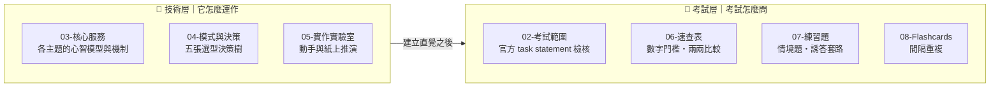
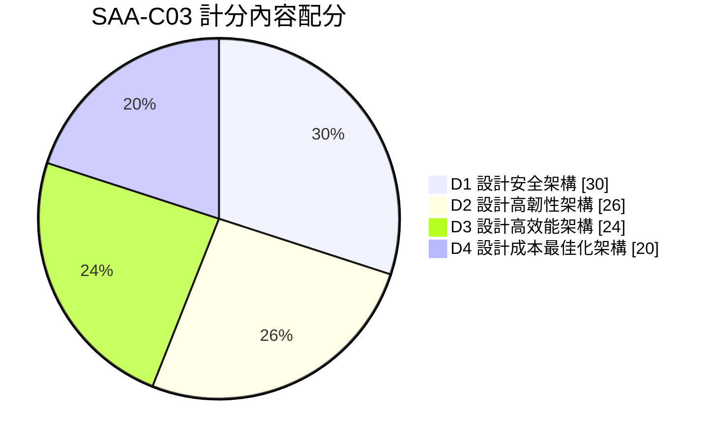
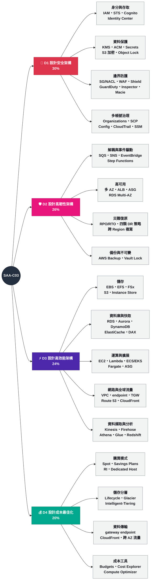

# 🎯 AWS Certified Solutions Architect – Associate (SAA-C03) 備考 Vault

> [!abstract] 這是什麼
> 一份為 **AWS SAA-C03** 打造的 Obsidian 知識庫。目標不只是「過考試」，而是能在真實專案裡做出正確的架構決策：選對運算平台、設計對的資料層、在安全與成本之間取捨。
>
> 內容依 **官方考試指南與 in-scope 服務清單**（2026-09-27 查核）撰寫，並針對 **Spring Boot / 微服務 / Kubernetes / EDA / SAGA** 背景的讀者調整——既有知識映射成 AWS 選型，重點補 VPC、IAM、儲存、資料庫、DNS/CDN、成本。

---

## 🚀 三步開始

1. 先讀 [[00 考試總覽]] — 5 分鐘知道要考什麼、怎麼考、四大 domain 各佔多少。
2. 再讀 [[01 如何使用本 Vault]] 與 [[02 Obsidian 設定與外掛建議]] — 讓連結、閃卡、進度追蹤都能動。
3. 挑一份讀書計劃開始跑：

| 計劃 | 節奏 | 適合 |
|---|---|---|
| ⭐ [[25 天衝刺計劃]] | 90–120 分/天 | 考試日期已定且在 25 天內 |
| [[6 週穩紮計劃]] | 60–75 分/天 + 週末 Lab | 上班族、想長期記住（**保留率最佳**） |
| [[10 天急救計劃]] | 2.5 h/天，只補洞 | 已有 2 年以上 AWS 實務經驗 |
| [[替代方案 比較與選擇]] | — | 不確定選哪個？看這裡的決策樹 |

---

## 🧭 兩層閱讀模型（先懂這個）

**技術關聯**與**考照準備**是兩種不同的閱讀需求，混在一起讀會互相干擾。本 Vault 把它們分開：



**分層不只在資料夾，也在每一篇筆記內部。** `03-核心服務` 與 `04-模式與決策` 的每篇都用 H1 切成三段：

| 區塊 | 回答什麼 | 什麼時候讀 |
|---|---|---|
| **🧠 技術層** | 它實際上怎麼運作——心智模型、機制、限制 | **第一輪**。考完之後仍然有用的知識 |
| **🎯 考試層** | 考試會怎麼問——關鍵字反射、誘答陷阱、閉卷檢核 | **第二輪與考前**。對真實工作幾乎沒用 |
| **🔗 相關** | 與其他筆記的接點、官方來源 | 需要跳轉時 |

> [!tip] 兩種讀者的動線
> **想學 AWS 架構** → 只讀技術層 + 決策樹，考試層整段跳過。
> **只想過考試** → 技術層快速掃過，重點放考試層 + `06-速查表` + `07-練習題`。

---

## 🗺️ Vault 地圖

| 資料夾 | 層 | 內容 | 什麼時候看 |
|---|:-:|---|---|
| `00-開始這裡` | — | 考試規格、使用說明、Obsidian 設定、官方資源 | 第一天 |
| `01-讀書計劃` | — | 三種節奏 + 每日追蹤 + 考前 48 小時 | 第一天，之後每天 |
| `02-考試範圍` | 🎯 | 官方四大 domain 的逐條拆解與對應筆記 | 當「檢核清單」反覆回看 |
| `03-核心服務` | 🧠+🎯 | 每個主題的分層筆記 | 主要學習期 |
| `04-模式與決策` | 🧠+🎯 | 五張選型決策樹、架構總圖、HA/DR 模式 | 學完服務後、考前必看 |
| `05-實作實驗室` | 🧠 | Lab 與不花錢的紙上推演 | 每個主題結束時 |
| `06-速查表` | 🎯 | 數字門檻、兩兩比較 | 實作時查、考前背 |
| `07-練習題` | 🎯 | 60 題情境題與詳解、誘答套路拆解、錯題模板 | 每個 domain 結束、考前兩天 |
| `08-Flashcards` | 🎯 | 間隔重複閃卡（`::` 格式） | 每天 10 分鐘、通勤時 |

---

## 📚 四大 Domain（官方權重）



- [[Domain 1 設計安全架構]] — **30%｜最重，先讀**
- [[Domain 2 設計高韌性架構]] — 26%｜RPO/RTO、解耦、多 AZ 與跨 Region
- [[Domain 3 設計高效能架構]] — 24%｜儲存/資料庫/運算選型、瓶頸判斷
- [[Domain 4 設計成本最佳化架構]] — 20%｜購買模式、資料傳輸、儲存類別

### 考試範圍心智圖

一張圖看完「SAA 到底要學什麼」。每個分支都對得上一篇筆記：



> [!tip] 這張圖的兩個用法
> **第一天**：對照 [[25 天衝刺計劃]]，確認每個分支都排進了某一天。
> **考前**：**遮住葉節點**，看著 domain 名稱能不能自己講出下面有哪些主題。講不出來的分支就是缺口。

> [!important] 考試規格速記
> **65 題（50 計分 + 15 不計分）／130 分鐘／scaled 100–1000，720 分通過／補償式計分。**
> 平均每題 **120 秒**。未作答一律算錯，**猜題無倒扣**。詳見 [[00 考試總覽]]。

---

## 🧭 最高頻考點捷徑

時間不夠時，直接跳這幾篇：

- [[決策樹 運算選型]] — 「這段程式該跑在哪」幾乎每份考卷都有 3–5 題
- [[決策樹 資料庫選型]] — RDS / Aurora / DynamoDB / ElastiCache 的分水嶺
- [[決策樹 儲存選型]] — EBS / EFS / FSx / S3 / Instance store
- [[決策樹 訊息與事件選型]] — SQS / SNS / EventBridge / Kinesis / Amazon MQ
- [[決策樹 網路與連線選型]] — endpoint / Peering / TGW / PrivateLink / DX
- [[常見陷阱與誘答選項識別]] — **直接值 5–10 分**
- [[數字與門檻速查]] — 考前 24 小時只讀這篇
- [[情境題庫]] — 60 題附完整排除理由

---

## ✅ 進度追蹤（不需任何外掛）

每篇筆記的 frontmatter 都有這三個欄位，讀完就手動更新：

```yaml
status: 未讀 | 讀過 | 熟練
confidence: 1     # 1=沒把握 5=可以教別人
importance: 5     # 考試重要性，已設定好，不要改
```

**要找出還沒掌握的筆記**，用 Obsidian 內建搜尋（`⌘⇧F`）輸入：

```
confidence: 1
```

換成 `confidence: 2` 再搜一次，這兩批就是你的複習清單。
考前的目標是：**`importance: 5` 的筆記都不能停在 confidence 1–2**。

進度打勾表在 [[每日追蹤模板]]。

---

## ⚠️ 關於資料時效

> [!warning] 以官方文件為準
> 本 Vault 的配額、門檻、預設值以 **2026-09-27** 查核為基準。AWS 變動快（尤其儲存類別、實例世代、新服務），考前請對照 [[03 官方資源清單]] 快速複查。
> 標記 🔢 的數字代表「可能被考、但也可能改版」。
>
> [[情境題庫]] 的 60 題是**自製練習題**，用於訓練排除法的反射，**不能取代正式模考題庫**。

## 🔗 相關

- [[00 考試總覽]]
- [[01 如何使用本 Vault]]
- [[25 天衝刺計劃]]
- [[考前 48 小時衝刺]]
